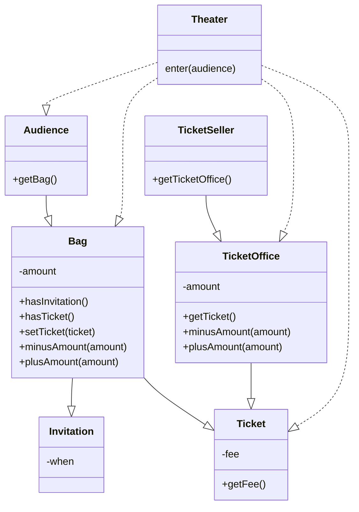

# 00. 들어가며
## 01 패러다임의 시대
과학혁명이란 과거의 패러다임이 새로운 패러다임에 의해 대체됨으로써 정상과학의 방향과 성격이 변하는 것을 의미한다. 
이를 패러다임의 전환이라고 부른다. 이 책에서 이야기하는 패러다임 전환이란 절차형 패러다임에서 객체지향 패러다임으로 변화를 가리킨다.

## 02 프로그래밍 패러다임
프로그래밍 패러다임은 과거의 패러다임을 폐기시키는 혁명적인 과정을 거치지 않는 것으로 보인다.
오히려 과거에 있던 패러다임의 단점을 보완하는 발전적인 과정을 거치는 것으로 보인다. 프로그래밍 패러다임은 혁명적(revolutionary)이 아니라 발전적(evolutionary)이다.

***

# 01. 객체, 설계
## 01 티켓 판매 애플리케이션 구현하기


```java
public class Theater {

    private TicketSeller ticketSeller;

    public Theater(TicketSeller ticketSeller) {
        this.ticketSeller = ticketSeller;
    }

    public void enter(Audience audience) {
        if (audience.getBag().hasInvitation()) {
            audience.getBag().setTicket(ticketSeller.getTicketOffice().getTicket());
        } else {
            Ticket ticket = ticketSeller.getTicketOffice().getTicket();
            audience.getBag().minusAmount(ticket.getFee());
            ticketSeller.getTicketOffice().plusAmount(ticket.getFee());
            audience.getBag().setTicket(ticket);
        }
    }
}
```

## 02 무엇이 문제인가
### 예상을 빗나가는 코드

### 변경에 취약한 코드

### 설계 개선하기

