**
# 00. 들어가며
## 01 패러다임의 시대
과학혁명이란 과거의 패러다임이 새로운 패러다임에 의해 대체됨으로써 정상과학의 방향과 성격이 변하는 것을 의미한다. 
이를 패러다임의 전환이라고 부른다. 이 책에서 이야기하는 패러다임 전환이란 절차형 패러다임에서 객체지향 패러다임으로 변화를 가리킨다.

## 02 프로그래밍 패러다임
프로그래밍 패러다임은 과거의 패러다임을 폐기시키는 혁명적인 과정을 거치지 않는 것으로 보인다.
오히려 과거에 있던 패러다임의 단점을 보완하는 발전적인 과정을 거치는 것으로 보인다. 프로그래밍 패러다임은 혁명적(revolutionary)이 아니라 발전적(evolutionary)이다.

***

# 01. 객체, 설계
## 01 티켓 판매 애플리케이션 구현하기
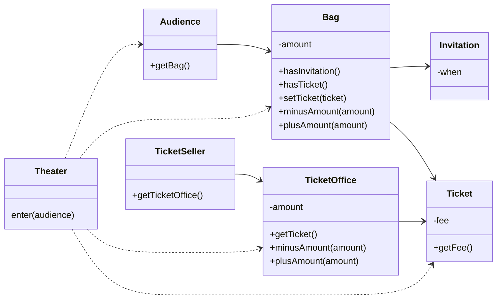

```java
public class Theater {

    private TicketSeller ticketSeller;

    public Theater(TicketSeller ticketSeller) {
        this.ticketSeller = ticketSeller;
    }

    public void enter(Audience audience) {
        if (audience.getBag().hasInvitation()) {
            audience.getBag().setTicket(ticketSeller.getTicketOffice().getTicket());
        } else {
            Ticket ticket = ticketSeller.getTicketOffice().getTicket();
            audience.getBag().minusAmount(ticket.getFee());
            ticketSeller.getTicketOffice().plusAmount(ticket.getFee());
            audience.getBag().setTicket(ticket);
        }
    }
}
```

## 02 무엇이 문제인가
> 예상을 빗나가는 코드

현실에서는 관람객이 직접 자신의 가방에서 초대장을 꺼내 판매원에게 건넨다. 티켓을 구매하는 관람객은 가방 안에서 돈을 직접 꺼내 판매원에게 지불한다.
판매원 매표소에 있는 티켓을 직접 꺼내 관람객에게 건네고 관람객에게서 직접 돈을 받아 매표소에 보관한다.
현재의 코드는 우리의 상식과는 너무나도 다르게 동작하기 때문에 코드를 읽는 사람과 제대로 의사소통하지 못한다.

코드를 이해하기 어려운 이유가 또 하나가 있다. 여러 가지 세부적인 내용들을 한꺼번에 기억하고 있어야 한다는 점이다. 
Theater의 enter 메서드를 이해하기 위해서는 Audience가 Bag을 가지고 있고 
Bag 안에는 현금과 티켓이 들어있으며 TicketSeller가 TicketOffice에서 티켓을 판매하고, TicketOffice 안에 돈과 티켓이 보관돼 있다는 모든 사실을 
동시에 기억하고 있어야 한다. 하나의 클래스나 메서드에서 너무 많은 세부사항을 다루기 때문에 코드를 작성하는 사람뿐만 아니라 이 코드를 읽고 이해해야 하는 사람 모두에게 큰 부담을 준다.

> 변경에 취약한 코드

Audience와 TicketSeller가 변경될 경우 Theater도 함께 변경되어야 한다. 두 객체 사이의 결합도가 높으면 높을 수록 함께 변경될 확률도 높아지기 때문에 
변경이 어려워진다. 따라서 설계 목표는 객체 사이의 결합도를 낮춰 변경이 용이한 설계를 만드는 것이어야 한다.

## 03 설계 개선하기
코드를 이해하기 어려운 이유는 Theater가 관람객의 가방과 판매원의 매표소에 직접 접근하기 때문이다. 관람객과 판매원이 자신의 일을 스스로처리해야 한다는 우리의 직관에서 벗어난다.
Theater가 관람객의 가방과 판매원의 매표소에 직접 접근한다는 것은 Theater가 Audience와 TicketSeller에 결합된다는 것을 의미한다.
이를 해결 하기 위해서는 관람객과 판매원을 자율적인 존재로 만들면 된다.

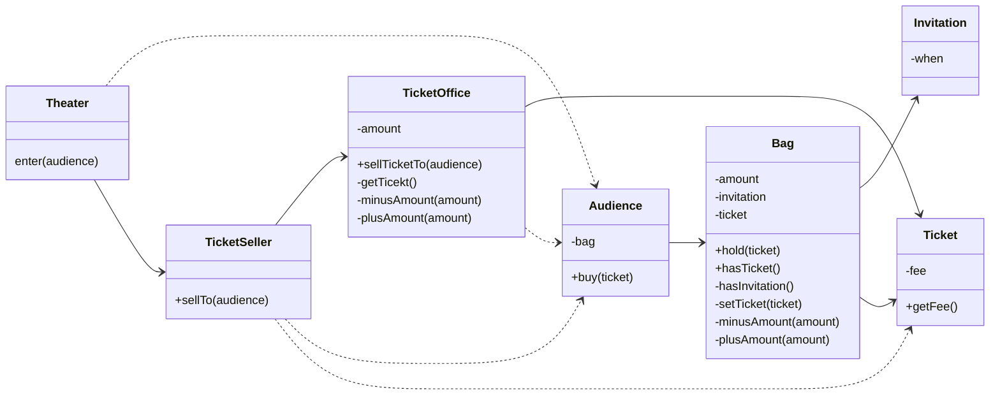

## 04 객체지향 설계
데이터와 프로세스를 하나의 덩어리로 모으는 것은 훌륭한 객체지향 설계로 가는 첫걸음이다. 
진정한 객체지향 설계로 나아가는 길은 협력하는 객체들 사이의 의존성을 적절하게 조절함으로써 변경에 용이한 설계를 만드는 것이다.

***

# 02. 객체지향 프로그래밍
## 01 영화 예매 시스템
* 영화: 제목, 상영시간, 가격 정보와 같이 영화가 가지고 있는 기본적인 정보를 가리킨다.
* 상영: 상영 일자, 시간, 순번 등을 가리킨다.
* 할인
  * 할인 조건: 가격의 할인 여부를 결정
    * 순서 조건
    * 기간 조건
  * 할인 정책: 할인 요금을 결정
    * 금액 할인 정책
    * 비율 할인 정책

## 02 객체지향 프로그래밍을 향해
> 협력, 객체, 클래스

객체지향 패러다임으로의 전환은 클래스가 아닌 객체에 초점을 맞출 때에만 얻을 수 있다. 이를 위해서는 프로그래밍하는 동안 다음의 두가지에 집중해야 한다.

1. 어떤 클래스가 필요한지 고민하기 전에 어떤 객체들이 필요한지 고민하라.
2. 객체를 독립적인 존재가 아니라 기능을 구현하기 위해 협력하는 공동체의 일원으로 봐야한다.

> 도메인 구조를 따르는 프로그램 구조

* 도메인: 문제를 해결하기 위해 사용자가 프로그램을 사용하는 분야

1. 클래스의 이름을 최대한 도메인 개념의 이름과 동일하거나 유사하게 지어야 한다.
2. 클래스 사이의 관계도 최대한 도메인 개념 사이에 맺어진 관계와 유사하게 만들어서 프로그램의 구조를 이해하고 예상하기 쉽게 만들어야 한다.

> 클래스 구현

* 자율적인 객체
  * 객체는 상태(state)와 행동(behavior)을 함께 가지는 복합적인 존재다.
  * 객체는 스스로 판단하고 행동하는 자율적인 존재다.

* 프로그래머의 자유
  * 클래스 작성가: 새로운 데이터 타입을 프로그램에 추가한다.
  * 클라이언트 프로그래머: 클래스 작성가가 추가한 데이터 타입을 사용한다.

> 협력하는 객체들의 공동체

객체지향 프로그램을 작성할 때는 먼저 협력의 관점에서 어떤 객체가 필요하진 결정하고, 객체들의 공통 상태와 행위를 구현하기 위해 클래스를 작성한다.

> 협력에 관한 짧은 이야기

객체의 내부 상태는 외부에서 접근하지 못하도록 감춰야 한다.
대신 외부에 공개하는 public 인터페이스를 통해 내부 상태에 접근할 수 있도록 허용한다.
객체는 다른 객체의 인터페이스에 공개된 행동을 수행하도록 요청(request)할 수 있다.
요청 받은 객체는 자율적인 방법에 따라 요청을 처리한 후 응답(response)한다.

객체가 다른 객체와 상호작용할 수 있는 유일한 방법은 메시지를 전송하는 것 뿐이다.
메시지를 수신한 객체는 스스로 결정에 따라 자율적으로 메시지를 처리할 방법을 결정한다.
이 처럼 메시지를 처리하기 위한 자신만의 방법을 메서드(method)라고 한다.

## 03 할인 요금 구하기
> 할인 요금 계산을 위한 협력 시작하기

```java
public Money calculateMovieFee(Screening screening) {
    return fee.minus(discountPolicy.calculateDiscountAmount(screening));
}
```
Movie 클래스의 calculateMovieFee 메서드는 discountPolicy에 calculateDiscountAmount 메시지를 전송해 알인 요금을 받환 받는다.
Movie는 기본 요금인 fee에서 반환된 할인 요금을 차감한다. 코드 어디에도 할인 정책을 판단하는 코드는 존재하지 않는다.
단지 discountPolicy에게 메세지를 전송할 뿐이다. 이 코드에는 객체 지향에서 중요하다고 여겨지는 `상송(inheritance)`, `다형성(polymorphism)` 개념이 숨겨져 있다.
그리고 그 기반에는 `추상화(abstraction)`라는 원리가 숨겨져 있다.

> 할인 정책과 할인 조건

할인 정책은 금액 할인 정책과 비율 할인 정책으로 구분된다. 두 가지 할인 정책은 각각 `AmountDiscountPolicy`와 `PercentDiscountPolicy`로 구현한다.
두 클래스는 대부분의 코드가 유사하고 할인 요금을 계산하는 방식이 조금 다르다.
중복 코드를 제거하기 위해서 부모 클래스인 `DiscountPolicy` 안에 중복 코드를 두고 
AmountDiscountPolicy와 PercentDiscountPolicy가 이 클래스를 상속 받게 한다.

영화 예매 시스템에는 순번 조건과 기간 조건의 두 가지 할인 조건이 존재한다.
각각 `SequenceCondition`과 `PeriodCondition` 클래스로 구현한다.

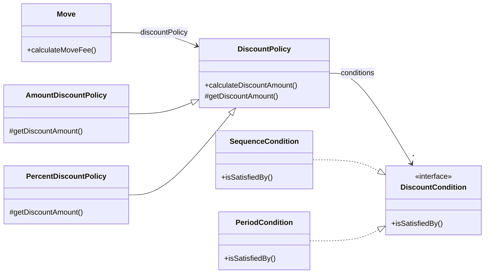

> 할인 정책 구성하기

하나의 영화에 대해 단 하나의 할인 정책만 설정할 수 있지만 할인 조건의 경우에는 여러 개를 적용할 수 있다.
`Movie`와 `DiscountPolicy`의 생성자는 이런 제약을 강제한다. 생성자 파라미터 목록을 이용해 초기화에 필요한 정보를 전달하도록 강제하면
올바른 상태를 가진 객체의 생성을 보장할 수 있다.

## 04 상속과 다형성
> 컴파일 시간 의존성과 실행 시간 의존성
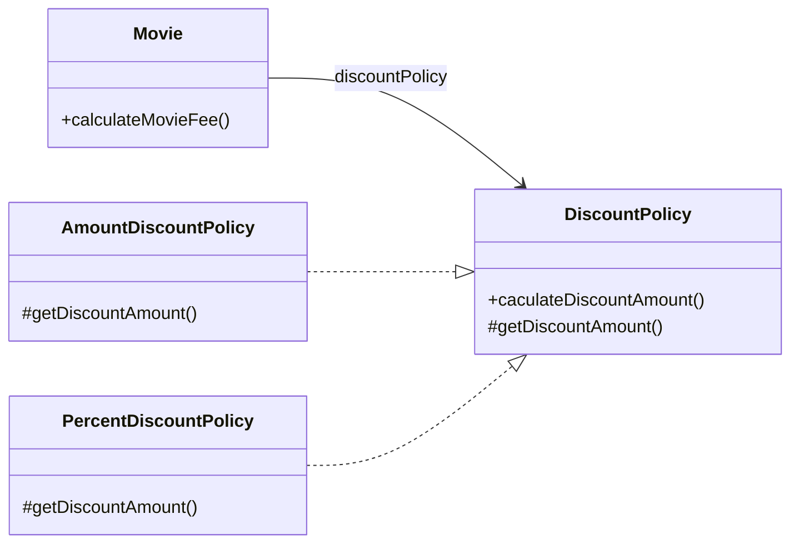
`Movie` 클래스가 `DiscountPolicy` 클래스와 연결돼 있다. 영화 요금을 계산하기 위해서는 추상 클래스인 `DiscountPolicy`가 아니라 
`AmountDiscountPolicy`, `PercentDiscountPolicy`의 인스턴스가 필요하다.
runtime 시에 `AmountDiscountPolicy`나 `PercentDiscountPolicy`의 인스턴스에 의존해야 한다. 하지만 코드 수준에서는
두 클래스중 어떤 것에도 의존하지 않는다. 오직 추상 클래스인 `DiscountPolicy`에만 의존하고 있다. 

```java
Movie avatar = new Movie(
        "아바타",
        Duration.ofMinutes(120),
        Money.wons(10000),
        new AmountDiscountPolicy(Money.wons(800), ...)
);

Movie avatar = new Movie(
        "아바타",
        Duration.ofMinutes(120),
        Money.wons(10000),
        new PercentDiscountPolicy(0.1, ...)
);
```
`Movie`의 생성자에서 `DiscountPolicy` 타입의 객체를 인자로 받는다. 
실행 시점에  `Movie`인스턴스는 `AmountDiscountPolicy`나 `PercentDiscountPolicy`의 인스턴스에 의존하게 된다.
확장 가능한 객체지향 설계가 가지는 특징은 코드의 의존성과 실행 시점의 의존성이 다르다는 것이다.

코드의 의존성과 실행 시점의 의존성이 다르면 코드를 이해하기 어렵지만 더 유연해지고 확장 가능해진다.
설계가 유연해질수록 코드를 이해하고 디버깅하기는 점점 더 어려워진다는 사실을 기억하라. 반면 유연성을 억제하면 코드를 이해하고 디버깅하기는 쉬워지지만
재사용성과 확장가능성이 낮아진다.


> 차이에 의한 프로그래밍

상속은 객체지향에서 코드를 재사용하기 위해 가장 널리 사용되는 방법이다.
상속은 기존 클래스를 기반으로 새로운 클래스를 쉽고 빠르게 추가할 수 있는 간편한 방법을 제공한다.
`AmountDiscountPolicy`와 `PercentDiscountPolicy`의 경우 `DiscountPolicy`에서 정의한 추상 메서드인 `getDiscountAmount()` 메서드를 오버라이딩해서
`DiscountPolicy`의 행동을 수정한다는 것을 알 수 있다.
이처럼 부모 클래스와 다른 부분만을 추가해서 새로운 클래스를 쉽고 빠르게 만드는 방법을 `차이에 의한 프로그래밍(programming by difference)`이라고 부른다.

> 상속과 인터페이스

자식 클래스는 상속을 통해 부모 클래스의 인터페이스를 물려받기 때문에 부모 클래스 대신 사용될 수 있다.
컴파일러는 코드 상에서 부모 클래스가 나오는 모든 장소에 자식 클래스를 사용하는 것을 허용한다.
이처럼 자식 클래스가 부모 클래스를 대신하는 것을 `업캐스팅(upcasting)`이라고 부른다.

> 다형성

`메시지와 메서드는 다른 개념이다.` `Movie`는 `DiscountPolicy`의 인스턴스에게 `calculateDiscountAmount` 메시지를 전송한다.
실행되는 메서드는 `Movie`와 상호작용하기 위해 연결된 객체의 클래스가 무엇인가에 따라 달라진다.
`Movie`는 동일한 메시지 전송을 하지만 실제로 어떤 메서드가 실행될 것인지는 메시지를 수신하는 객체의 클래스가 무엇이냐에 따라 달라진다.
이를 `다형성`이라고 부른다. 다형성은 컴파일 시간 의존성과 실행 시간 의존성을 다르게 만들 수 있는 객체지향의 특성을 이용해 서로 다른 메서드를 실행할 수 있게 한다.

다형성을 구현하는 방법은 매우 다양하지만 메시지에 응답하기 위해 실행될 메서드를 컴파일 시점이 아닌 실행 시점에 결정한다는 공통점이 있다.
메시지와 메서드를 실행 시점에 바인딩 한다는 것이다. 이를 `지연 바인딩(lazy binding)`또는 `동적 바인딩(dynamic binding)`이라고 부른다.
반면 전통적인 함수 호출처럼 컴파일 시점에 실행될 함수나 프로시저를 결정하는 것을 `초기 바인딩(early binding)` 또는 `정적 바인딩(static binding)`이라고 부른다.
객체지향이 컴파일 시점의 의존성과 실행 시점의 의존성을 분리하고 하나의 메시지를 선택적으로 서로 다른 메서드에 연결할 수 있는 이유가 바로 지연 바인딩이라는 메커니즘을 사용하기 때문이다.

> 인터페이스와 다형성

구현은 공유할 필요가 없고 순수하게 인터페이스만 공유하고 싶을 때가 있다. 이를 위해 C#과 자바에서는 `인터페이스`라는 프로그래밍 용소를 제공한다.
추상 클래스를 이용해 다형성을 구현했던 할인 정책과 달리 할인 조건은 구현을 공유할 필요가 없기 때문에 인터페이스를 이용해 타입 계층을 구현 했다.

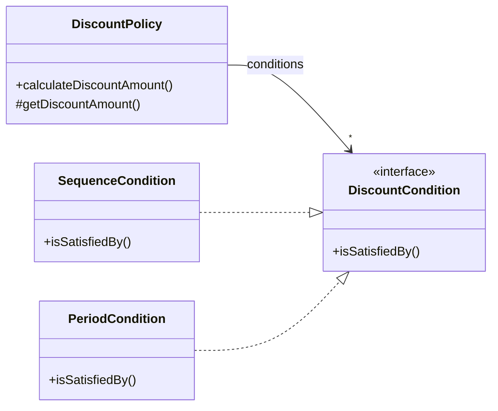
## 05 추상화와 유연성
> 추상화의 힘

추상화를 사용하면 세부적인 내용을 무시한 채 상위 정책을 쉽고 간단한게 표현할 수 있다.
추상화를 이용해 상위 정책을 표현하면 기존 구조를 수정하지 않고도 새로운 기능을 쉽게 추가하고 확장할 수 있다.
설계를 유연하게 만들 수 있다.

> 유연한 설계

할인 정책이 없는 영화는 `Movie`에 설정된 기본 금액을 그대로 사용하면 된다.
```java
public class Movie {
    public Money calculateMoveFee(Screening screening) {
        if (discount == null) {
            return fee;
        }
        
        return fee.minus(discountPolicy.calculateDiscountAmount(screening));
    }
}
```
하지만 이 방식은 할인 정책이 없는 경우를 예외 케이스로 취급하기 때문에 지금까지 일관성있던 협력 방식이 무너지게 된다.
기존 할인 정책은 할인할 금액을 계산하는 책임이 `DiscountPolicy`의 자식 클래스에 있었지만 할인 정책이 없는 경우에는 할인 금액이 0원이라는 사실을
결정하는 책임이 `DiscountPolicy`가 아닌 `Movie`쪽에 있기 때문이다. 책임의 위치를 결정하기 위해 조건문을 사용하는 것은 협력의 설계 측면에서 대부분의 경우 좋지 않은 선택이다.
<U>항상 예외 케이스를 최소화하고 일관성을 유지할 수 있는 방법을 선택하라.</U>

일관성 유지를 위해 0원의 할인 요금을 계산하는 `NoneDiscountPolicy` 클래스를 추가하자.
```java
public class NoneDiscountPolicy extends DiscountPolicy {

  @Override
  protected Money getDiscountAmount(Screening screening) {
    return Money.ZERO;
  }
}
```
```java
Movie avatar = new Movie(
        "스타워즈",
        Duration.ofMinutes(210),
        Money.wons(10000),
        new NoneDiscountPolicy()
);
```
기존 `Movie`와 `DiscountPolicy`를 수정하지 않고 `NoneDiscountPolicy`라는 클래스를 추가하는 것만으로 애플리케이션의 기능을 확장했다.
이처럼 추상화를 중심으로 코드의 구조를 설계하면 유연하고 확장 가능한 설계를 만들 수 있다. 결론은 간단하다. 유연성이 필요한 곳에 추상화를 사용하라.

> 추상 클래스와 인터페이스 트레이드 오프

`NoneDiscountPolicy` 클래스의 코드를 자세히 살펴보면 `getDiscountAmount()` 메서드가 어떤 값을 반환하더라도 상관이 없다는 사실을 알 수 있다.
부모 클래스인 `DiscountPolicy`에서 할인 조건이 없을 경우에는 `getDiscountAmount()`를 호출하지 않기 때문이다.

부모 클래스인 `DiscountPolicy`와 `NoneDiscountPolicy`를 개념적으로 결합시킨다. 이 문제를 해결하는 방법은 `DiscountPolicy`를 인터페이스로 바꾸고
`NoneDiscountPolicy`가 `DiscountPolicy`의 `getDiscountAmount()` 메서드가 아닌 `calculateDiscountAmount()` 오퍼레이션을 오버라이딩 하도록 변경하는 것이다.

```java
public interface DiscountPolicy {
    Money calculateDiscountAmount(Screening screening);
}
```
원래의 `DiscountPolicy`는 `DefaultDiscountPolicy`로 변경하고 새로 만든 `DiscountPolicy` 인터페이스를 구현하도록 한다.

```java
public abstract class DefaultDiscountPolicy implements DiscountPolicy {

    private List<DiscountCondition> conditions = Collections.emptyList();

    public DefaultDiscountPolicy(DiscountCondition... conditions) {
        this.conditions = List.of(conditions);
    }

    @Override
    public Money calculateDiscountAmount(Screening screening) {
        for (DiscountCondition condition : conditions) {
            if (condition.isSatisfiedBy(screening)) {
                return getDiscountAmount(screening);
            }
        }

        return Money.ZERO;
    }

    abstract protected Money getDiscountAmount(Screening screening);
}
```
이제 `NoneDiscountPolicy`가 `DiscountPolicy` 인터페이스를 구현하도록 변경하면 개념적인 혼란과 결합을 제거할 수 있다.

```java
public class NoneDiscountPolicy implements DiscountPolicy {

    @Override
    public Money calculateDiscountAmount(Screening screening) {
        return Money.ZERO;
    }
}

```

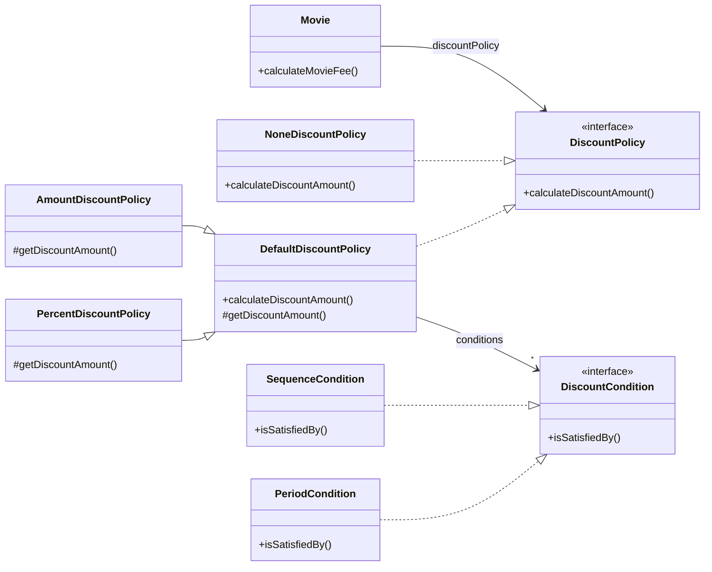
구현과 관련된 모든 것들이 트레이드오프의 대상이 될 수 있따는 사실이다.
비록 사소한 결정이라도 트레이드오프를 통해 얻어진 결론과 그렇지 않은 결론 사이의 차이는 크다.
고민하고 트레이드오프하라.

> 코드 재사용

상속은 코드를 재사용하기 위해 널리 사용되는 방법이다.
그러나 널리 사용되는 방법이라고 해서 가장 좋은 방법인 것은 아니다.
상속보다는 합성(Composition)이 더 좋은 방법이라는 이야기를 많이 들었을 것이다.
상속 대신 합성을 선호하는 이유는 무엇일까?

> 상속

상속은 객체지향 코드를 재사용하기 위해 널리 사용되는 기법이다. 하지만 두 가지 관점에서 설계에 안 좋은 영향을 미친다.

1. 캡슐화 위반
2. 설계를 유연하지 못하게 만든다.

상속의 가장 큰 문제는 캡슐화를 위반한다는 것이다.
상속을 이용하기 위해서는 부모 클래스의 구조를 잘 알고 있어야 한다.
결과적으로 부모 클래스의 구현이 자식 클래스에게 노출 되기 때문에 캡슐화가 약화 된다.
이는 결국 부모 클래스와 자식 클래스의 결합도를 높이게 되고 부모 클래스의 변경은 자식 클래스의 변경까지 이어지게 된다.

상속의 두 번째 단점은 설계가 유연하지 않다는 것이다.
상속은 부모 클래스와 자식 클래스 사이의 관계를 컴파일 시점에 결정한다. 따라서 실행 시점에 객체의 종류를 변경하는 것이 불가능하다.
`AmountDiscountPolicy`의 인스턴스를 `PercentDiscountPolicy`로 변경해야 될 경우 최선의 방법은 `PercentDiscountPolicy` 인스턴스를 생성 후
`AmountDiscountPolicy`의 상태를 복사하는 것뿐이다. 이것은 부모 클래스와 자식 클래스가 강하게 결합돼 있기 때문에 발생하는 문제다.

> 합성

`Movie`는 요금을 계산하기 위해 `DiscountPolicy`의 코드를 재사용한다.
이 방법이 상속과 다른 점은 상속이 부모 클래스의 코드와 자식 클래스의 코드를 컴파일 시점에 하나의 단위로 강하게 결합하는 데 비해
`Movie`가 `DiscountPolicy`의 인터페이스를 통해 약하게 결합된다는 것이다.
`Movie`는 `DiscountPolicy`가 외부에 `calculateDiscountAmount` 메서드를 제공한다는 사실만 알고 내부 구현에 대해서는 전혀 알지 못한다.
이처럼 인터페이스에 정의된 메서드를 통해서만 코드를 재사용하는 방법을 `합성`이라고 부른다.

합성은 상속의 두 가지 문제를 모두 해결한다.
인터페이스에 정의된 메시지를 통해서만 재사용이 가능하기 때문에 구현을 효과적으로 캡슐화 한다.
의존하는 인터페이스를 교체하는 것이 비교적 쉽기 때문에 설계를 유연하게 만든다.
따라서 코드 재사용을 위해서는 상속보다는 합성을 선호하는 것이 더 좋은 방법이다.
그렇다고 해서 상속을 절대 사용하지 말라는 것은 아니다. 다형성을 위해 인터페이스를 재사용하는 경우에는
상속과 합성을 함께 조합해서 사용할 수 밖에 없다.

***

# 03. 역할, 책임, 협력

## 01 협력
> 영화 예매 시스템 돌아보기

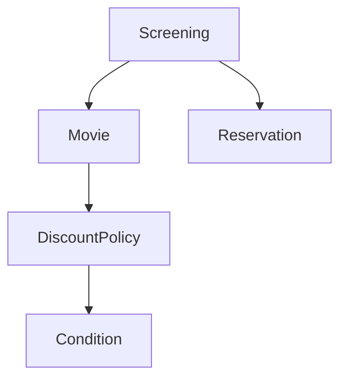
객체들이 영화 예매라는 기능을 구현하기 위해 메시지를 주고 받으면서 상호작용한다.
이처럼 객체들이 애플리케이션의 기능을 구현하기 위해 수행하는 상호작용을 `협력`이라고 한다.
객체가 협력에 참여하기 위해 수행하는 로직은 `책임`이라고 한다.
객체들이 협력 안에서 수행하는 책임들이 모여 객체가 수행하는 `역할`을 구성한다.

> 협력

협력이란 어떤 객체가 다른 객체에게 무엇인가를 요청하는 것이다.
한 객체는 어떤 것이 필요할 때 다른 객체에게 전적으로 위임하거나 서로 협력한다.
두 객체가 상호작용을 통해 더 큰 책임을 수행하는 것이다.
객체 사이의 협력을 설계할 때는 객체를 서로 분리된 인스턴스가 아닌 협력하는 파트너로 인식해야 한다.
객체들 사이의 협력을 구성하는 일련의 요청 과정과 응답의 흐름을 통해 애플리케이션의 기능이 구현된다.

> 협력이 설계를 위한 문맥을 결정한다

객체의 행동을 결정하는 것은 협력이다.
객체의 상태를 결정하는 것은 행동이다.
협력이라는 문맥을 고려하지 않고 행동을 결정하는 것은 아무런 의미가 없다.
객체는 자신의 상태를 스스로 결정하고 관리하는 존재이기 때문에 객체가 수행하는 행동에 필요한 상태도 함께 가지고 있어야 한다.

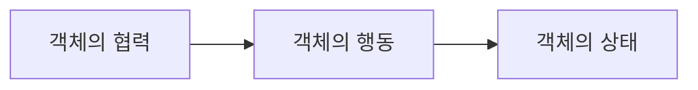
객체가 참여하는 협력이 객체를 구성하는 행동과 상태 모두를 결정한다. 따라서 협력은 일종의 문맥(context)을 제공한다.

## 02 책임
> 책임이란 무엇인가

협력에 참여하기 위해 객체가 수행하는 행동을 책임이라고 부른다.
객체의 책임은 객체가 `무엇을 할 수 있는가`와 `무엇을 알고 있는가` 로 구성된다.
객체의 책임은 크게 `하는 것`과 `아는 것`의 두가지 범주로 나누어 세분화할 수 있다.

* 하는 것
  * 객체를 생성하거나 계산을 수행하는 등의 스스로 하는 것
  * 다른 객체의 행동을 시작시키는 것
  * 다른 객체의 활동을 제어하고 조절하는 것
* 아는 것
  * 사적인 정보에 관해 아는 것
  * 관련된 객체에 관해 아는 것
  * 자신이 유도하거나 계산할 수 있는 것에 관해 아는 것

객체지향 설계에서 가장 중요한 것은 책임이다.
객체에게 얼마나 적절한 책임을 할당하느냐가 설계의 전체적인 품질을 결정한다.

> 책임할당

책임을 수행하는 데 필요한 정보를 가장 잘 알고 있는 전문가에게 그 책임을 할당한다.
이를 책임 할당을 위한 `Information expert`(정보 전문가) 패턴이라고 한다.
객체지향 설계는 시스템의 책임을 완료하는 데 필요한 더 작은 책임을 찾아내고 
이를 객체들에게 할당하는 반복적인 과정을 통해 모양을 갖춰간다.

> 책임 주도 설계

책임을 찾고 책임을 수행할 적절한 객체를 찾아 책임을 할당하는 방식으로 협력을 설계하는 방법을 `책임 주도 설계`(Responsibility-Driven Design, RDD)라고 부른다.
다음은 책임 주도 설계 방법의 과정이다.

* 시스템이 사용자에게 제공해야하는 기능인 시스템 책임을 파악한다.
* 시스템 책임을 더 작은 책임으로 분할 한다.
* 분할된 책임을 수행할 수 있는 적절한 객체 또는 역할을 찾아 책임을 할당한다.
* 객체가 책임을 수행하는 도중 다른 객체의 도움이 필요한 경우 이를 책임질 적절한 객체 또는 역할을 찾는다.
* 해당 객체 또는 역할에게 책임을 할당함으로써 두객체가 협력하게 한다.

책임 주도 설계는 자연스럽게 객체의 구현이 아닌 책임에 집중할 수 있게 한다. 
구현이 아닌 책임에 집중하는 것이 중요한 이유는 유연하고 견고한 객체지향 시스템을 위해 가장 중요한 재료가 바로 책임이기 때문이다. 

> 메시지가 객체를 결정한다

객체가 메시지를 선택하는 것이 아니라 메시지가 객체를 선택하게 한다.
두 가지 중요한 이유가 있다.

1. 최소한의 인터페이스(minimal interface)
   * 필요한 메시지가 식별될 때까지 객체의 퍼블릭 인터페이스에 어떤 것도 추가하지 않기 때문에 객체는 꼭 필요한 퍼블릭 인터페이스를 가질 수 있다.
2. 추상적인 인터페이스(abstract interface)
   * 객체의 인터페이스는 `무엇`을 하는지 표현해야 하지만 `어떻게` 수행하는지를 노출해서는 안된다. 메시지는 외부의 객체가 요쳥하는 무언가를 의미하기 때문에 메시지를 먼저 식별하면 무엇을 수행할지에 초점을 맞추는 인터페이스를 얻을 수 있다.  

> 행동이 상태를 결정한다

상태는 단지 객체가 행동을 정상적으로 수행하기 위해 필요한 재료일뿐이다. 
중요한 것은 객체의 상태가 아니라 행동이다.
객체가 가질 수 있는 상태는 행동을 결정하고 나서야 비로소 결정할 수 있다. 
협력이 객체의 행동을 결정하고  행동이 상태를 결정한다.
그리고 그 행동이 바로 객체의 책임이 된다.

## 03 역할
> 역할과 협력

객체가 어떤 특정한 협력 안에서 수행하는 책임의 집합을 역할이라고 부른다.
실제로 협력을 모델링할 때는 특정한 객체가 아니라 역할에 책임을 할당한다고 생각하는게 좋다.

> 유연하고 재사용 가능한 협력

역할이 중요한 이유는 역할을 통해 유연하고 재사용 가능한 협력을 얻을 수 있기 때문이다.
영화 예매 도메인에는 금액 할인 정책과 비율 할인 정책이라는 두 가지 종류의 가격 할인 정책이 존재한다.
때문에 `AmountDiscountPolicy` 인스턴스와 `PercentDiscountPolicy` 인스턴스라는 두 가지 종류의 객체가 할인 요금을 계산하라 메세지에 응답할 수 있어야 한다.
두 협력을 구현하면 대부분의 코드가 중복된다.
문제를 해결하기 위해서는 객체가 아닌 책임에 초점을 맞춰야 한다.
순수하게 책임의 관점에서 두 협력을 바라보면 모두 할인 요금 계산이라는 동일한 책임을 수행한다는 사실을 알 수 있다.
객체라는 존재를 지우고 할인 요금을 계산하라는 메시지에 응답할 수 있는 대표자를 생각한다면 두 협력을 하나로 통합할 수 있을 것이다.
이 대표자를 협력 안에서 두 종류의 객체로 교대로 바꿔서 끼울 수 있는 일종의 슬롯으로 생각할 수 있다.
이 슬롯이 바로 역할이다.

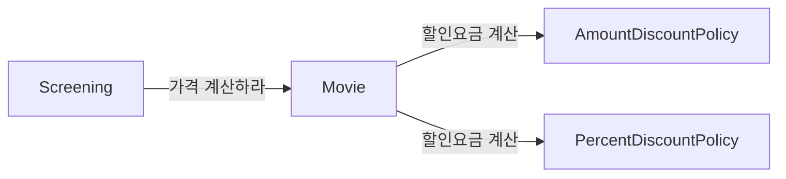
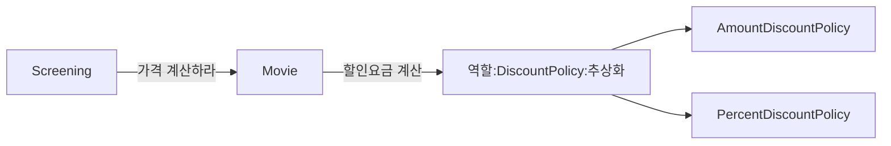

> 객체 대 역할

협력에 적합한 책임을 수행하는 대상이 한 종류라면 간단하게 객체로 간주한다.
만약 여러 종류의 객체들이 참여할 수 있다면 역할이라고 부르면 된다.
유연하고 확장 가능하며 일관된 구조를 가지는 시스템을 구축하는 데 역할은 매우 중요하다.

> 역할과 추상화

역할은 공통의 책임을 바탕으로 객체의 종류를 숨기기 때문에 이런 관점에서 역할을 객체의 추상화로 볼 수 있다.
따라서 추상화가 가지는 두 가지 장점을 협력의 관점에서 역할에도 동일하게 적용 될 수 있다.

1. 세부 사항에 억눌리지 않고도 상위 수준의 정책을 쉽고 간단하게 표현할 수 있다.
2. 설계를 유연하게 만들 수 있다.

> 배우와 배역

연극의 배역과 배우 간의 관계에는 다음과 같은 특성이 존재한다.

* 배역은 연극 배우가 특정 연극에서 연기하는 역할이다.
* 배역은 연극이 상영되는 동안에만 존재하는 일시적인 개념이다.
* 연극이 끝나면 연극 배우는 배역이라는 역할을 벗어 버리고 원래의 연극 배우로 돌아온다.
* 서로 다른 배우들이 동일한 배역을 연기할 수 있다.
* 하나의 배우가 다양한 연극 안에서 서로 다른 배역을 연기할 수 있다.

연극 안에서 배역을 연기하는 배우는, 협력 안에서 역할을 수행하는 객체라는 관점이 가진 입체적인 측면들을 훌륭하게 담아낸다.
객체는 다양한 역할을 가질 수 있다.
객체는 협력에 참여할 때 협력 안에서 하나의 역할로 보여진다.
객체가 다른 협력에 참여할 때는 다른 역할로 보여진다.
협력의 관점에서 동일한 역할을 수행하는 객체들은 서로 대체 가능하다.
역할은 특정한 객체의 종류를 캡슐화하기 때문에 동일한 역할을 수행하고 계약을 준수하는 대체 가능한 객체들은 다형적이다.

***

# 04. 설계 품질과 트레이드오프
## 01 데이터 중심의 영화 예매 시스템
> 데이터를 준비하자

책임 중심의 설계가 '책임이 무엇인가'를 묻는 것으로 시작한다면 데이터 중심의 설계는 객체가 내부에 저장해야하는 '데이터가 무엇인가'를 묻는 것으로 시작한다.

```java
public class Movie {
    private String title;
    private Duration runningTime;
    private Money fee;
    private List<DiscountCondition> discountConditionList;

    private MovieType movieType;
    private Money discountAmount;
    private double discountPercentage;
}
```
가장 두드러지는 차이점은 할인 조건의 목록이 인스턴스 변수로 `Movie` 안에 직접 포함돼 있다는 것이다.
또한 할인 정책을 `DiscountPolicy`라는 별도의 클래스로 분리했던 예전 예제와 달리 
금액 할인 정책에 사용되는 할인 금액과 비율 할인 정책에 사용되는 할인 비율을 `Movie` 안에서 직접 정의하고 있다.

할인 정책은 영화별로 오직 하나만 지정할 수 있기에 한 시점에 `discountAmount`와 `discountPercentage` 중 하나의 값만 사용될 수 있다.
영화의 할인 정책의 종류는 어떻게 알 수 있을까? 할인 정책의 종류를 결정하는 것이 바로 `movieType`이다.

데이터 중심의 설계에서는 객체가 포함해야 하는 데이터에 집중한다.
객체의 종류를 저장하는 인스턴스 변수(movieType)와 인스턴스의 종류에 따라 배타적으로 사용될 인스턴스 변수를 하나의 클래스 안에 포함시키는 방식은 데이터 중심의 설계 안에서 흔히 볼수 있는 패턴이다.

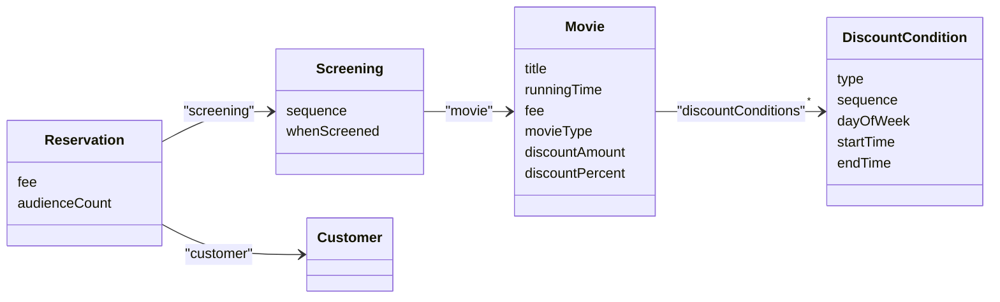

> 영화를 예매하자

```java
public class ReservationAgency {

    public Reservation reserve(Screening screening, Customer customer, int audienceCount) {

        Movie movie = screening.getMovie();

        boolean discountable = false;
        for (DiscountCondition condition : movie.getDiscountConditionList()) {
            if (condition.getDiscountType() == DiscountType.PEROID) {
                discountable = screening.getWhenScreened().getDayOfWeek().equals(condition.getDayOfWeek())
                        && condition.getStartTime().compareTo(screening.getWhenScreened().toLocalTime()) <= 0
                        && condition.getEndTime().compareTo(screening.getWhenScreened().toLocalTime()) >= 0;
            } else {
                discountable = condition.getSequence() == screening.getSequence();
            }

            if (discountable) {
                break;
            }
        }

        Money fee;
        if (discountable) {
            Money discountAmount = Money.ZERO;
            switch (movie.getMovieType()) {
                case AMOUNT_DISCOUNT -> discountAmount = movie.getDiscountAmount();
                case PERCENT_DISCOUNT -> discountAmount = movie.getFee().times(movie.getDiscountPercentage());
                case NONE_DISCOUNT -> discountAmount = Money.ZERO;
            }

            fee = movie.getFee().minus(discountAmount);
        } else {
            fee = movie.getFee();
        }

        return new Reservation(customer, screening, fee, audienceCount);
    }
}
```
reserve 메서드는 크게 두 부분으로 나눌수 있다.
첫 번째는 `DiscountCondition`에 대해 루프를 돌면서 할인 가능 여부를 확인하는 for문이다.
두 번째는 `discountable` 변수의 값으 체크하고 적절한 활인 정책에 따라 예매 요금을 계산하는 if문이다.
책임 중심의 설계 방법과 비교해 보면서 두 방법의 장단점을 파악해보자.

## 02 설계 트레이드오프
> 캡슐화

변경될 가능성이 높은 부분을 구현이라고 부르고 상대적으로 안정적인 부분을 인터페이스라고 부른다.
캡슐화의 가장 중요한 원리는 불안정한 구현 세부사항을 안정적인 인터페이스 뒤로 캡슐화하는 것이다.
정리하면 캡슐화란 변경 가능성이 높은 부분을 객체 내부로 숨기는 추상화 기법이다.
변경될 수 있는 어떤 것이라도 캡슐화해야한다. 이것이 바로 객체지향 설계의 핵심이다.
 
> 응집도와 결합도

#### 응집도
모듈에 포함된 내부 요소들이 연관돼 있는 정도를 나타낸다. 
모듈 내의 요소들이 하나의 목적을 위해 긴밀하게 협력한다면 그 모듈은 높은 응집도를 가진다. 
모듈 내의 요소들이 서로 다른 목적을 추구한다면 그 모듈은 낮은 응집도를 가진다.

#### 결합도
의존성의 정도를 나타내며 다른 모듈에 대해 얼마나 많은 지식을 갖고 있는지 나타내는 척도다.
어떤 모듈이 다른 모듈에 대해 자세한 부분까지 알고 있다면 두 모듈은 높은 결합도를 가진다.
어떤 모듈이 다른 모듈에 대해 필요한 부분만 알고 있다면 두 모듈은 낮은 결합도를 가진다.

높은 응집도와 낮은 결합도를 추구하는 이유는 단 한가지다.
그것이 설계를 변경하기 쉽게 만들기 때문이다.

## 03 데이터 중심의 영화 예매 시스템의 문제점
> 캡슐화 위반

데이터 중심으로 설계한 `Movie` 클래스를 보면 오직 메서드를 통해서만 객체의 내부 상태에 접근할 수 있다는 것을 알 수 있다.
```java
public class Movie {
    private Money fee;
    
    public Money getFee() {
        return fee;
    }
    
    public void setFee(Money fee) {
        this.fee = fee;
    }
}
```
위 코드는 직접 객체의 내부에 접근할 수 없기 때문에 캡슐화의 원칙을 지키고 있는 것처럼 보인다.
하지만 `getFee()`, `setFee()` 메서드는 `Movie` 내부에 `Money` 타입의 fee라는 인스턴스 변수가 존재한다는 사실을 퍼블릭 인터페이스에 노골적으로 드러낸다.
`Moive`가 캡슐화의 원칙을 어기게 된 근본적인 원인은 객체가 수행할 책임이 아니라 내부에 저장할 데이터에 초점을 맞췄기 때문이다.

설계할 때 협력에 관해 고민하지 않으면 캡슐화를 위반하는 과도한 접근자와 수정자를 가지게 되는 경향이 있다.
객체가 사용될 문맥을 추측할 수밖에 없는 경우 개발자는 어떤 상황에서도 해당 객체가 사용될 수 있게 최대한 많은 접근자 메서드를 추가하게 되는 것이다.
앤런 홀럽(Allen Holub)은 이처럼 접근자와 수정자에 과도하게 의존하는 설계 방식을 `추측에 의한 설계 전략(design-by-guessing strategy)`라고 부른다.
그 결과, 캡슐화의 원칙을 위반하는 변경에 취약한 설계를 얻게 된다.

> 높은 결합도

데이터 중심 설계가 가지는 또 다른 단점은 여러 데이터 객체들을 사용하는 제어로직이 특정 객체 안에 집중되기 때문에 하나의 제어 객체가 다수의 데이터 객체에 강하게 결합된다는 것이다.
이 결합도로 인해 어떤 데이터 객체를 변경하더라도 제어 객체를 함께 변경할 수 밖에 없다.

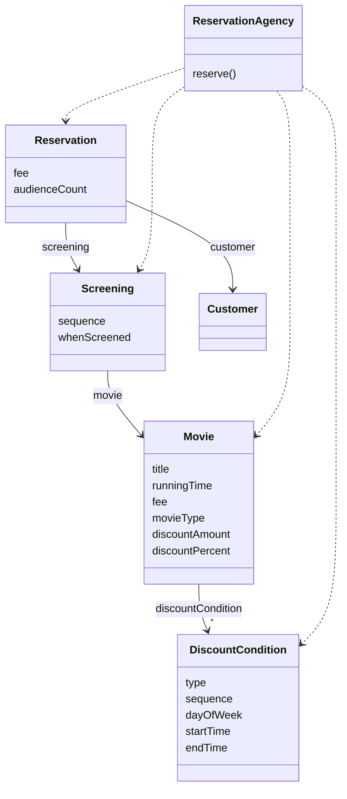
영화 예매 시스템의 대부분의 제어 로직을 가지고 있는 `ReservationAgency`가 모든 데이터 객체에 의존한다.
`DiscountCondition`, `Screening`이 수정되면 `ReservationAgency`도 수정해야 한다. 
시스템의 모든 변경이 `ReservationAgency`의 변경을 유발한다.

데이터 중심의 설계는 전체 시스템을 하나의 거대한 의존성 덩어리로 만들어 버리기 때문에 어떤 변경이라도 일단 발생하고 나면 시스템 전체가 요동칠 수밖에 없다.

> 낮은 응집도

서로 다른 이유로 변경되는 코드가 하나의 모듈 안에 공존할 때 응집도가 낮다고 말한다.
낮은 응집도는 두 가지 측면에서 설계에 문제를 일으킨다.

* 변경의 이유가 서로 다른 코드들을 하나의 모듈 안에 뭉쳐놓았기 때문에 변경과 아무 상관이 없는 코드들이 영향을 받게 된다.
  * `ReservationAgency` 안에 할인 정책을 선택하는 코드와 할인 조건을 판단하는 코드가 함께 존재하기 때문에 새로운 할인 정책을 추가하는 작업이 할인 조건에도 영향을 미칠 수 있다.
  * 어떤 코드를 수정한 후 아무런 상관도 없던 코드에 문제가 발생하는 것은 모듈의 응집도가 낮을 때 발생하는 대표적인 증상이다.
* 하나의 요구사항 변경을 반영하기 위해 동시에 여러 모듈을 수정해야 한다.
  * 응집도가 낮은 경우 모듈에 위치해야할 책임의 일부가 엉뚱한 곳에 위치하게 되기 때문이다.
  * 새로운 할인 정책이 추가 될 경우 `MovieType`에 새로운 할인 정책을 표현하는 열거형 값을 추가하고, `ReservationAgency`의 `reserve()` 메서드의 switch 구문에 새로운 case 절을 추가해야 한다.
  * 또한 새로운 할인 정책에 따라 할인 요금을 계산하기 위해 필요한 데이터도 `Movie`에 추가해야 한다.

어떤 요구사항 변경을 수용하기 위해 하나 이상의 클래스를 수정해야 하는 것은 응집도가 낮다는 증거다.

## 04 자율적인 객체를 향해
> 캡슐화를 지켜라

캡슐화는 설계의 제 1원리다.
낮은 응집도와 높은 결합도라는 문제로 몸살을 앓게 된 근본적인 원인은 캡슐화의 원칙을 위반했기 때문이다.

```java
class Rectangle {
    private int left;
    private int top;
    private int right;
    private int bottom;
    
    public Rectangle(int left, int top, int right, int bottom) {
        this.left = left;
        this.top = top;
        this.right = right;
        this.bottom = bottom;
    }
    
    public int getLeft() {
        return this.left;
    }
    
    public void setLeft(int left) {
        this.left = left;
    }

    public int getTop() {
      return this.top;
    }
  
    public void setTop(int top) {
      this.top = top;
    }

    public int getRight() {
      return this.right;
    }
  
    public void setRight(int right) {
      this.right = right;
    }

    public int getBottom() {
      return this.bottom;
    }
  
    public void setBottom(int bottom) {
      this.bottom = bottom;
    }
}
```

```java
class AnyClass {
    void anyMethod(Rectangle rectangle, int multiple) {
        rectangle.setRight(rectangle.getRight() * multiple);
        rectangle.setBottom(rectangle.getBottom() * multiple);
    }
}
```
사각형의 너비와 높이를 증가시키는 코드다.
이 코드는 많은 문제점이 도사리고 있다.
1. 코드 중복
   * 다른 곳에서도 사각형의 너비와 높이를 증가시키는 코드가 필요하다면 아마 그곳에서도 getter, setter를 호출하는 유사한 코드가 존재하게 될 것이다.
2. 변경에 취약
   * right와 bottom 대신 length, height를 이용해서 사각형을 표현하도록 수정한다면 getter, setter는 내부 구현을 인터페이스의 일부로 만들기 때문에 인스턴스 변수들의 존재를 외부에 노출하게 된다.
   * 결과적으로 각각의 getter, setter들은 getLength, setLength, getHeight, setHeight로 변경해야하고 이 변경은 getter, setter를 사용하는 모든 코드에 영향을 끼친다

```java
class Rectangle {
    private int left;
    private int top;
    private int right;
    private int bottom;
    
    public Rectangle(int left, int top, int right, int bottom) {
        this.left = left;
        this.top = top;
        this.right = right;
        this.bottom = bottom;
    }
    
    public void enlarge(int multiple) {
        right *= multiple;
        bottom *= multiple;
    }
}
```
Rectangle을 변경하는 주체를 외부 객체에서 Rectangle로 이동시켰다.
자신의 크기는 Rectangle 스스로가 증가시키도록 `책임을 이동`시킨 것이다. 이것이 바로 객체가 스스로 책임진다는 말의 의미다.

> 스스로 자신의 데이터를 책임지는 객체

객체는 단순한 데이터 제공자가 아니다.
객체 내부에 저장되는 데이터보다 객체가 협력에 참여하면서 수행할 책임을 정의하는 오퍼레이션이 더 중요하다.

"이 객체가 어떤 데이터를 포함해야 하는가?"라는 질문은 다음과 같은 두 개의 개별적인 질문으로 분리해야 한다.
* 이 객체가 어떤 데이터를 포함해야 하는가?
* 이 객체가 데이터에 대해 수행해야 하는 오퍼레이션은 무엇인가?

두 질문을 조합하면 객체의 내부 상태를 저장하는 방식과 저장된 상태에 대해 호출할 수 있는 오퍼레이션의 집합을 얻을 수 있다.
다시 말해 새로운 데이터 타입을 만들 수 있는 것이다.

```java
public class DiscountCondition {
    private DiscountType discountType;
    private int sequence;
    private DayOfWeek dayOfWeek;
    private LocalTime startTime;
    private LocalTime endTime;
}
```
첫 번째 질문은 어떤 데이터를 관리해야 하는 지를 묻는 것이다.
`DiscountCondition`이 관리하는 데이터를 결정해 놓았다.

두 번째 질문은 이 데이터에 대해 수행할 수 있는 오퍼레이션이 무엇인가를 묻는 것이다.
할인 조건에는 순번 조건과 기간 조건의 두 가지 종류가 존재한다.
`DiscountCondition`은 순번 조건일 경우 `sequence`를 이용해서 할인 여부를 결정하고,
기간 조건일 경우에는 `dayOfWeek`, `startTime`, `endTime`을 이용해 할인 여부를 결정한다.

두 가지 할인 조건을 판단할 수 있게 두 개의 `isDiscountable` 메서드가 필요하다.

```java
public class DiscountCondition {

    private DiscountType discountType;
    private int sequence;
    private DayOfWeek dayOfWeek;
    private LocalTime startTime;
    private LocalTime endTime;


    public boolean isDiscountable(DayOfWeek dayOfWeek, LocalTime time) {
        if (discountType != DiscountType.PEROID) {
            throw new IllegalArgumentException();
        }

        return this.dayOfWeek.equals(dayOfWeek)
                && !this.startTime.isAfter(time)
                && !this.endTime.isBefore(time);
    }

    public boolean isDiscountable(int sequence) {
        if (discountType != DiscountType.SEQUENCE) {
            throw new IllegalArgumentException();
        }

        return this.sequence == sequence;
    }
}
```

이제 `Movie`를 구현하자.
첫 번째 질문은 `Movie`가 어떤 데이터를 포함해야 하는가를 묻는 것이다.

```java
public class Movie {
    private String title;
    private Duration runningTime;
    private Money fee;
    private List<DiscountCondition> discountConditionList;

    private MovieType movieType;
    private Money discountAmount;
    private double discountPercentage;
}
```

두 번째 질문은 이 데이터를 처리하기 위해 어떤 오퍼레이션이 필요한지 묻는 것이다.
`Moive`가 포함하는 데이터를 살펴보면 영화 요금을 계산하는 오퍼레이션과 할인 여부를 판단하는 오퍼레이션이 필요할 것 같다.

먼저 요금을 계산하는 오퍼레이션을 구현하자.
요금을 계산하기 위해서는 할인 정책을 염두에 둬야 한다. 
따라서 `DiscountCondition`과 마찬가지로 할인 정책의 타입을 반환하는 `getMovieType` 메서드와 
정책별로 요금을 계산하는 세 가지 메서드를 구현해야 한다.

```java
public class Movie {
    private String title;
    private Duration runningTime;
    private Money fee;
    private List<DiscountCondition> discountConditionList;

    private MovieType movieType;
    private Money discountAmount;
    private double discountPercentage;

    public Money calculateAmountDiscountedFee() {
        if (movieType != MovieType.AMOUNT_DISCOUNT) {
            throw new IllegalStateException();
        }

        return fee.minus(discountAmount);
    }

    public Money calculatePercentDiscountedFee() {
        if (movieType != MovieType.PERCENT_DISCOUNT) {
            throw new IllegalStateException();
        }

        return fee.minus(fee.times(discountPercentage));
    }

    public Money calculateNoneDiscountedFee() {
        if (movieType != MovieType.NONE_DISCOUNT) {
            throw new IllegalStateException();
        }

        return fee;
    }
}
```
`Moive`는 `DiscountCondition`의 목록을 포함하기 때문에 할인 여부를 판단하는 오퍼레이션 역시 포함해야 한다.
`isDiscountable` 메서드를 추가하자. 

```java
public class Movie {
  public boolean isDiscountable(LocalDateTime whenScreened, int sequence) {
    for (DiscountCondition discountCondition : discountConditionList) {
      if (discountCondition.getDiscountType() == DiscountType.PEROID) {
        if (discountCondition.isDiscountable(whenScreened.getDayOfWeek(), whenScreened.toLocalTime())) {
          return true;
        }
      } else {
        if (discountCondition.isDiscountable(sequence)) {
          return true;
        }
      }
    }

    return false;
  }
}
```

이제 `Screening`을 살펴보자.
`Screening`이 관리하는 데이터와 메서드다.

```java
public class Screening {

  private Movie movie;
  private int sequence;
  private LocalDateTime whenScreened;

  public Screening(Movie movie, int sequence, LocalDateTime whenScreened) {
    this.movie = movie;
    this.sequence = sequence;
    this.whenScreened = whenScreened;
  }

  public Money calculateFee(int audienceCount) {
    switch (movie.getMovieType()) {
      case AMOUNT_DISCOUNT:
        if (movie.isDiscountable(whenScreened, sequence)) {
          return movie.calculateAmountDiscountedFee().times(audienceCount);
        }
        break;
      case PERCENT_DISCOUNT:
        if (movie.isDiscountable(whenScreened, sequence)) {
          return movie.calculatePercentDiscountedFee().times(audienceCount);
        }
        break;
      case NONE_DISCOUNT:
        return movie.calculateNoneDiscountedFee().times(audienceCount);
    }
    return movie.calculateNoneDiscountedFee().times(audienceCount);
  }
  

  public Movie getMovie() {
    return movie;
  }

  public void setMovie(Movie movie) {
    this.movie = movie;
  }

  public int getSequence() {
    return sequence;
  }

  public void setSequence(int sequence) {
    this.sequence = sequence;
  }

  public LocalDateTime getWhenScreened() {
    return whenScreened;
  }

  public void setWhenScreened(LocalDateTime whenScreened) {
    this.whenScreened = whenScreened;
  }
}

```

`ReservationAgency`는 `Screening`의 `calculateFee` 메서드를 호출해 예매 요금을 계산한 후 계산되는 요금을 이용해 `Reservation`을 생성한다.
```java
public class ReservationAgency {

    public Reservation reservation(Screening screening, Customer customer, int audienceCount) {
        Money fee = screening.calculateFee(audienceCount);
        return new Reservation(customer, screening, fee, audienceCount);
    }
}
```
결합도 측면에서 `ReservationAgency`에 의존성이 몰려있던 첫 번째 설계보다는 개선된 것으로 보인다.
이 것은 두 번째 설계가 첫 번째 설계보다 내부 구현을 더 면밀하게 캡슐화 하고 있기 때문이다.

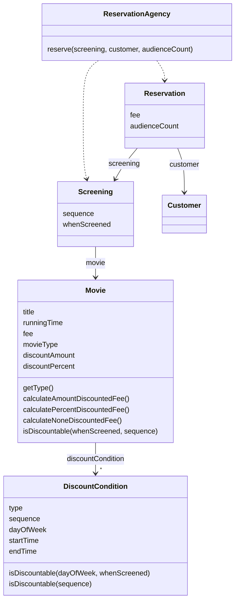

## 05 하지만 여전히 부족하다.
> 캡슐화 위반

`DiscountCondition`의 `isDiscountable` 메서드는 시그니처를 통해 객체 내부의 상태를 그대로 드러냈다.
`DiscountCondition`의 객체 내부의 상태가 변경되면 `isDiscountable`을 호출하는 모든 코드에 영향을 끼칠 것이다.
내부 구현의 변경이 외부로 퍼져나가는 파급 효과(ripple effect)는 캡슐화가 부족하다는 명백한 증거다.
따라서 변경 후의 설계는 자기 자신을 스스로 처리한다는 점에서 이전의 설계보다 분명히 개선됐지만 여전히 내부의 구현을 캡슐화하는 데는 실패한 것이다.

`Movie`의 요금 계산 메서드들은 객체의 파라미터나 반환 값을 내부에 포함된 속성에 대한 어떤 정보도 노출하지 않는다.
따라서 캡슐화의 원칙을 지키고 있다고 생각할 수도 있지만, `Movie` 역시 내부 구현을 인터페이스에서 노출시키고 있다.
여기서 노출시키는 것은 할인 정책의 종류다. `calculateAmountDiscountedFee`, `calculatePercentDiscountedFee`, `calculateNoneDiscountedFee` 라는
세 개의 메서드는 할인 정책의 세 가지 종류를 드러내고 있다.
만약 새로운 할인 정책이 추가 되거나 기존 할인 정책이 제거 된다면 이 메서드들에 의존하는 모든 클라이언트가 영향을 받을 것이다.

```
캡슐화의 진정한 의미
캡슐화는 단순히 객체 내부의 데이터를 외부로부터 감추는 것 이상을 의미한다.
캡슐화는 변경될 수 있는 어떤 것이다로 감추는 것을 의미한다.
내부 구현의 변경으로 인해 외부의 객체가 영향을 받는다면 캡슐화를 위반한 것이다.
```

> 높은 결합도

캡슐화의 위반으로 인해 `DiscountCondtion`의 내부 구현이 외부로 노출됐기 때문에 `Movie`와 `DiscountCondition` 사이의 결합도는 높을 수 밖에 없다.
두 객체 사이의 결합도가 높은 경우 한 객체의 구현을 변경할 경우 다른 객체에게 변경의 영향이 전파될 확률이 높다.

```java
public class Movie {
    
  public boolean isDiscountable(LocalDateTime whenScreened, int sequence) {
    for (DiscountCondition discountCondition : discountConditionList) {
      if (discountCondition.getDiscountType() == DiscountType.PEROID) {
        if (discountCondition.isDiscountable(whenScreened.getDayOfWeek(), whenScreened.toLocalTime())) {
          return true;
        }
      } else {
        if (discountCondition.isDiscountable(sequence)) {
          return true;
        }
      }
    }
    return false;
  }
  
}
```
* `DiscountCondition`의 기간 할인 조건의 명칭이 PERIOD에서 다른 값으로 변경된다면 `Movie`를 수정해야 한다.
* `DiscountCondition`의 종류가 추가되거나 삭제된다면 `Movie`의 `isDiscountable` 메서드의 `if ~ else` 구문을 수정해야 한다.
* `DiscountCondition`의 만족 여부를 판단하는데 필요한 정보가 변경되면 `Movie`의 `isDiscountable` 메서드 시그니처도 함께 변경이 되어야 한다.

`DiscountCondition`의 인터페이스가 아니라 구현을 변경해도 `Movie`를 변경해야 한다는 것은 결합도가 높다는 것을 의미한다. 

> 낮은 응집도

앞에서 설명한 것처럼 `DiscountConditon`이 할인 여부를 판단하는데 필요한 정보가 변경된다면 `Movie`의 `isDiscountable` 메서드로 전달해야하는 파라미터의 종류를 변경해야 하고,
이로 인해 `Screening`에서 `Moive`의 `isDiscountable` 메서드를 호출하는 부분도 함께 변경해야 한다.
결과적으로 할인 조건의 종류를 변경하기 위해서는 `DiscountCondtion`, `Movie`, `Screening`을 함께 수정해야 한다.
하나의 변경을 수용하기 위해 코드의 여러 곳을 동시에 변경해야 한다는 것은 응집도가 낮다는 증거다.

응집도가 낮은 이유도 캡슐화를 위반했기 때문이다.
앞서 설명한 경우 `DiscountCondition`이나 `Movie`에 위치해야하는 로직이 `Screening`으로 새어나왔기 때문이다.

## 06 데이터 중심 설계의 문제점
> 데이터 중심 설계는 객체의 행동보다는 상태에 초점을 맞춘다.

데이터 중심의 설계를 시작할 때 던졌던 첫 번째 질무은 "이 객체가 포함해야하는 데이터가 무엇인가?"다.
데이터는 구현의 일부라는 사실을 명심하라.
데이터 주도 설계는 처음부터 데이터에 관해 결정하도록 강요하기 때문에 너무 이른 시기에 내부 구현에 초점을 맞추게 된다.

데이터 중심의 관점에서는 객체는 그저 단순한 데이터의 집합체일 뿐이다.
데이터 객체를 사용하는 절차를 분리된 별도의 객체 안에 구현하게 된다.
때문에 객체의 캡슐화는 완전히 무너질 수 밖에 없다.
데이터를 먼저 결정하고 데이터를 처리하는데 필요한 오퍼레이션을 나중에 결정하는 방식은 데이터에 관한 지식이 객체의 인터페이스에 고스란히 드러나게 된다.

> 데이터 중심 설계는 객체를 고립시킨 채 오퍼레이션을 정의하도록 만든다.

객체지향 애플리케이션을 구현한다는 것은 협력하는 객체들의 공동체를 구축한다는 것을 의미한다.
따라서 협력이라는 문맥 안에서 필요한 책임을 결정하고, 이를 수행할 적절한 객체를 결정하는 것이 가장 중요하다.

올바른 객체지향 설계의 무게 중심은 항상 객체 외부에 맞춰져 있어야 한다.
객체 내부에 어떤 상태를 가지고 그 상태를 어떻게 관리하는가는 부가적인 문제다.
중요한 것은 객체가 다른 객체와 `협력`하는 방법이다.

데이터 중심 설계에서 무게 중심은 객체의 내부로 향한다.
실행 문맥에 대한 고민 없이 객체가 관리할 데이터의 세부 정보를 먼저 결정한다.
객체의 구현이 이미 결정된 상태에서 다른 객체와 협력 방법을 고민하기 때문에 
이미 구현된 객체의 인터페이스를 억지로 끼워맞춰줄 수 밖에 없다.

***

# 05. 책임 할당하기
## 01 책임 주도 설계를 향해
> 데이터보다 행동을 먼저 결정하라

객체의 데이터에서 행동으로 무게 중심을 옮기기 위해서는 설계하기 위한 질문의 순서를 바꿔야 한다.
'이 객체가 수행해야 하는 책임은 무엇인가'를 결정하고 '이 책임을 수행하는데 필요한 데이터는 무엇인가'를 결정한다.
즉 책임을 결정한 후에 객체의 상태를 결정한다는 것이다.


> 협력이라는 문맥 안에서 책임을 결정하라

객체에게 적절한 책임을 할당하기 위해서는 협력이라는 문맥을 고려해야 한다.
협력이라는 문맥에서 적절한 책임이란 곧 클라이언트의 관점에서 적절한 책임을 의미한다.
올바른 객체지향 설계는 클라이언트가 전송할 메시지를 결정한 후에야 비로소 객체의 상태를 저장하는데 필요한 내부 데이터에 관해 고민하기 시작한다.
 
> 책임 주도 설계

* 시스템이 사용자에게 제공해야 하는 기능인 시스템 책임을 파악한다.
* 시스템 책임을 더 작은 책임으로 분할한다.
* 분할된 책임을 수행할 수 있는 적절한 객체 또는 역할을 찾아 책임을 할당한다.
* 객체가 책임을 수행하는 도중 다른 객체의 도움이 필요한 경우 이를 책임질 적절한 객체 또는 역할을 찾는다.
* 해당 객체 또는 역할에게 책임을 할당함으로써 두 객체가 협력하게 한다.

## 02 책임 할당을 위한 GRASP 패턴
GRASP는 "General Responsibility Assignment Software Pattern"(일반적인 책임 할당을 위한 소프트웨어 패턴)의 약자로 객체에게 책임을 할당할 때 지침으로
삼을 수 있는 원칙들의 집합을 패턴 형식으로 정리한 것이다.

> 도메인 개념에서 출발하기

설계를 시작하기 전에 도메인에 대한 개략적인 모습을 그려보는 것이 유용하다.
어떤 책임을 할당 해야 할 때 가장 먼저 고민해야 하는 유력한 후보는 바로 도메인 개념이다.

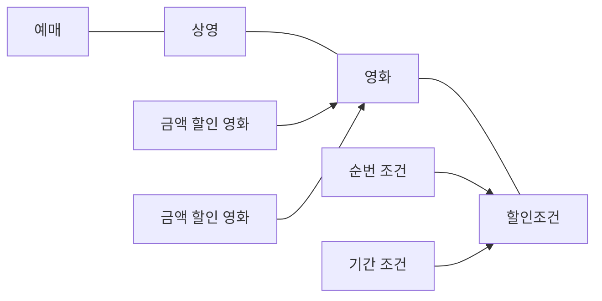
> 정보 전문가에게 책임을 할당하라

책임 주도 설계 방식의 첫 단계는 애플리케이션이 제공해야 하는 기능을 애플리케이션의 책임으로 생각하는 것이다.
이 책임을 애플리케이션에 대해 전송된 메시지로 간주하고 이 메시지를 책임질 첫 번째 객체를 선택하는 것으로 설계를 시작한다.

사용자에게 제공해야 하는 기능은 영화를 예매하는 것이다. 이를 책임으로 간주하면 애플리케이션은 영화를 예매할 책임이 있다고 할 수 있다.
이제 책임을 수행하는데 필요한 메시지를 결정해야 한다.
메시지는 메시지를 수신할 객체가 아니라 메시지를 전송할 객체의 의도를 반영해서 결정해야 한다.

첫 번째 질문은 다음과 같다.
`메시지를 전송할 객체는 무엇을 원하는가?`
협력을 시작하는 객체는 미정이지만 이 객체가 원하는 것은 바로 영화를 예매하는 것이다. 
메시지의 이름은 `영화를 예매하라`가 적절한 것 같다.

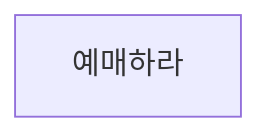

메시지를 결정했으므로 메시지에 적합한 객체를 선택해야 한다. 두번째 질문은 다음과 같다.
`메시지를 수신할 적합한 객체는 누구인가?`

객체에게 책임을 할당하는 첫 번째 원칙은 책임을 수행할 정보를 알고 있는 객체에게 책임을 할당하는 것이다.
`GRASP`에서는 이를 `INFORMATION EXPERT(정보 전문가)` 패턴이라고 부른다.

> INFORMATION EXPERT 패턴   
> 책임을 수행하는 데 필요한 정보를 가지고 있는 객체에게 할당하라.   
> 정보를 알고 있는 객체만이 책임을 어떻게 수행할지 스스로 결정할 수 있기 때문이다.   
> INFORMATION EXPERT 패턴을 따르면 정보와 행동을 최대한 가까운 곳에 위치시키기 때문에 캡슐화를 유지할 수 있다.   
> 필요한 정보를 가진 객체들로 책임이 분산되기 때문에 더 응집력있고 이해하기 쉬워진다. 따라서 높은 응집도가 가능하다.

책임을 수행하는 객체가 정보를 '알고' 있다고 해서 그 정보를 '저장'하고 있을 필요는 없다.
해당 정보를 제공할 수 있는 다른 객체를 알고 있거나 필요한 정보를 계산해서 제공할 수도 있다.
어떤 방식이건 정보 전문가가 데이터를 반드시 저장하고 있을 필요는 없다는 사실을 이해하는 것이 중요하다.

예매하는 데 필요한 정보를 가장 많이 알고 있는 객체는 상영이다.
상영은 영화에 대한 정보와, 상영 시간, 순서처럼 영화 예매에 필요한 다양한 정보를 알고 있다.

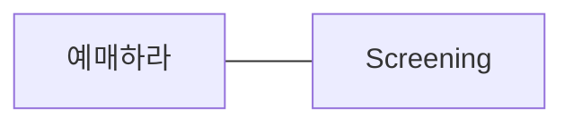

예매하라는 메시지를 수신했을 때 `Screening`이 수행해야하는 작업의 흐름을 생각해보자.
이제부터는 외부의 인터페이스가 아닌 `Screening`의 내부로 들어가 메시지를 처리하기 위해 필요한 절차와 구현을 고민해보는 것이다.

만약 스스로 처리할 수 없는 작업이 있다면 외부에 도음을 요청해야 한다.
이 요청이 외부로 전송해야 하는 새로운 메시지가 되고, 최종적으로 이 메시지가 새로운 객체의 책임으로 할당된다.
이 같은 연쇄적인 메시지 전송과 수신을 통해 협력 공동체가 구성되는 것이다.

예매하라 메시지를 완료하기 위해서는 예매 가격을 계산하는 작업이 필요하다.
예매 가격은 영화 한 편의 가격을 계산한 금액에 예매 인원수를 곱한 값으로 구할 수 있다.

따라서 영화 한 편의 가격을 알아야 한다. `Screening`은 가격을 계산하는 데 필요한 정보를 모르기 때문에 외부의 객체에게 도움을 요청해야 한다.
새로운 메시지 이름을 가격을 계산하라로 정한다.

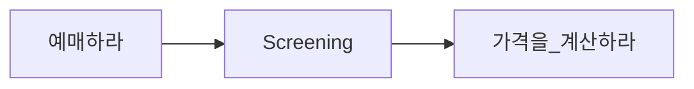

이제 메시지를 책임질 객체를 선택해야 한다. 영화 가격을 계산하는 데 필요한 정보를 알고 있는 전문가는 Movie가 될 것이다.

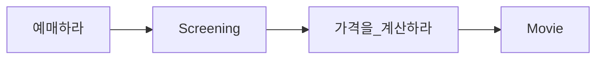
가격을 계산하기 위해 `Movie`가 어떤 작업을 해야 하는지 생각해보자.
요금을 계산하기 위해서는 먼저 영화가 할인 가능한지 판단한 후 할인 정책에 따라 할인 요금을 제외한 금액을 계산하면 된다.
이 중에서 `Movie`가 스스로 처리할 수 없는 일이 있다.
할인 조건에 따라 영화가 할인 가능한지를 판단 하는 것이다. 따라서 `Movie`는 할인 여부를 판단하라 메시지를 전송해 외부에 도움을 요청해야 한다.

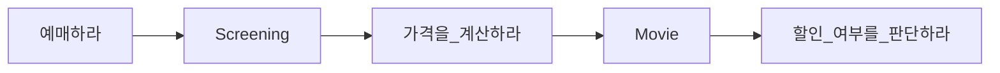

할인 여부를 한단하라 메시지를 책임질 객체를 선택한다.
할인 여부를 판단할 수 있는 정보를 가장 많이 알고 있는 객체는 `DiscountCondition`이다.

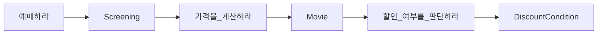
`DiscountCondition`은 자체적으로 할인 여부를 판단하는 데 필요한 모든 정보를 알고 있기 때문에 외부의 도움 없이 할인 여부를 판단할 수 있다.
따라서 `DiscountCondition`은 외부에 메시지를 전송하지 않는다.

이처럼 INFORMATION EXPERT 패턴을 따르는 것만으로도 자율성이 높은 객체들로 구성된 협력 공동체를 구축할 가능성이 높아지는 것이다.

> 높은 응집도와 낮은 결합도

설계는 트레이드오프 활동이라는 것을 기억하라.
동일한 기능을 구현할 수 있는 무수히 많은 설계가 존재한다.
몇 가지 설계중 한 가지를 선택해야 하는 경우가 빈번하게 발생한다.

이 경우 올바른 책임 할당을 위해 INFORMATION EXPERT 패턴 이외의 다른 책임 할당 패턴들을 함께 고려할 필요가 있다.
예를 들어, 방금 전 설계한 영화 예매 시스템에서는 할인 요금을 계산하기 위해 `Movie`가 `DiscountCondition`에 할인 여부를 판단하라 메시지를 전송한다.
그렇다면 이 설계의 대안으로 `Movie` 대신 `Screening`이 직접 `DisocuntCondition`과 협력하게 하는 것은 어떨까?

```mermaid
flowchart LR
    1.예매하라 --> screening[Screening] <-- 3.가격을_계산하라 --> movie[Movie]
    screening[Screening] <-- 2.할인_여부를_판단하라 --> discountCondition[DiscountCondition]
```
왜 우리는 이 설계 대신 `Movie`가 `DiscountCondition`과 협력하는 방법을 선택한 것일까?
그 이유는 응집도와 결합도에 있다. 높은 응집도와 낮은 결합도는 객체에 책임을 할당할 때 항상 고려해야 하는 기본 원리다.
GRASP에서는 이를 LOW COUPLING 패턴과 HIGH COHESION 패턴이라고 부른다.

`DiscountCondition`이 `Movie`와 `Screening` 중 어느 객체와 협력하는 것이 좋을까?
실마리는 결합도에 있다. `Movie`와 `DiscountConditoin`은 이미 결합돼 있기 때문에 `Movie`를 `DiscountCondition`과 협력하게 하면
설계 전체적으로 결합도를 추가하지 않고도 협력을 완성할 수 있다.

HIGH COHESION 패턴의 관점에서도 설계 대안들을 평가할 수 있다.
`Screening`의 가장 중요한 책임은 예매를 생성하는 것이다.
`Screening`이 `DiscountCondition`과 협력해야 한다면 영화 요금과 관련된 책임 일부를 떠안아야 할 것이다.
이 경우 `Screening`은 `DiscountCondition`이 할인 여부를 판단할 수 있고 `Movie`가 이 할인 여부를 필요로 한다는 사실 역시 알고 있어야 한다.
다시 말해 예메 요금을 계산하는 방식이 변경될 경우 `Screening`도 함께 변경해야 한다.

따라서 HIGH COHESION 패턴의 관점에서 `Movie`가 `DiscountCondition`과 협력하는 것이 더 나은 설계 대안이다.
책임을 할당하고 코드를 작성하는 매순간마다 LOW COUPLING, HIGH COHESION의 관점에서 전체적인 설계 품질을 검토하면
단순하면서도 재사용 가능하고 유연한 설계를 얻을 수 있을 것이다.

> 창조자에게 객체 생성 책임을 할당하라

영화 예매 협력의 최종 결과물은 `Reservation` 인스턴스를 생성하는 것이다.
이것은 협력에 참여하는 어떤 객체에게는 `Reservation` 인스턴스를 생성할 책임을 할당해야 한다는 것을 의미한다.
GRASP의 CREATOR(창조자) 패턴은 이 같은 경우에 사용할 수 있는 책임 할당 패턴으로서 객체를 생성할 책임을 어떤 객체에게 할당할지에 대한 지침을 제공한다.

`Reservation`을 잘 알고 있거나, 긴밀하게 사용하건, 초기화에 필요한 데이터를 가지고 있는 객체는 무엇인가?
바로 `Screening`이다. `Screening`은 예매 정보를 생성하는 데 필요한 영화, 상영 시간, 상영 순번 등의 정보에 대한 전문가이며,
예매 요금을 계산하는 데 필수정인 `Moive`도 알고 있다.
따라서 `Screening`을 `Reservation`의 CREATOR로 선택하는 것이 적절해 보인다.

```mermaid
flowchart LR
    예매하라 --> screening[Screening] --> 가격을_계산하라 --> movie[Movie] --> 할인_여부를_판단하라 --> discountCondition[DiscountCondition]
    screening[Screening] --> reservation[Reservation] 
```
## 03 구현을 통한 검증
`Screening`은 영화를 예매할 책임을 맡으며 그 결과로 `Reservation` 인스턴스를 생성할 책임을 수행해야 한다.
`Screening`은 예매에 대한 정보 전문가인 동시에 `Reservation`의 창조자다.

협력의 관점에서 `Screening`은 '예매하라' 메시지에 응답할 수 있어야 한다.
이 메시지를 처리할 수 있는 메서드를 구현하자.

```java
public class Screening {
    
    public Reservation reserve(Customer customer, int audienceCount) {
        return null;
    }
}
```
책임이 결정됐으므로 책임을 수행하는데 필요한 인스턴스 변수를 결정해야 한다.
`Screening`은 상영시간, 상영 순번을 인스턴스 변수로 포함한다.
`Movie`에 '가격을 계산하라' 메시지를 전송해야 하기에 `Movie`에 대한 참조도 포함한다.

```java
public class Screening {
    
    private Movie movie;
    private int sequence;
    private LocalDateTime whenScreened;
    
    public Reservation reserve(Customer customer, int audienceCount) {
        return null;
    }
}
```
영화를 예매하기 위해서는 `Movie`에게 '가격을 계산하라' 메시지를 전송해서 계산된 요금을 반환받아야 한다.
`calculateFee` 메서드는 이렇게 반환된 요금에 예매 인원수를 곱해서 전체 예매 요금을 계산한 후 `Reservation`을 생성해서 반환한다.

```java
public class Screening {

    private Movie movie;
    private int sequence;
    private LocalDateTime whenScreened;

    public Reservation reserve(Customer customer, int audienceCount) {
        return new Reservation(customer, this, calculateFee(audienceCount), audienceCount);
    }

    private Money calculateFee(int audienceCount) {
        return movie.calculateMovieFee(this).times(audienceCount);
    }
}
```
`Screening`을 구현하는 과정에서 `Movie`에 전송하는 메시지의 시그니처를 `calculateMovieFee(Screening screening)`으로 선언했다는 사실을 주목하라.
이 메시지는 수신자인 `Movie`가 아니라 송신자인 `Screening`의 의도를 표현한다.
여기서 중요한 것은 `Screening`이 `Movie`의 내부 구현에 대한 어떤 지식도 없이 전송할 메시지를 결정했다는 것이다.
이처럼 `Movie`의 구현을 고려하지 않고 필요한 메시지를 결정하면 `Movie`의 내부 구현을 깔끔하게 캡슐화 할 수 있다.
메시지가 객체를 선택하도록 책임 주도 설계의 방식을 따르면 캡슐화와 낮은 결합도라는 목표를 비교적 손쉽게 달성할 수 있다.

`Movie`는 `Screening`과 협력하기 위해 `calculateMovieFee` 메시지에 응답하기 위해 메서드를 구현해야 한다.
```java
public class Movie {

    public Money calculateMovieFee(Screening screening) {
        return null;
    }
}
```
`Movie`는 기본 요금, 할인 조건, 할인 정책 등의 정보를 알아야 한다.
그리고 현재의 `Movie`가 어떤 할인 정책이 적용된 영화인지를 나타내기 위한 영화 종류를 인스턴스 변수로 포함한다.

```java
public class Movie {

    private String title;
    private Duration duration;
    private Money fee;
    private List<DiscountCondition> discountConditions;
    private MovieType movieType;
    private Money discountAmount;
    private double discountPercentage;
    
    public Money calculateMovieFee(Screening screening) {
        return null;
    }
}
```

`MovieType`은 할인 정책의 종류를 나열하는 단순한 열거형 타입이다.

```java
public enum MovieType {
    AMOUNT_DISCOUNT,
    PERCENT_DISCOUNT,
    NONE_DISCOUNT,
}
```
`Movie`는 먼저 `discountConditions`를 순회하면서 `DiscountCondition` 인스턴스에게 `isSatisfiedBy` 메시리를 전송해 할인 여부를 판단하도록 요청한다.
할인 조건에 만족하는 `DiscountCondition` 인스턴스가 존재한다면 할인 요금을 계산하기 위해 `calculateDiscountAmount`를 호출한다.
만족하는 할인 조건이 존재하지 않을 경우 기본 금액을 반환한다.

```java
public class Movie {

    private String title;
    private Duration duration;
    private Money fee;
    private List<DiscountCondition> discountConditions;
    private MovieType movieType;
    private Money discountAmount;
    private double discountPercentage;

    public Money calculateMovieFee(Screening screening) {
        if (isDiscountable(screening)) {
            return fee.minus(calculateDiscountAmount());
        }

        return fee;
    }

    private boolean isDiscountable(Screening screening) {
        return discountConditions.stream()
                .allMatch(condition -> condition.isSatisfiedBy(screening));
    }

    private Money calculateDiscountAmount() {
        return null;
    }
}
```
실제 요금을 계산하는 `calculateDiscountAmount` 메서드는 `movieType`의 값에 따라 적절한 메서드를 호출한다.
```java
public class Movie {
    
    private Money calculateDiscountAmount() {
        switch (movieType) {
            case AMOUNT_DISCOUNT:
                return calculateAmountDiscountAmount();
            case PERCENT_DISCOUNT:
                return calculatePercentDiscountAmount();
            default:
                return calculateNoneDiscountAmount();
        }
    }

    private Money calculateAmountDiscountAmount() {
        return discountAmount;
    }

    private Money calculatePercentDiscountAmount() {
        return fee.times(discountPercentage);
    }

    private Money calculateNoneDiscountAmount() {
        return Money.ZERO;
    }
}
```

`Movie`는 `DiscountCondition`에 '할인 여부를 판단하라' 메시지를 전송한다.
`DiscountCondition`은 이 메시지를 처리하기 위해 `isSatisfiedBy` 메서드를 구현해야 한다.

```java
public class DiscountCondition {
    public boolean isSatisfiedBy(Screening screening) {
        return false;
    }
}
```
`DiscountCondition`은 기간 조건을 위한 요일(dayOfWeek), 시작 시간(startTime), 종료 시간(endTime)과 순번 조건을 위한 상영 순번(sequence)을 인스턴스 변수로 포함한다.
추가적인 할인 조건의 종류(type)를 인스턴스 변수로 포함한다.
`isSatisfiedBy` 메서드는 type 값에 따라 적절한 메서드를 호출한다.

```java
public class DiscountCondition {

    private DiscountConditionType type;
    private int sequence;
    private DayOfWeek dayOfWeek;
    private LocalTime startTime;
    private LocalTime endTime;
    
    public boolean isSatisfiedBy(Screening screening) {
        if (type == DiscountConditionType.PERIOD) {
            return isSatisfiedByPeriod(screening);
        }

        return isSatisfiedBySequence(screening);
    }

    private boolean isSatisfiedByPeriod(Screening screening) {
        return dayOfWeek.equals(screening.getWhenScreened().getDayOfWeek())
                && !startTime.isAfter(screening.getWhenScreened().toLocalTime())
                && !endTime.isBefore(screening.getWhenScreened().toLocalTime());
    }

    private boolean isSatisfiedBySequence(Screening screening) {
        return sequence == screening.getSequence();
    }
}
```

`DiscountConditionType`은 할인 조건의 종류를 나열한 열거형 타입이다.
```java
public enum DiscountConditionType {
    SEQUENCE,
    PERIOD,
}
```
구현이 완료됐다. 하지만 몇 가지 문제점이 숨어 있다.

> DiscountCondition 개선하기

가장 큰 문제점은 변경에 취약한 클래스를 포함하고 있다는 것이다.
변경에 취약한 클래스란 코드를 수정해야 하는 이유를 하나 이상 가지는 클래스다.
`DiscountCondition`은 다음과 같은 서로 다른 세 가지 이유로 변경 될 수 있다.

1. 새로운 할인 조건 추가
   * `isSatisfiedBy` 메서드 안의 `if ~ else` 구문을 수정해야 한다.
2. 순번 조건을 판단하는 로직 변경
   * `isSatisfiedBySequence` 메서드의 내부 구현을 수정해야 한다.
3. 기간 조건을 판단하는 로직 변경
   * `isSatisfiedByPeriod` 메서드의 내부 구현을 수정해야 한다.

`DiscountCondition`은 하나 이상의 변경 이유를 가지기 때문에 응집도가 낮다.
응집도가 낮다는 것은 서로 연관성 없는 기능이나 데이터가 하나의 클래스에 뭉쳐져 있다는 것을 의미한다.
변경의 이유에 따라 클래스를 분리해야 한다.

`isSatisfiedBySequence` 메서드와 `isSatisfiedByPeriod` 메서드는 서로 다른 이유로 변경된다.
`DiscountCondition`은 서로 다른 이유로, 서로 다른 시점에 변경될 확률이 높다.

설계를 개선하는 작업은 변경의 이유가 하나 이상인 클래스를 찾는 것으로부터 시작하는 것이 좋다.
변경의 이유가 하나 이상인 클래스에는 위험 징후를 또렷하게 드러내는 몇 가지 패턴이 존재한다는 점이다.

첫 번째 패턴은 <U>인스턴스 변수가 초기화 되는 시점</U>이다.
응집도가 높은 클래스는 인스턴스를 생성할 때 모든 속성을 함께 초기화 한다.
응집도가 낮은 클래스는 객체의 속성 중일부만 초기화하고 일부는 초기화 되지 않은 상태로 남겨진다.
`DiscountConditon`은 순번 조건을 표현하는 경우 sequence는 초기화 되지만 dayOfWeek, startTime, endTime은 초기화 되지 않는다.
반대로 기간 조건을 표현하는 경우에는 dayOfWeek, startTime, endTime은 초기화 되지만 sequence는 초기화되지 않는다.
클래스의 속성이 서로 다른 시점에 초기화 되거나 일부만 초기화된다는 것은 응집도가 낮다는 증거다.
따라서 초기화 속성을 기준으로 코드를 분리해야 한다.

두 번째 패턴은 <U>메서드들이 인스턴스 변수를 사용하는 방식</U>이다.
모든 메서드가 객체의 모든 속성을 사용한다면 클래스의 응집도는 높다고 볼 수 있다.
반면 메서드들이 사용하는 속성에 따라 그룹이 나뉜다면 클래스의 응집도가 낮다고 볼 수 있다.
`DiscountCondition`의 `isSatisfiedBySequence` 메서드와 `isSatisfiedByPeriod` 메서드가 이 경우에 해당한다.
이 경우 클래스의 응집도를 높이기 위해 속성 그룹과 해당 그룹에 접근하는 메서드 그룹을 기준으로 코드를 분리해야 한다.

> 타입 분리하기

`DiscountConditon`의 가장 큰 문제점은 순번 조건과 기간 조건이라는 두 개의 독립적인 타입이 하나의 클래스 안에 공존하고 있다는 점이다.
가장 먼저 떠오르는 해결 방법은 두 타입을 `SequenceCondition`과 `PeriodCondition`이라는 두 개의 클래스로 분리하는 것이다.

```java
public class PeriodCondition {

    private DayOfWeek dayOfWeek;
    private LocalTime startTime;
    private LocalTime endTime;

    public PeriodCondition(DayOfWeek dayOfWeek, LocalTime startTime, LocalTime endTime) {
        this.dayOfWeek = dayOfWeek;
        this.startTime = startTime;
        this.endTime = endTime;
    }

    public boolean isSatisfiedBy(Screening screening) {
        return dayOfWeek.equals(screening.getWhenScreened().getDayOfWeek())
                && !startTime.isAfter(screening.getWhenScreened().toLocalTime())
                && !endTime.isBefore(screening.getWhenScreened().toLocalTime());
    }
    
}
```
```java
public class SequenceCondition {

    private int sequence;

    public SequenceCondition(int sequence) {
        this.sequence = sequence;
    }

    public boolean isSatisfiedBy(Screening screening) {
        return sequence == screening.getSequence();
    }
}
```
클래스를 분리하면서 앞에서 인스턴스 변수 초기화, 메서드들이 인스턴스 변수를 사용하는 방식 문제를 해결했다.
하지만 클래스를 분리한 후에 새로운 문제가 나타났다.
`Movie`와 협력하는 클래스는 `DiscountCondition` 하나뿐이다.
수정 후 `Movie`는 `SequenceCondition`, `PeriodCondition` 클래스들의 인스턴스와 협력할 수 있어야 한다.

문제를 해결 하기 위해 `Movie` 클래스 안에서 `SequenceCondition` 목록과 `PeriodCondition` 목록을 따로 유지하는 것이다.
하지만 이 방법은 새로운 문제점을 야기한다.

1. `Movie`가 `SequenceCondition`, `PeriodCondition` 양쪽 모두에게 결합된다.
2. 새로운 할인 조건을 추가되면 또 다른 목록을 `Movie` 안에 만들어야 한다.

> 다형성을 통해 분리하기

`Movie` 입장에서 보면 `SequenceCondition`, `PeriodCondition`은 아무 차이도 없다.
둘다 할인 여부를 판단하는 동일한 책임을 수행하고 있을 뿐이다.
할인 가능 여부를 반환해 주기만 하면 `Movie`는 객체가 `SequenceCondition`의 인스턴스인지, `PeriodCondition`의 인스턴스인지는 상관하지 않는다.

이 시점이 되면 자연스럽게 `역할`의 개념이 등장한다.
역할은 협력 안에서 대체 가능성을 의미하기 때문에 `SequenceCondition`, `PeriodCondition`에 역할의 개념을 적용하면 `Movie`가 구체적인 클래스는 알지 못한 채 오직 역할에 대해서만 결합되도록 의존성을 제한할 수 있다.

```mermaid
flowchart LR
    가격을_계산하라 --> movie[Movie] --> 할인_여부를_판단하라 --> discountCondition[SequenceCondition or PeriodCondition]
```
역할을 사용하면 객체의 구체적인 타입을 추상화할 수 있다.
역할을 대체할 클래스들 사이에 구현을 공유해야 할 필요가 있다면 추상 클래스를 사용하면 된다.
구현을 공유할 필요 없이 역할을 대체하는 객체들의 책임만 정의하고 싶다면 인터페이스를 사용하면 된다.

`SequenceCondition`과 `PeriodCondition`은 구현을 공유할 필요는 없다. 따라서 `DiscountCondition`이라는 인터페이스를 이용해 역할을 구현하자.

```java
public interface DiscountCondition {
    boolean isSatisfiedBy(Screening screening);
}
```

```java
public class SequenceCondition implements DiscountCondition{

    private int sequence;

    public SequenceCondition(int sequence) {
        this.sequence = sequence;
    }

    @Override
    public boolean isSatisfiedBy(Screening screening) {
        return sequence == screening.getSequence();
    }
}
```
```java
public class PeriodCondition implements DiscountCondition{

    private DayOfWeek dayOfWeek;
    private LocalTime startTime;
    private LocalTime endTime;

    public PeriodCondition(DayOfWeek dayOfWeek, LocalTime startTime, LocalTime endTime) {
        this.dayOfWeek = dayOfWeek;
        this.startTime = startTime;
        this.endTime = endTime;
    }

    @Override
    public boolean isSatisfiedBy(Screening screening) {
        return dayOfWeek.equals(screening.getWhenScreened().getDayOfWeek())
                && !startTime.isAfter(screening.getWhenScreened().toLocalTime())
                && !endTime.isBefore(screening.getWhenScreened().toLocalTime());
    }
}
```
이제 `Movie`는 협력하는 객체의 구체적인 타입을 몰라도 상관없다.
협력하는 객체가 `DiscountCondition` 역할을 수행할 수 있도 `isSatisfiedBy` 메시지를 이해할 수 있다는 사실만 알고 있어도 충분하다.
`Movie`와 `DiscountConditon` 사이의 협력은 다형적이다.
객체의 타입에 따라 변하는 행동이 있다면 타입을 분리하고 변화하는 행동을 각 타입의 책임으로 할당하라는 것이다.
GRASP에서는 이를 POLYMORPHISM(다형성) 패턴이라고 부른다.

> 변경으로부터 보호하기

`DiscountCondition`이라는 역할이 `Movie`로부터 `PeriodCondition`과 `SequenceCondition`의 존재를 감춘다는 사실에 주목하라.
`DiscountCondition`이라는 추상화가 구체적인 타입을 캡슐화한다.
`Movie`의 관점에서는 `DiscountCondition`의 타입이 캡슐화된다는 것은 새로운 `DiscountCondition` 타입을 추가하더라도 `Movie`가 영향을 받지 않는다는 것을 의미한다.
`Movie`에 대한 어떤 수정도 필요 없다.
`DiscountCondition` 인터페이스를 실체화하는 클래스를 추가하는 것으로 할인 조건의 종류를 확장할 수 있다.
이처럼 변경을 캡슐화하도록 책임을 할당하는 것을 GRASP에서는 PROTECTED VARIATIONS(변경 보호)패턴이라고 부른다.

하나의 클래스가 여러 타입의 행동을 구현하고 있는 것처럼 보인다면 클래스를 분해하고 POLYMORPHISM 패턴에 따라 책임을 분산 시켜라.
예측 가능한 변경으로 인해 여러 클래스들이 불안정해진다면 PROTECTED VARIATIONS 패턴에 따라 안정적인 인터페이스 뒤로 변경을 캡슐화하라.

> Movie 개선하기

`Movie` 역시 `DiscountCondition`과 동일한 문제가 있다.
금액 할인 정책 영화와 비율 할인 정책 영화라는 두 가지 타입을 하나의 클래스 안에 구현하고 있기 때문에 하나 이상의 이유로 변경될 수 있다.
응집도가 낮은 것이다.

역할의 개념을 도입해서 협력을 다형적으로 만들면된다. POLYMORPHISM 패턴을 사용해 서로 다른 행동을 타입별로 분리하면 다형성의 혜택을 누릴 수 있다.

금액 할인 정책과 관련된 인스턴스 변수와 메서드를 옮길 클래스의 이름으로는 `AmountDiscountMovie`가 적합할 것 같다.
비율 할인 정책과 관련된 인스턴스 변수와 메서드를 옮길 클래스는 `PercentDiscountMovie`로 명명하자.
할인 정책을 적용하지 않는 경우는 `NoneDiscountMovie`로 명명하자.

`DiscountCondition`의 경우에는 역할을 수행할 클래스들 사이에 공유할 구현이 없기 때문에 인터페이스를 이용했다.
`Movie`의 경우 구현을 공유할 필요가 있다. 따라서 추상 클래스를 이용해 역할을 구현한다.

```java
public abstract class Movie {

    private String title;
    private Duration duration;
    private Money fee;
    private List<DiscountCondition> discountConditions;

    public Movie(String title, Duration duration, Money fee, DiscountCondition ... discountCondition) {
        this.title = title;
        this.duration = duration;
        this.fee = fee;
        this.discountConditions = List.of(discountCondition);
    }

    public Money calculateMovieFee(Screening screening) {
        if (isDiscountable(screening)) {
            return fee.minus(calculateDiscountAmount());
        }

        return fee;
    }

    private boolean isDiscountable(Screening screening) {
        return discountConditions.stream()
                .allMatch(condition -> condition.isSatisfiedBy(screening));
    }

    abstract protected Money calculateDiscountAmount();

    protected Money getFee() {
        return fee;
    }
}
```
```java
public class AmountDiscountMovie extends Movie {

    private Money discountAmount;

    public AmountDiscountMovie(String title, Duration duration, Money fee, Money discountAmount, DiscountCondition... discountCondition) {
        super(title, duration, fee, discountCondition);
        this.discountAmount = discountAmount;
    }

    @Override
    protected Money calculateDiscountAmount() {
        return discountAmount;
    }
}
```
```java
public class PercentDiscountMovie extends Movie {

    private double percent;

    public PercentDiscountMovie(String title, Duration duration, Money fee, double percent, DiscountCondition... discountCondition) {
        super(title, duration, fee, discountCondition);
        this.percent = percent;
    }

    @Override
    protected Money calculateDiscountAmount() {
        return getFee().times(percent);
    }
}
```
```java
public class NoneDiscountMovie extends Movie {

    public NoneDiscountMovie(String title, Duration duration, Money fee, DiscountCondition... discountCondition) {
        super(title, duration, fee, discountCondition);
    }

    @Override
    protected Money calculateDiscountAmount() {
        return Money.ZERO;
    }
}
```
```mermaid
classDiagram
    Screening --> Movie:movie
    Movie -->"*" DiscountCondition:discountConditions 
    AmountDiscountMovie --|> Movie
    PercentDiscountMovie --|> Movie
    NoneDiscountMovie --|> Movie
    SequenceCondition ..|> DiscountCondition
    PeriodCondition ..|> DiscountCondition
    
    class Screening {
        +reserv()
    }
    class Movie {
        +calculateMovieFee()
        #calculateDiscountAmount()
    }
    class AmountDiscountMovie {
        #calculateDiscountAmount() 
    }
    class PercentDiscountMovie {
        #calculateDiscountAmount()
    }
    class NoneDiscountMovie {
        #calculateDiscountAmount() 
    }
    class DiscountCondition {
        <<interface>>
        +isSatisfiedBy()
    }
    class SequenceCondition {
        +isSatisfiedBy()
    }
    class PeriodCondition {
        +isSatisfiedBy()
    }
```
결론은 데이터가 아닌 책임을 중심으로 설계하라는 것이다.
객체에게 중요한 것은 상태가 아니라 행동이다.
객체지향 설계의 기본은 책임과 협력에 초점을 맞추는 것이다.

> 변경과 유연성

설계를 주도하는 것은 변경이다.
개발자로서 변경에 대비할 수 있는 두 가지 방법이 있다.
하나는 코드를 이해하고 수정하기 쉽도록 최대한 단순하게 설계하는 것이다.
다른 하나는 코드를 수정하지 않고도 변경을 수용할 수 있또록 코드를 더 유연하게 만드는 것이다.
대부분의 경우에 전자가 더 좋은 방법이지만 유사한 변경이 반복적으로 발생하고 있다면 복잡성이 상승하더라도 유연성을 추가하는 두 번째 방법이 더 좋다.

현재의 설계에서는 할인 정책을 구현하기 위해 상속을 이용하고 있기 때문에 실행 중에 영화의 할인 정책을 변경하기 위해서는
새로운 인스턴스를 생성한 후 필요한 정보를 복사해야 한다.
또한 변경 전후의 인스턴스가 개념적으로 동일한 객체를 가리키지만 물리적으로 서로 다른 객체이기 때문에 식별자의 관점에서 혼란스러울 수 있다.

해결 방법은 상속 대신 합성을 사용하는 것이다.
`Movie`의 상속 계층 안에 구현된 할인 정책을 독립적인 `DiscountPolicy`로 분리한 후 `Movie`에 합성시키면 유연한 설계가 된다.

```mermaid
classDiagram
    Screening --> Movie:movie
    Movie --> DiscountPolicy:discountPolicy
    DiscountPolicy -->"*" DiscountCondition:discountConditions 
    AmountDiscountMovie --|> DiscountPolicy
    PercentDiscountMovie --|> DiscountPolicy
    NoneDiscountMovie --|> DiscountPolicy
    SequenceCondition ..|> DiscountCondition
    PeriodCondition ..|> DiscountCondition
    
    class Screening {
        +reserv()
    }
    class Movie {
        
    }
    class DiscountPolicy {
      +calculateMovieFee()
      #calculateDiscountAmount()
    }
    class AmountDiscountPolicy {
        #calculateDiscountAmount() 
    }
    class PercentDiscountPolicy {
        #calculateDiscountAmount()
    }
    class NoneDiscountPolicy {
        #calculateDiscountAmount() 
    }
    class DiscountCondition {
        <<interface>>
        +isSatisfiedBy()
    }
    class SequenceCondition {
        +isSatisfiedBy()
    }
    class PeriodCondition {
        +isSatisfiedBy()
    }
```

이제 금액 할인 정책이 적용된 영화를 비율 할인 정책으로 바꾸는 일은 `Movie`에 연결된 `DiscountPolicy`의 인스턴스를 교체하는 단순한 작업으로 바뀐다.

```java
Movie moive = new Movie(
        "타이타닉",
        Duration.ofMinutes(120),
        Money.wons(10000),
        new AmountDiscountPolicy(...)
);

movie.changeDiscountPolicy(new PercentDiscountPolicy(...));
```
유연성은 의존성 관리의 문제다. 요소들 사이의 의존성의 정도가 유연성의 정도를 결정한다.
유연성의 정도에 따라 결합도를 조절할 수 있는 능력은 객체지향 개발자가 갖춰야 하는 중요한 기술 중 하나다.

## 04 책임 주도 설계의 대안
책임 주도 설계에 익숙해지기 위해서는 부단한 노력과 시간이 필요하다.
설계를 진행하는 동안 데이터가 아닌 책임 관점에서 사고하기 위해서는 충분한 경험과 학습이 필요하다.

책임과 객체 사이에서 방황할 때 돌파구를 찾기 위해 선택하는 방법은 최대한 빠르게 목적한 기능을 수행하는 코드를 작성하는 것이다.
아무것도 없는 상태에서 책임과 협력에 관해 고민하기 보다는 일단 실행되는 코드를 작성하는 것이다.
일단 실행되는 코드를 얻고 난 후에 코드 상에 명확하게 드러나는 책임들을 올바른 위치로 이동시키는 것이다.

주의할 점은 코드를 수정한 후에 겉으로 드러나는 동작이 바뀌어서는 안된다는 것이다.
이처럼 이해하기 쉽고 수정하기 쉬운 소프트웨어로 개선하기 위해 겉으로 보이는 동작은 바꾸지 않은 채
내부 구조를 변경하는 것을 리팩터링이라고 부른다.

> 메서드 응집도

데이터 중심으로 설계된 영화 예매 시스템에서 도메인 객체들은 단지 데이터의 집합일 뿐이며 영화 예매를 처리하는 모든 절차는 `ReservationAgency`에 집중돼 있었다.
따라서 `ReservationAgency`에 포함된 로직들을 적절한 객체의 책임으로 분배하면 책임 주도 설계와 거의 유사한 결과를 얻을 수 있다.

```java
public class ReservationAgency {

    public Reservation reservation(Screening screening, Customer customer, int audienceCount) {

        Movie movie = screening.getMovie();

        boolean discountable = false;
        for (DiscountCondition condition : movie.getDiscountConditionList()) {
            if (condition.getDiscountType() == DiscountType.PEROID) {
                discountable = screening.getWhenScreened().getDayOfWeek().equals(condition.getDayOfWeek())
                        && condition.getStartTime().compareTo(screening.getWhenScreened().toLocalTime()) <= 0
                        && condition.getEndTime().compareTo(screening.getWhenScreened().toLocalTime()) >= 0;
            } else {
                discountable = condition.getSequence() == screening.getSequence();
            }

            if (discountable) {
                break;
            }
        }

        Money fee;
        if (discountable) {
            Money discountAmount = Money.ZERO;
            switch (movie.getMovieType()) {
                case AMOUNT_DISCOUNT -> discountAmount = movie.getDiscountAmount();
                case PERCENT_DISCOUNT -> discountAmount = movie.getFee().times(movie.getDiscountPercentage());
                case NONE_DISCOUNT -> discountAmount = Money.ZERO;
            }

            fee = movie.getFee().minus(discountAmount);
        } else {
            fee = movie.getFee();
        }

        return new Reservation(customer, screening, fee, audienceCount);
    }
}
```

`ReservationAgency`의 `reserve` 메서드는 길이가 너무 길고 이해하기도 어렵다.
긴 메서드는 다양한 측면에서 코드의 유지 보수에 부정적인 영향을 미친다.

* 어떤 일을 수행하는지 한눈에 파악하기 어렵기 때문에 코드를 전체적으로 이해하는 데 너무 많은 시간이 걸린다.
* 하나의 메서드 안에서 너무 많은 작업을 처리하기 때문에 변경이 필요할 때 수정해야할 부분을 찾기 어렵다.
* 메서드 내부의 일부 로직만 수정하더라도 메서드의 나머지 부분에서 버그가 발생할 확률이 높다.
* 로직의 일부만 재사용하는 것이 불가능하다.
* 코드를 재사용하는 유일한 방법은 원하는 코드를 복사해서 붙여넣는 것뿐이므로 코드 중복을 초래하기 쉽다.

긴 메서드는 응집도가 낮기 때문에 이해하기 어렵고 재사용하기 어려우며 변경하기도 어렵다.
마이클 페더스는 이런 메서드를 `몬스터 메서드(monster method)`라고 부른다.

응집도가 낮은 메서드는 로직의 흐름을 이해하기 위해 주석이 필요한 경우가 대부분이다.
주석을 추가하는 대신 메서드를 작게 분해해서 각 메서드의 응집도를 높여라.
작은 메서드들로 조합된 메서드는 마치 주석들을 나열한 것처럼 보이기 때문에 코드를 이해하기도 쉽다.

```java
public class ReservationAgencyRefactor {

    public Reservation reservation(Screening screening, Customer customer, int audienceCount) {
        boolean discountable = checkDiscountable(screening);
        Money fee = calculateFee(screening, discountable, audienceCount);
        return createReservation(screening, customer, audienceCount, fee);
    }

    private boolean checkDiscountable(Screening screening) {
        return screening.getMovie()
                .getDiscountConditions()
                .stream()
                .anyMatch(condition -> isDiscountable(condition, screening));
    }

    private boolean isDiscountable(DiscountCondition condition, Screening screening) {
        if (condition.getType() == DiscountConditionType.PERIOD) {
            return isSatisfiedByPeriod(condition, screening);
        }

        return isSatisfiedBySequence(condition, screening);
    }

    private boolean isSatisfiedByPeriod(DiscountCondition condition, Screening screening) {
        return screening.getWhenScreened().getDayOfWeek().equals(condition.getDayOfWeek())
                && !condition.getStartTime().isAfter(screening.getWhenScreened().toLocalTime())
                && !condition.getEndTime().isBefore(screening.getWhenScreened().toLocalTime());
    }

    private boolean isSatisfiedBySequence(DiscountCondition condition, Screening screening) {
        return screening.getSequence() == condition.getSequence();
    }


    private Money calculateFee(Screening screening, boolean discountable, int audienceCount) {
        if (discountable) {
            return screening.getMovie()
                    .getFee()
                    .minus(calculateDiscountedFee(screening.getMovie()))
                    .times(audienceCount);
        }
        return screening.getMovie().getFee().times(audienceCount);
    }

    private Money calculateDiscountedFee(Movie movie) {
        switch (movie.getMovieType()) {
            case AMOUNT_DISCOUNT:
                return calculateAmountDiscountedFee(movie);
            case PERCENT_DISCOUNT:
                return calculatePercentDiscountedFee(movie);
            case NONE_DISCOUNT:
                return calculateNoneDiscountedFee(movie);
        }
        throw new IllegalArgumentException("Invalid movie type");
    }

    private Money calculateAmountDiscountedFee(Movie movie) {
        return movie.getDiscountAmount();
    }

    private Money calculatePercentDiscountedFee(Movie movie) {
        return movie.getFee().times(movie.getDiscountPercentage());
    }

    private Money calculateNoneDiscountedFee(Movie movie) {
        return Money.ZERO;
    }

    private Reservation createReservation(Screening screening, Customer customer, int audienceCount, Money fee) {
        return new Reservation(customer, screening, fee, audienceCount);
    }
}
```
비록 클래스의 길이는 더 길어졌지만 일반적으로 명확성의 가치가 클래스의 길이보다 더 중요하다.
코드를 작은 메서드들로 분해하면 전체적인 흐름을 이해하기도 쉬워진다.
동시에 너무 많은 세부사항을 기억하도록 강요하는 코드는 이해하기도 어렵다.
큰 메서드를 작은 메서드들로 나누면 한 번에 기억해야 하는 정보를 줄일 수 있다.
더 세부적인 정보가 필요하면 그때 각 메서드의 세부적인 구현을 확인하면 되기 때문이다.

> 객체를 자율적으로 만들자

자신이 소유하고 있는 데이터를 자기 스스로 처리하도록 만드는 것이 자율적인 객체를 만드는 지름길이다.
메서드가 사용하는 데이터를 저장하고 있는 클래스로 메서드를 이동시키면 된다.
어떤 데이터를 사용하는지 가장 쉽게 알 수 있는 방법은 메서드 안에서 어떤 클래스의 접근자 메서드를 사용하는지 파악하는 것이다.

```java
public class ReservationAgency {
    private boolean isDiscountable(DiscountCondition condition, Screening screening) {
        if (condition.getType() == DiscountConditionType.PERIOD) {
          return isSatisfiedByPeriod(condition, screening);
        }
      
        return isSatisfiedBySequence(condition, screening);
    }
    
    private boolean isSatisfiedByPeriod(DiscountCondition condition, Screening screening) {
        return screening.getWhenScreened().getDayOfWeek().equals(condition.getDayOfWeek())
                && !condition.getStartTime().isAfter(screening.getWhenScreened().toLocalTime())
                && !condition.getEndTime().isBefore(screening.getWhenScreened().toLocalTime());
    }
    
    private boolean isSatisfiedBySequence(DiscountCondition condition, Screening screening) {
        return screening.getSequence() == condition.getSequence();
    }
}
```
`ReservationAgency`의 `isDiscountable`는 `DiscountCondtion`의 `getType` 메서드를 호출해서 할인 조건의 타입을 알아낸 후 타입에 따라 
`isSatisfiedByPeriod`나 `isSatisfiedBySequence`를 호출한다.
`isSatisfiedByPeriod`와 `isSatisfiedBySequence`의 내부 구현 역시 할인 여부를 판단하기 위해 `DiscountCondtion`의 접근자 메서드를 이용해 데이터를 가져온다.
두 메서드를 데이터가 존재하는 `DiscountCondition`으로 이동하자.

```java
public class DiscountCondition {

    private DiscountConditionType type;
    private int sequence;
    private DayOfWeek dayOfWeek;
    private LocalTime startTime;
    private LocalTime endTime;

    public boolean isDiscountable(Screening screening) {
        if (type == DiscountConditionType.PERIOD) {
            return isSatisfiedByPeriod(screening);
        }

        return isSatisfiedBySequence(screening);
    }
    
    public boolean isSatisfiedBy(Screening screening) {
        if (type == DiscountConditionType.PERIOD) {
            return isSatisfiedByPeriod(screening);
        }

        return isSatisfiedBySequence(screening);
    }

    private boolean isSatisfiedByPeriod(Screening screening) {
        return dayOfWeek.equals(screening.getWhenScreened().getDayOfWeek())
                && !startTime.isAfter(screening.getWhenScreened().toLocalTime())
                && !endTime.isBefore(screening.getWhenScreened().toLocalTime());
    }

    private boolean isSatisfiedBySequence(Screening screening) {
        return sequence == screening.getSequence();
    }
}
```
`DiscountCondition`의 `isDiscountable` 메서드는 외부에서 호출 가능해야 하므로 `private`에서 `public`으로 변경했다.
기존 `isDiscountable` 메서드는 `DiscountCondition`의 인스턴스를 인자로 받아야 했지만 이제 `DiscountCondition`의 일부가 됐기 때문에
인자로 전달 받을 필요가 없어졌다.
이처럼 메서드를 다른 클래스로 이동시킬 때는 인자에 정의된 클래스 중 하나로 이동하는 경우가 일반적이다.

이제 `DiscountConditoin` 내부에서만 `DiscountCondition` 인스턴스 변수에 접근한다.
따라서 모든 접근자 메서드를 제거할 수 있다.
이를 통해 내부 구현을 캡슐화 할 수 있다.
할인 조건을 계산하는 데 필요한 모든 로직이 `DiscountCondition`에 모여있기 때문에 응집도 역시 높아졌다.

# 06. 메시지와 인터페이스
## 01 협력과 메시지
> 클라이언트-서버 모델

두 객체 사이의 협력 관계를 설명하기 위해 사용하는 전통적인 메타포는 `클라이언트-서버` 모델이다.
협력 안에서 메시지를 전송하는 객체를 클라이언트, 메시지를 수신하는 객체를 서버라고 부른다.
협력은 클라이언트가 서버의 서비스를 요청하는 단방향 상호작용이다.

> 메시지와 메시지 전송

메시지(message)는 객체들이 협력하기 위해 사용할 수 있는 유일한 의사소통 수단이다.
한 객체가 다른 객체에게 도음을 요청하는 것을 메시지 전송(message sending) 또는 메시지 패싱(message passing)이라고 부른다.
이때 메시지를 전송하는 객체를 메시지 전송자(message sender)라고 부르고 메시지를 수신하는 객체를 메시지 수신자(message receiver)라고 부른다.
클라이언트-서버 모델에서는 메시지 전송자를 클라이언트, 메시지 수신자를 서버라고 부르기도 한다.

메시지는 오퍼레이션명(operation name)과 인자(argument)로 구성되며 메시지 전송은 여기에 메시지 수신자를 추가한 것이다.
따라서 메시지 전송은 메시지 수신자, 오퍼레이션명, 인자의 조합이다.
`condition`.`isSatisfiedBy(screening)` => `수신자`.`오퍼레이션명(인자)`

> 메시지와 메서드

메시지와 메서드의 구분은 메시지 전송자와 메시지 수신자가 느슨하게 결합될 수 있게 한다.

메시지 전송자는 자신이 어떤 메시지를 전송해야 하는지만 알면 된다.
수신자가 어떤 클래스의 인스턴스인지, 어떤 방식으로 요청을 처리하는지 모르더라도 원활한 협력이 가능하다.

메시지 수신자 역시 누가메시지를 전송하는지 알 필요가 없다.
단지 메시지가 도착했다는 사실만 알면 된다. 
메시지 수신자는 메시지를 처리하기 위해 필요한 메서드를 스스로 결정할 수 있는 자율권을 누린다.

> 퍼블릭 인터페이스와 오퍼레이션

객체는 안과 밖을 구분하는 뚜렷한 경계를 가진다.
외부의 객체는 오직 객체가 공개하는 메시지를 통해서만 객체와 상호작용할 수 있다.
객체가 의사소통을 위해 외부에 공개하는 메시지의 집합을 `퍼블릭 인터페이스`라고 부른다.

퍼블릭 인터페이스에 포함된 메시지를 `오퍼레이션`이라고 부른다.
오퍼레이션은 수행 가능한 어떤 행동에 대한 추상화다.
그에 비해 메시지를 수신했을 때 실제로 실행되는 코드는 메서드라고 부른다.

오퍼레이션: `DiscountCondition` 인터페이스에 정의된 `isSatisfiedBy`
메서드: `SequenceCondition`과 `PeriodCondition`의 `isSatisfiedBy`

> 시그니처

오퍼레이션(또는 메서드)의 이름과 파라미터 목록을 합쳐서 `시그니쳐(signature)`라고 부른다.
오퍼레이션은 실행 코드 없이 시그니처만을 정의한 것이다.
메서드는 이 시그니처에 구현을 더한 것이다.

## 02 인터페이스와 설계 품질
> 디미터 법칙

```java
public class ReservationAgency {

    public Reservation reservation(Screening screening, Customer customer, int audienceCount) {

        Movie movie = screening.getMovie();

        boolean discountable = false;
        for (DiscountCondition condition : movie.getDiscountConditionList()) {
            if (condition.getDiscountType() == DiscountType.PEROID) {
                discountable = screening.getWhenScreened().getDayOfWeek().equals(condition.getDayOfWeek())
                        && condition.getStartTime().compareTo(screening.getWhenScreened().toLocalTime()) <= 0
                        && condition.getEndTime().compareTo(screening.getWhenScreened().toLocalTime()) >= 0;
            } else {
                discountable = condition.getSequence() == screening.getSequence();
            }

            if (discountable) {
                break;
            }
        }
        
      ...
    }
}
```
절차적인 방식의 영화 예매 시스템 코드중 할인 가능 여부를 체크하는 코드이다.
`ReservationAgency`와 인자로 전달된 `Screening` 사이의 결합도가 너무 높기 때문에
`Screening`의 내부 구현을 변경할 때마다 `ReservationAgency`도 함께 변경된다는 것이다.
문제의 원인은 `ReservationAgency`가 `Screening`뿐만 아니라 `Moive`와 `DiscountCondition`에도 직접 접근하기 때문이다.

```mermaid
classDiagram
  direction LR
  ReservationAgency ..> Reservation
  ReservationAgency ..> Screening
  ReservationAgency ..> Movie
  ReservationAgency ..> DiscountCondition
  Reservation -->"customer" Customer
  Reservation -->"screening" Screening
  Screening -->"movie" Movie
  Movie -->"*" DiscountCondition
  
  class ReservationAgency {
      reserve()
  }
  class Reservation {
      fee
      audienceCount
  }
  class Customer {
      
  }
  class Screening {
      sequence
      whenScreened
  }
  class Movie {
      title
      runningTime
      fee
      movieType
      discountAmount
      discountPercent
  }
  class DiscountCondition {
    type
    sequence
    dayOfWeek
    startTime
    endTime
  }
```
* `Screening`이 `Movie`를 포함하지 않도록 변경되거나
* `Movie`가 `DiscountCondition`을 포함하지 않아도 되도록 변경되거나
* `DiscountCondition` 내부에 sequence를 포함하지 않게 된거나
* sequence가 int가 아니라 `Sequence`라는 클래스로 변경된거나

`ReservationAgency`는 사소한 변경에도 흔들리는 의존성의 집결지다.
이처럼 협력하는 객체의 내부 구조에 대한 결합으로 인해 발생하는 설계 문제를 해결하기 위해 제안된 원칙이 바로 `디미터 법칙`이다.   
디미터 법칙을 간단하게 요약하면 '객체의 내부 구조에 강하게 결합되지 않도록 협력 경로를 제한하라'이다.

* 낯선 자에게 말하지 말라
* 오직 인접한 이웃하고만 말하라
* 오직 하나의 도트(.)만 사용하라

내부의 메서드가 아래 조건을 만족하는 인스턴스에만 메시지를 전송하도록 프로그래밍해야 한다고 이해해도 무방하다.
* this 객체
* 메서드의 매개변수
* this의 속성
* this의 속성인 컬렉션의 요소
* 메서드 내에서 생성된 지역 객체

```java
public class ReservationAgency {

    public Reservation reservation(Screening screening, Customer customer, int audienceCount) {
        Money fee = screening.calculateFee(audienceCount);
        return new Reservation(customer, screening, fee, audienceCount);
    }
}
```
결합도 문제를 해결한 `ReservationAgency` 코드이다.
메서드의 인자로 전달된 `Screening` 인스턴스에게만 메시지를 전송한다.
`ReservationAgency`는 `Screening` 내부에 대한 어떤 정보도 알지 못한다.
`ReservationAgency`가 `Screening`의 내부 구조에 결합돼 있지 않기 때문에 `Screening`의 내부 구현을 변경할 때 `ReservationAgency`를 함께 변경할 필요가 없다.

```mermaid
classDiagram
  direction LR
  ReservationAgency ..> Reservation
  ReservationAgency ..> Screening
  Reservation -->"customer" Customer
  Reservation -->"screening" Screening
  Screening -->"movie" Movie
  Movie -->"*" DiscountCondition
  
  class ReservationAgency {
      reserve()
  }
  class Reservation {
      fee
      audienceCount
  }
  class Customer {
      
  }
  class Screening {
      sequence
      whenScreened
  }
  class Movie {
      title
      runningTime
      fee
      movieType
      discountAmount
      discountPercent
  }
  class DiscountCondition {
    type
    sequence
    dayOfWeek
    startTime
    endTime
  }
```

다음은 디미터 법칙을 위반하는 전형적인 모습의 코드이다.
메시지 전송자가 수신자의 내부 구조에 대해 물어보고 반환받은 요소에 대해 연쇄적으로 메시지를 전송한다.
이와 같은 코드를 `기차 충돌(train wreck)`이라고 부르는데 여러 대의 기차가 한줄로 늘어서 충돌한 것처럼 보이기 때문이다.
메시지 전송자는 메시지 소수신자의 내부 정보를 자세히 알게 된다.
따라서 메시지 수신자의 캡슐화는 무너지고 메시지 전송자가 메시지 수신자의 내부 구현에 강하게 결합된다.

디미터 법칙을 따르도록 코드를 개선하면 메시지 전송자는 더 이상 메시지 수신자의 내부 구조에 관해 묻지 않게 된다.
단지 자신이 원하는 것이 무엇인지 명시하고 단순히 수행하도록 요청한다.
```java
screening.getMovie().getDiscountConditions();
```

> 묻지 말고 시켜라


> 의도를 드러내는 인터페이스
> 함께 모으기


## 03 원칙의 함정
## 04 명령-쿼리 분리 원칙
