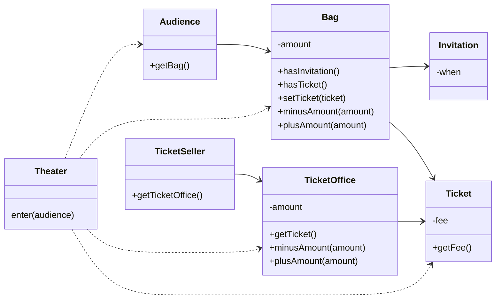
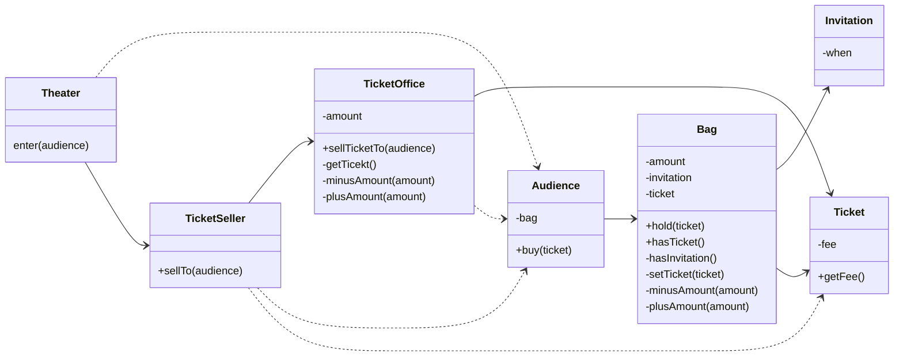
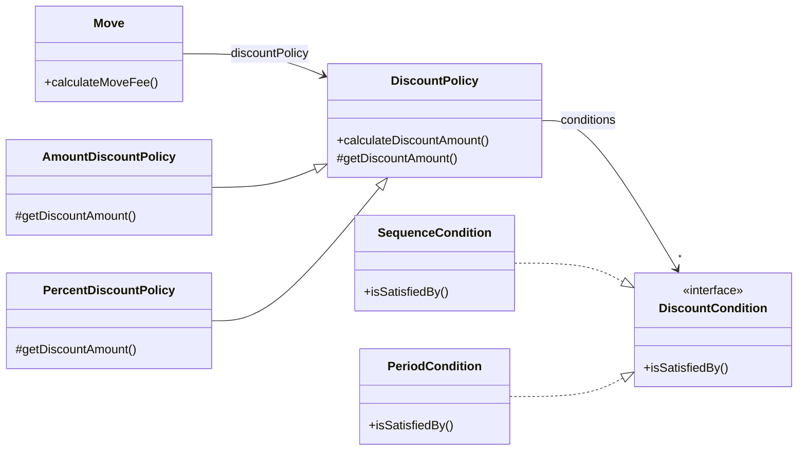
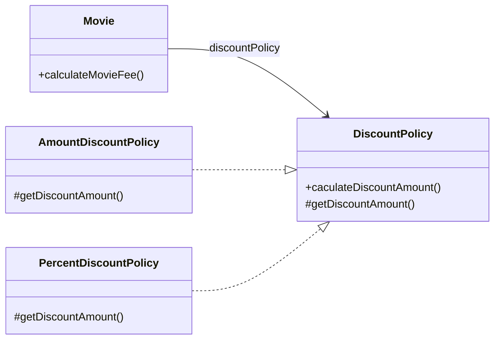
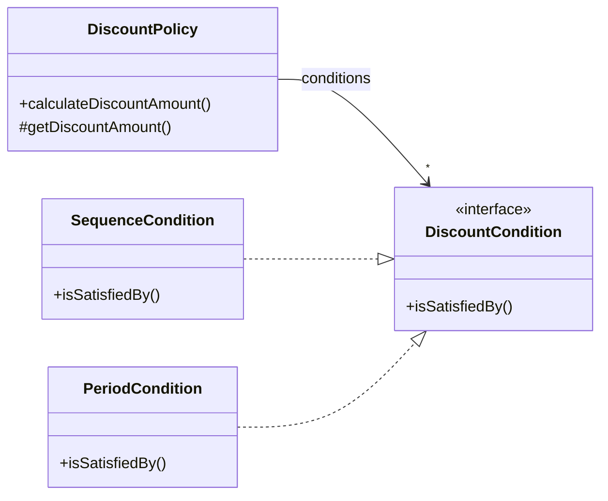

# 00. 들어가며
## 01 패러다임의 시대
과학혁명이란 과거의 패러다임이 새로운 패러다임에 의해 대체됨으로써 정상과학의 방향과 성격이 변하는 것을 의미한다. 
이를 패러다임의 전환이라고 부른다. 이 책에서 이야기하는 패러다임 전환이란 절차형 패러다임에서 객체지향 패러다임으로 변화를 가리킨다.

## 02 프로그래밍 패러다임
프로그래밍 패러다임은 과거의 패러다임을 폐기시키는 혁명적인 과정을 거치지 않는 것으로 보인다.
오히려 과거에 있던 패러다임의 단점을 보완하는 발전적인 과정을 거치는 것으로 보인다. 프로그래밍 패러다임은 혁명적(revolutionary)이 아니라 발전적(evolutionary)이다.

***

# 01. 객체, 설계
## 01 티켓 판매 애플리케이션 구현하기


```java
public class Theater {

    private TicketSeller ticketSeller;

    public Theater(TicketSeller ticketSeller) {
        this.ticketSeller = ticketSeller;
    }

    public void enter(Audience audience) {
        if (audience.getBag().hasInvitation()) {
            audience.getBag().setTicket(ticketSeller.getTicketOffice().getTicket());
        } else {
            Ticket ticket = ticketSeller.getTicketOffice().getTicket();
            audience.getBag().minusAmount(ticket.getFee());
            ticketSeller.getTicketOffice().plusAmount(ticket.getFee());
            audience.getBag().setTicket(ticket);
        }
    }
}
```

## 02 무엇이 문제인가
### 예상을 빗나가는 코드
현실에서는 관람객이 직접 자신의 가방에서 초대장을 꺼내 판매원에게 건넨다. 티켓을 구매하는 관람객은 가방 안에서 돈을 직접 꺼내 판매원에게 지불한다.
판매원 매표소에 있는 티켓을 직접 꺼내 관람객에게 건네고 관람객에게서 직접 돈을 받아 매표소에 보관한다.
현재의 코드는 우리의 상식과는 너무나도 다르게 동작하기 때문에 코드를 읽는 사람과 제대로 의사소통하지 못한다.

코드를 이해하기 어려운 이유가 또 하나가 있다. 여러 가지 세부적인 내용들을 한꺼번에 기억하고 있어야 한다는 점이다. 
Theater의 enter 메서드를 이해하기 위해서는 Audience가 Bag을 가지고 있고 
Bag 안에는 현금과 티켓이 들어있으며 TicketSeller가 TicketOffice에서 티켓을 판매하고, TicketOffice 안에 돈과 티켓이 보관돼 있다는 모든 사실을 
동시에 기억하고 있어야 한다. 하나의 클래스나 메서드에서 너무 많은 세부사항을 다루기 때문에 코드를 작성하는 사람뿐만 아니라 이 코드를 읽고 이해해야 하는 사람 모두에게 큰 부담을 준다.

### 변경에 취약한 코드
Audience와 TicketSeller가 변경될 경우 Theater도 함께 변경되어야 한다. 두 객체 사이의 결합도가 높으면 높을 수록 함께 변경될 확률도 높아지기 때문에 
변경이 어려워진다. 따라서 설계 목표는 객체 사이의 결합도를 낮춰 변경이 용이한 설계를 만드는 것이어야 한다.

## 03 설계 개선하기
코드를 이해하기 어려운 이유는 Theater가 관람객의 가방과 판매원의 매표소에 직접 접근하기 때문이다. 관람객과 판매원이 자신의 일을 스스로처리해야 한다는 우리의 직관에서 벗어난다.
Theater가 관람객의 가방과 판매원의 매표소에 직접 접근한다는 것은 Theater가 Audience와 TicketSeller에 결합된다는 것을 의미한다.
이를 해결 하기 위해서는 관람객과 판매원을 자율적인 존재로 만들면 된다.



## 04 객체지향 설계
데이터와 프로세스를 하나의 덩어리로 모으는 것은 훌륭한 객체지향 설계로 가는 첫걸음이다. 
진정한 객체지향 설계로 나아가는 길은 협력하는 객체들 사이의 의존성을 적절하게 조절함으로써 변경에 용이한 설계를 만드는 것이다.

***

# 02. 객체지향 프로그래밍
## 01 영화 예매 시스템
* 영화: 제목, 상영시간, 가격 정보와 같이 영화가 가지고 있는 기본적인 정보를 가리킨다.
* 상영: 상영 일자, 시간, 순번 등을 가리킨다.
* 할인
  * 할인 조건: 가격의 할인 여부를 결정
    * 순서 조건
    * 기간 조건
  * 할인 정책: 할인 요금을 결정
    * 금액 할인 정책
    * 비율 할인 정책

## 02 객체지향 프로그래밍을 향해
> 협력, 객체, 클래스

객체지향 패러다임으로의 전환은 클래스가 아닌 객체에 초점을 맞출 때에만 얻을 수 있다. 이를 위해서는 프로그래밍하는 동안 다음의 두가지에 집중해야 한다.

1. 어떤 클래스가 필요한지 고민하기 전에 어떤 객체들이 필요한지 고민하라.
2. 객체를 독립적인 존재가 아니라 기능을 구현하기 위해 협력하는 공동체의 일원으로 봐야한다.

> 도메인 구조를 따르는 프로그램 구조

* 도메인: 문제를 해결하기 위해 사용자가 프로그램을 사용하는 분야

1. 클래스의 이름을 최대한 도메인 개념의 이름과 동일하거나 유사하게 지어야 한다.
2. 클래스 사이의 관계도 최대한 도메인 개념 사이에 맺어진 관계와 유사하게 만들어서 프로그램의 구조를 이해하고 예상하기 쉽게 만들어야 한다.

> 클래스 구현

* 자율적인 객체
  * 객체는 상태(state)와 행동(behavior)을 함께 가지는 복합적인 존재다.
  * 객체는 스스로 판단하고 행동하는 자율적인 존재다.

* 프로그래머의 자유
  * 클래스 작성가: 새로운 데이터 타입을 프로그램에 추가한다.
  * 클라이언트 프로그래머: 클래스 작성가가 추가한 데이터 타입을 사용한다.

> 협력하는 객체들의 공동체

객체지향 프로그램을 작성할 때는 먼저 협력의 관점에서 어떤 객체가 필요하진 결정하고, 객체들의 공통 상태와 행위를 구현하기 위해 클래스를 작성한다.

> 협력에 관한 짧은 이야기

객체의 내부 상태는 외부에서 접근하지 못하도록 감춰야 한다.
대신 외부에 공개하는 public 인터페이스를 통해 내부 상태에 접근할 수 있도록 허용한다.
객체는 다른 객체의 인터페이스에 공개된 행동을 수행하도록 요청(request)할 수 있다.
요청 받은 객체는 자율적인 방법에 따라 요청을 처리한 후 응답(response)한다.

객체가 다른 객체와 상호작용할 수 있는 유일한 방법은 메시지를 전송하는 것 뿐이다.
메시지를 수신한 객체는 스스로 결정에 따라 자율적으로 메시지를 처리할 방법을 결정한다.
이 처럼 메시지를 처리하기 위한 자신만의 방법을 메서드(method)라고 한다.

## 03 할인 요금 구하기
> 할인 요금 계산을 위한 협력 시작하기

```java
public Money calculateMovieFee(Screening screening) {
    return fee.minus(discountPolicy.calculateDiscountAmount(screening));
}
```
Movie 클래스의 calculateMovieFee 메서드는 discountPolicy에 calculateDiscountAmount 메시지를 전송해 알인 요금을 받환 받는다.
Movie는 기본 요금인 fee에서 반환된 할인 요금을 차감한다. 코드 어디에도 할인 정책을 판단하는 코드는 존재하지 않는다.
단지 discountPolicy에게 메세지를 전송할 뿐이다. 이 코드에는 객체 지향에서 중요하다고 여겨지는 `상송(inheritance)`, `다형성(polymorphism)` 개념이 숨겨져 있다.
그리고 그 기반에는 `추상화(abstraction)`라는 원리가 숨겨져 있다.

> 할인 정책과 할인 조건

할인 정책은 금액 할인 정책과 비율 할인 정책으로 구분된다. 두 가지 할인 정책은 각각 `AmountDiscountPolicy`와 `PercentDiscountPolicy`로 구현한다.
두 클래스는 대부분의 코드가 유사하고 할인 요금을 계산하는 방식이 조금 다르다.
중복 코드를 제거하기 위해서 부모 클래스인 `DiscountPolicy` 안에 중복 코드를 두고 
AmountDiscountPolicy와 PercentDiscountPolicy가 이 클래스를 상속 받게 한다.

영화 예매 시스템에는 순번 조건과 기간 조건의 두 가지 할인 조건이 존재한다.
각각 `SequenceCondition`과 `PeriodCondition` 클래스로 구현한다.



> 할인 정책 구성하기

하나의 영화에 대해 단 하나의 할인 정책만 설정할 수 있지만 할인 조건의 경우에는 여러 개를 적용할 수 있다.
`Movie`와 `DiscountPolicy`의 생성자는 이런 제약을 강제한다. 생성자 파라미터 목록을 이용해 초기화에 필요한 정보를 전달하도록 강제하면
올바른 상태를 가진 객체의 생성을 보장할 수 있다.

## 04 상속과 다형성
> 컴파일 시간 의존성과 실행 시간 의존성

`Movie` 클래스가 `DiscountPolicy` 클래스와 연결돼 있다. 영화 요금을 계산하기 위해서는 추상 클래스인 `DiscountPolicy`가 아니라 
`AmountDiscountPolicy`, `PercentDiscountPolicy`의 인스턴스가 필요하다.
runtime 시에 `AmountDiscountPolicy`나 `PercentDiscountPolicy`의 인스턴스에 의존해야 한다. 하지만 코드 수준에서는
두 클래스중 어떤 것에도 의존하지 않는다. 오직 추상 클래스인 `DiscountPolicy`에만 의존하고 있다. 

```java
Movie avatar = new Movie(
        "아바타",
        Duration.ofMinutes(120),
        Money.wons(10000),
        new AmountDiscountPolicy(Money.wons(800), ...)
);

Movie avatar = new Movie(
        "아바타",
        Duration.ofMinutes(120),
        Money.wons(10000),
        new PercentDiscountPolicy(0.1, ...)
);
```
`Movie`의 생성자에서 `DiscountPolicy` 타입의 객체를 인자로 받는다. 
실행 시점에  `Movie`인스턴스는 `AmountDiscountPolicy`나 `PercentDiscountPolicy`의 인스턴스에 의존하게 된다.
확장 가능한 객체지향 설계가 가지는 특징은 코드의 의존성과 실행 시점의 의존성이 다르다는 것이다.

코드의 의존성과 실행 시점의 의존성이 다르면 코드를 이해하기 어렵지만 더 유연해지고 확장 가능해진다.
설계가 유연해질수록 코드를 이해하고 디버깅하기는 점점 더 어려워진다는 사실을 기억하라. 반면 유연성을 억제하면 코드를 이해하고 디버깅하기는 쉬워지지만
재사용성과 확장가능성이 낮아진다.


> 차이에 의한 프로그래밍

상속은 객체지향에서 코드를 재사용하기 위해 가장 널리 사용되는 방법이다.
상속은 기존 클래스를 기반으로 새로운 클래스를 쉽고 빠르게 추가할 수 있는 간편한 방법을 제공한다.
`AmountDiscountPolicy`와 `PercentDiscountPolicy`의 경우 `DiscountPolicy`에서 정의한 추상 메서드인 `getDiscountAmount()` 메서드를 오버라이딩해서
`DiscountPolicy`의 행동을 수정한다는 것을 알 수 있다.
이처럼 부모 클래스와 다른 부분만을 추가해서 새로운 클래스를 쉽고 빠르게 만드는 방법을 `차이에 의한 프로그래밍(programming by difference)`이라고 부른다.

> 상속과 인터페이스

자식 클래스는 상속을 통해 부모 클래스의 인터페이스를 물려받기 때문에 부모 클래스 대신 사용될 수 있다.
컴파일러는 코드 상에서 부모 클래스가 나오는 모든 장소에 자식 클래스를 사용하는 것을 허용한다.
이처럼 자식 클래스가 부모 클래스를 대신하는 것을 `업캐스팅(upcasting)`이라고 부른다.

> 다형성

`메시지와 메서드는 다른 개념이다.` `Movie`는 `DiscountPolicy`의 인스턴스에게 `calculateDiscountAmount` 메시지를 전송한다.
실행되는 메서드는 `Movie`와 상호작용하기 위해 연결된 객체의 클래스가 무엇인가에 따라 달라진다.
`Movie`는 동일한 메시지 전송을 하지만 실제로 어떤 메서드가 실행될 것인지는 메시지를 수신하는 객체의 클래스가 무엇이냐에 따라 달라진다.
이를 `다형성`이라고 부른다. 다형성은 컴파일 시간 의존성과 실행 시간 의존성을 다르게 만들 수 있는 객체지향의 특성을 이용해 서로 다른 메서드를 실행할 수 있게 한다.

다형성을 구현하는 방법은 매우 다양하지만 메시지에 응답하기 위해 실행될 메서드를 컴파일 시점이 아닌 실행 시점에 결정한다는 공통점이 있다.
메시지와 메서드를 실행 시점에 바인딩 한다는 것이다. 이를 `지연 바인딩(lazy binding)`또는 `동적 바인딩(dynamic binding)`이라고 부른다.
반면 전통적인 함수 호출처럼 컴파일 시점에 실행될 함수나 프로시저를 결정하는 것을 `초기 바인딩(early binding)` 또는 `정적 바인딩(static binding)`이라고 부른다.
객체지향이 컴파일 시점의 의존성과 실행 시점의 의존성을 분리하고 하나의 메시지를 선택적으로 서로 다른 메서드에 연결할 수 있는 이유가 바로 지연 바인딩이라는 메커니즘을 사용하기 때문이다.

> 인터페이스와 다형성

구현은 공유할 필요가 없고 순수하게 인터페이스만 공유하고 싶을 때가 있다. 이를 위해 C#과 자바에서는 `인터페이스`라는 프로그래밍 용소를 제공한다.
추상 클래스를 이용해 다형성을 구현했던 할인 정책과 달리 할인 조건은 구현을 공유할 필요가 없기 때문에 인터페이스를 이용해 타입 계층을 구현 했다.



