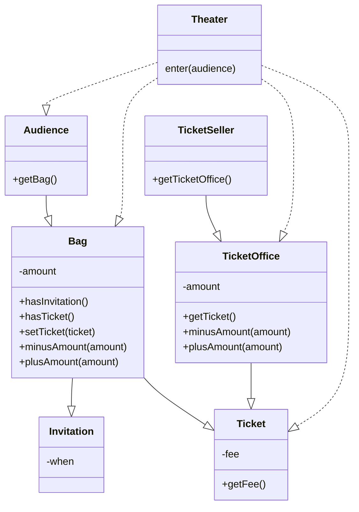
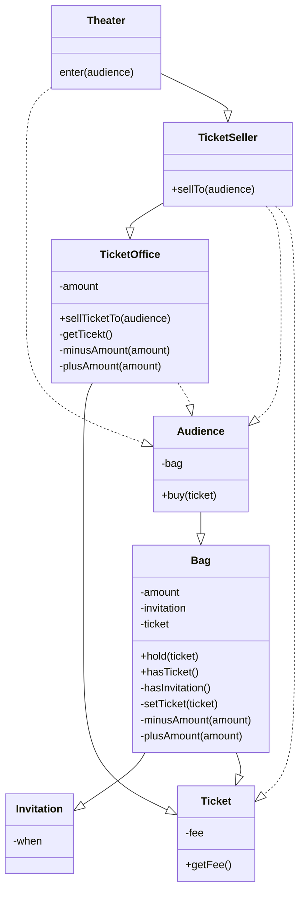

# 00. 들어가며
## 01 패러다임의 시대
과학혁명이란 과거의 패러다임이 새로운 패러다임에 의해 대체됨으로써 정상과학의 방향과 성격이 변하는 것을 의미한다. 
이를 패러다임의 전환이라고 부른다. 이 책에서 이야기하는 패러다임 전환이란 절차형 패러다임에서 객체지향 패러다임으로 변화를 가리킨다.

## 02 프로그래밍 패러다임
프로그래밍 패러다임은 과거의 패러다임을 폐기시키는 혁명적인 과정을 거치지 않는 것으로 보인다.
오히려 과거에 있던 패러다임의 단점을 보완하는 발전적인 과정을 거치는 것으로 보인다. 프로그래밍 패러다임은 혁명적(revolutionary)이 아니라 발전적(evolutionary)이다.

***

# 01. 객체, 설계
## 01 티켓 판매 애플리케이션 구현하기


```java
public class Theater {

    private TicketSeller ticketSeller;

    public Theater(TicketSeller ticketSeller) {
        this.ticketSeller = ticketSeller;
    }

    public void enter(Audience audience) {
        if (audience.getBag().hasInvitation()) {
            audience.getBag().setTicket(ticketSeller.getTicketOffice().getTicket());
        } else {
            Ticket ticket = ticketSeller.getTicketOffice().getTicket();
            audience.getBag().minusAmount(ticket.getFee());
            ticketSeller.getTicketOffice().plusAmount(ticket.getFee());
            audience.getBag().setTicket(ticket);
        }
    }
}
```

## 02 무엇이 문제인가
### 예상을 빗나가는 코드
현실에서는 관람객이 직접 자신의 가방에서 초대장을 꺼내 판매원에게 건넨다. 티켓을 구매하는 관람객은 가방 안에서 돈을 직접 꺼내 판매원에게 지불한다.
판매원 매표소에 있는 티켓을 직접 꺼내 관람객에게 건네고 관람객에게서 직접 돈을 받아 매표소에 보관한다.
현재의 코드는 우리의 상식과는 너무나도 다르게 동작하기 때문에 코드를 읽는 사람과 제대로 의사소통하지 못한다.

코드를 이해하기 어려운 이유가 또 하나가 있다. 여러 가지 세부적인 내용들을 한꺼번에 기억하고 있어야 한다는 점이다. 
Theater의 enter 메서드를 이해하기 위해서는 Audience가 Bag을 가지고 있고 
Bag 안에는 현금과 티켓이 들어있으며 TicketSeller가 TicketOffice에서 티켓을 판매하고, TicketOffice 안에 돈과 티켓이 보관돼 있다는 모든 사실을 
동시에 기억하고 있어야 한다. 하나의 클래스나 메서드에서 너무 많은 세부사항을 다루기 때문에 코드를 작성하는 사람뿐만 아니라 이 코드를 읽고 이해해야 하는 사람 모두에게 큰 부담을 준다.

### 변경에 취약한 코드
Audience와 TicketSeller가 변경될 경우 Theater도 함께 변경되어야 한다. 두 객체 사이의 결합도가 높으면 높을 수록 함께 변경될 확률도 높아지기 때문에 
변경이 어려워진다. 따라서 설계 목표는 객체 사이의 결합도를 낮춰 변경이 용이한 설계를 만드는 것이어야 한다.

## 03 설계 개선하기
코드를 이해하기 어려운 이유는 Theater가 관람객의 가방과 판매원의 매표소에 직접 접근하기 때문이다. 관람객과 판매원이 자신의 일을 스스로처리해야 한다는 우리의 직관에서 벗어난다.
Theater가 관람객의 가방과 판매원의 매표소에 직접 접근한다는 것은 Theater가 Audience와 TicketSeller에 결합된다는 것을 의미한다.
이를 해결 하기 위해서는 관람객과 판매원을 자율적인 존재로 만들면 된다.



## 04 객체지향 설계
데이터와 프로세스를 하나의 덩어리로 모으는 것은 훌륭한 객체지향 설계로 가는 첫걸음이다. 
진정한 객체지향 설계로 나아가는 길은 협력하는 객체들 사이의 의존성을 적절하게 조절함으로써 변경에 용이한 설계를 만드는 것이다.

***

# 02. 객체지향 프로그래밍
## 01 영화 예매 시스템
* 영화: 제목, 상영시간, 가격 정보와 같이 영화가 가지고 있는 기본적인 정보를 가리킨다.
* 상영: 상영 일자, 시간, 순번 등을 가리킨다.
* 할인
  * 할인 조건: 가격의 할인 여부를 결정
    * 순서 조건
    * 기간 조건
  * 할인 정책: 할인 요금을 결정
    * 금액 할인 정책
    * 비율 할인 정책

## 02 객체지향 프로그래밍을 향해
> 협력, 객체, 클래스

객체지향 패러다임으로의 전환은 클래스가 아닌 객체에 초점을 맞출 때에만 얻을 수 있다. 이를 위해서는 프로그래밍하는 동안 다음의 두가지에 집중해야 한다.

1. 어떤 클래스가 필요한지 고민하기 전에 어떤 객체들이 필요한지 고민하라.
2. 객체를 독립적인 존재가 아니라 기능을 구현하기 위해 협력하는 공동체의 일원으로 봐야한다.

> 도메인 구조를 따르는 프로그램 구조

* 도메인: 문제를 해결하기 위해 사용자가 프로그램을 사용하는 분야

1. 클래스의 이름을 최대한 도메인 개념의 이름과 동일하거나 유사하게 지어야 한다.
2. 클래스 사이의 관계도 최대한 도메인 개념 사이에 맺어진 관계와 유사하게 만들어서 프로그램의 구조를 이해하고 예상하기 쉽게 만들어야 한다.

> 클래스 구현

* 자율적인 객체
  * 객체는 상태(state)와 행동(behavior)을 함께 가지는 복합적인 존재다.
  * 객체는 스스로 판단하고 행동하는 자율적인 존재다.

* 프로그래머의 자유
  * 클래스 작성가: 새로운 데이터 타입을 프로그램에 추가한다.
  * 클라이언트 프로그래머: 클래스 작성가가 추가한 데이터 타입을 사용한다.

> 협력하는 객체들의 공동체

객체지향 프로그램을 작성할 때는 먼저 협력의 관점에서 어떤 객체가 필요하진 결정하고, 객체들의 공통 상태와 행위를 구현하기 위해 클래스를 작성한다.

> 협력에 관한 짧은 이야기

객체의 내부 상태는 외부에서 접근하지 못하도록 감춰야 한다.
대신 외부에 공개하는 public 인터페이스를 통해 내부 상태에 접근할 수 있도록 허용한다.
객체는 다른 객체의 인터페이스에 공개된 행동을 수행하도록 요청(request)할 수 있다.
요청 받은 객체는 자율적인 방법에 따라 요청을 처리한 후 응답(response)한다.

객체가 다른 객체와 상호작용할 수 있는 유일한 방법은 메시지를 전송하는 것 뿐이다.
메시지를 수신한 객체는 스스로 결정에 따라 자율적으로 메시지를 처리할 방법을 결정한다.
이 처럼 메시지를 처리하기 위한 자신만의 방법을 메서드(method)라고 한다.


