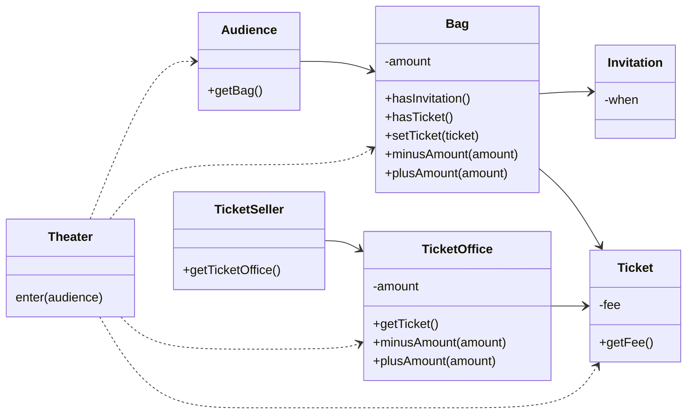
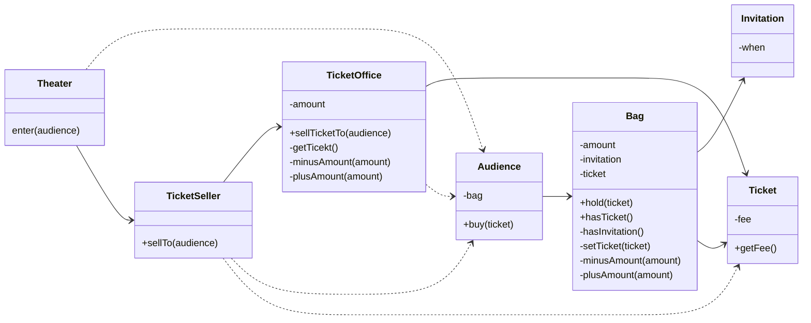

# 01. 객체, 설계
## 01 티켓 판매 애플리케이션 구현하기


```java
public class Theater {

    private TicketSeller ticketSeller;

    public Theater(TicketSeller ticketSeller) {
        this.ticketSeller = ticketSeller;
    }

    public void enter(Audience audience) {
        if (audience.getBag().hasInvitation()) {
            audience.getBag().setTicket(ticketSeller.getTicketOffice().getTicket());
        } else {
            Ticket ticket = ticketSeller.getTicketOffice().getTicket();
            audience.getBag().minusAmount(ticket.getFee());
            ticketSeller.getTicketOffice().plusAmount(ticket.getFee());
            audience.getBag().setTicket(ticket);
        }
    }
}
```

## 02 무엇이 문제인가
> 예상을 빗나가는 코드

현실에서는 관람객이 직접 자신의 가방에서 초대장을 꺼내 판매원에게 건넨다. 티켓을 구매하는 관람객은 가방 안에서 돈을 직접 꺼내 판매원에게 지불한다.
판매원 매표소에 있는 티켓을 직접 꺼내 관람객에게 건네고 관람객에게서 직접 돈을 받아 매표소에 보관한다.
현재의 코드는 우리의 상식과는 너무나도 다르게 동작하기 때문에 코드를 읽는 사람과 제대로 의사소통하지 못한다.

코드를 이해하기 어려운 이유가 또 하나가 있다. 여러 가지 세부적인 내용들을 한꺼번에 기억하고 있어야 한다는 점이다.
Theater의 enter 메서드를 이해하기 위해서는 Audience가 Bag을 가지고 있고
Bag 안에는 현금과 티켓이 들어있으며 TicketSeller가 TicketOffice에서 티켓을 판매하고, TicketOffice 안에 돈과 티켓이 보관돼 있다는 모든 사실을
동시에 기억하고 있어야 한다. 하나의 클래스나 메서드에서 너무 많은 세부사항을 다루기 때문에 코드를 작성하는 사람뿐만 아니라 이 코드를 읽고 이해해야 하는 사람 모두에게 큰 부담을 준다.

> 변경에 취약한 코드

Audience와 TicketSeller가 변경될 경우 Theater도 함께 변경되어야 한다. 두 객체 사이의 결합도가 높으면 높을 수록 함께 변경될 확률도 높아지기 때문에
변경이 어려워진다. 따라서 설계 목표는 객체 사이의 결합도를 낮춰 변경이 용이한 설계를 만드는 것이어야 한다.

## 03 설계 개선하기
코드를 이해하기 어려운 이유는 Theater가 관람객의 가방과 판매원의 매표소에 직접 접근하기 때문이다. 관람객과 판매원이 자신의 일을 스스로처리해야 한다는 우리의 직관에서 벗어난다.
Theater가 관람객의 가방과 판매원의 매표소에 직접 접근한다는 것은 Theater가 Audience와 TicketSeller에 결합된다는 것을 의미한다.
이를 해결 하기 위해서는 관람객과 판매원을 자율적인 존재로 만들면 된다.



## 04 객체지향 설계
데이터와 프로세스를 하나의 덩어리로 모으는 것은 훌륭한 객체지향 설계로 가는 첫걸음이다.
진정한 객체지향 설계로 나아가는 길은 협력하는 객체들 사이의 의존성을 적절하게 조절함으로써 변경에 용이한 설계를 만드는 것이다.