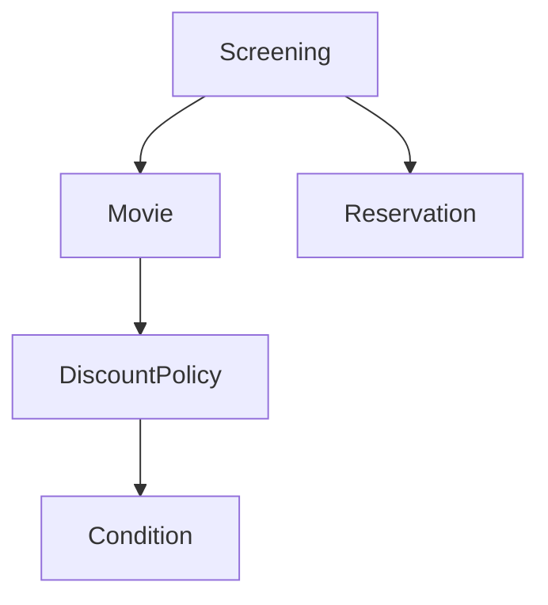
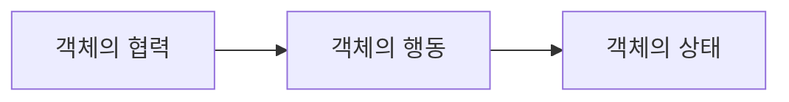
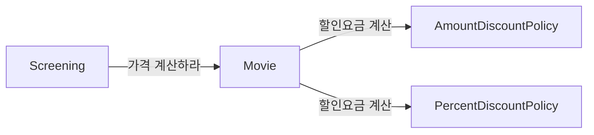
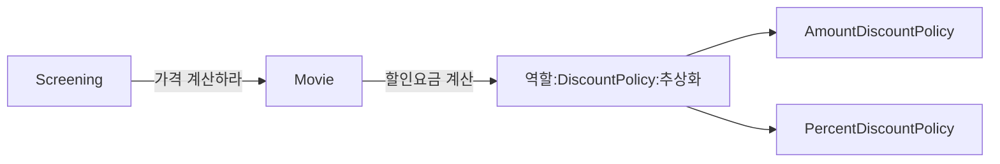

# 03. 역할, 책임, 협력

## 01 협력
> 영화 예매 시스템 돌아보기

객체들이 영화 예매라는 기능을 구현하기 위해 메시지를 주고 받으면서 상호작용한다.
이처럼 객체들이 애플리케이션의 기능을 구현하기 위해 수행하는 상호작용을 `협력`이라고 한다.
객체가 협력에 참여하기 위해 수행하는 로직은 `책임`이라고 한다.
객체들이 협력 안에서 수행하는 책임들이 모여 객체가 수행하는 `역할`을 구성한다.

> 협력

협력이란 어떤 객체가 다른 객체에게 무엇인가를 요청하는 것이다.
한 객체는 어떤 것이 필요할 때 다른 객체에게 전적으로 위임하거나 서로 협력한다.
두 객체가 상호작용을 통해 더 큰 책임을 수행하는 것이다.
객체 사이의 협력을 설계할 때는 객체를 서로 분리된 인스턴스가 아닌 협력하는 파트너로 인식해야 한다.
객체들 사이의 협력을 구성하는 일련의 요청 과정과 응답의 흐름을 통해 애플리케이션의 기능이 구현된다.

> 협력이 설계를 위한 문맥을 결정한다

객체의 행동을 결정하는 것은 협력이다.
객체의 상태를 결정하는 것은 행동이다.
협력이라는 문맥을 고려하지 않고 행동을 결정하는 것은 아무런 의미가 없다.
객체는 자신의 상태를 스스로 결정하고 관리하는 존재이기 때문에 객체가 수행하는 행동에 필요한 상태도 함께 가지고 있어야 한다.

객체가 참여하는 협력이 객체를 구성하는 행동과 상태 모두를 결정한다. 따라서 협력은 일종의 문맥(context)을 제공한다.

## 02 책임
> 책임이란 무엇인가

협력에 참여하기 위해 객체가 수행하는 행동을 책임이라고 부른다.
객체의 책임은 객체가 `무엇을 할 수 있는가`와 `무엇을 알고 있는가` 로 구성된다.
객체의 책임은 크게 `하는 것`과 `아는 것`의 두가지 범주로 나누어 세분화할 수 있다.

* 하는 것
    * 객체를 생성하거나 계산을 수행하는 등의 스스로 하는 것
    * 다른 객체의 행동을 시작시키는 것
    * 다른 객체의 활동을 제어하고 조절하는 것
* 아는 것
    * 사적인 정보에 관해 아는 것
    * 관련된 객체에 관해 아는 것
    * 자신이 유도하거나 계산할 수 있는 것에 관해 아는 것

객체지향 설계에서 가장 중요한 것은 책임이다.
객체에게 얼마나 적절한 책임을 할당하느냐가 설계의 전체적인 품질을 결정한다.

> 책임할당

책임을 수행하는 데 필요한 정보를 가장 잘 알고 있는 전문가에게 그 책임을 할당한다.
이를 책임 할당을 위한 `Information expert`(정보 전문가) 패턴이라고 한다.
객체지향 설계는 시스템의 책임을 완료하는 데 필요한 더 작은 책임을 찾아내고
이를 객체들에게 할당하는 반복적인 과정을 통해 모양을 갖춰간다.

> 책임 주도 설계

책임을 찾고 책임을 수행할 적절한 객체를 찾아 책임을 할당하는 방식으로 협력을 설계하는 방법을 `책임 주도 설계`(Responsibility-Driven Design, RDD)라고 부른다.
다음은 책임 주도 설계 방법의 과정이다.

* 시스템이 사용자에게 제공해야하는 기능인 시스템 책임을 파악한다.
* 시스템 책임을 더 작은 책임으로 분할 한다.
* 분할된 책임을 수행할 수 있는 적절한 객체 또는 역할을 찾아 책임을 할당한다.
* 객체가 책임을 수행하는 도중 다른 객체의 도움이 필요한 경우 이를 책임질 적절한 객체 또는 역할을 찾는다.
* 해당 객체 또는 역할에게 책임을 할당함으로써 두객체가 협력하게 한다.

책임 주도 설계는 자연스럽게 객체의 구현이 아닌 책임에 집중할 수 있게 한다.
구현이 아닌 책임에 집중하는 것이 중요한 이유는 유연하고 견고한 객체지향 시스템을 위해 가장 중요한 재료가 바로 책임이기 때문이다.

> 메시지가 객체를 결정한다

객체가 메시지를 선택하는 것이 아니라 메시지가 객체를 선택하게 한다.
두 가지 중요한 이유가 있다.

1. 최소한의 인터페이스(minimal interface)
    * 필요한 메시지가 식별될 때까지 객체의 퍼블릭 인터페이스에 어떤 것도 추가하지 않기 때문에 객체는 꼭 필요한 퍼블릭 인터페이스를 가질 수 있다.
2. 추상적인 인터페이스(abstract interface)
    * 객체의 인터페이스는 `무엇`을 하는지 표현해야 하지만 `어떻게` 수행하는지를 노출해서는 안된다. 메시지는 외부의 객체가 요쳥하는 무언가를 의미하기 때문에 메시지를 먼저 식별하면 무엇을 수행할지에 초점을 맞추는 인터페이스를 얻을 수 있다.

> 행동이 상태를 결정한다

상태는 단지 객체가 행동을 정상적으로 수행하기 위해 필요한 재료일뿐이다.
중요한 것은 객체의 상태가 아니라 행동이다.
객체가 가질 수 있는 상태는 행동을 결정하고 나서야 비로소 결정할 수 있다.
협력이 객체의 행동을 결정하고  행동이 상태를 결정한다.
그리고 그 행동이 바로 객체의 책임이 된다.

## 03 역할
> 역할과 협력

객체가 어떤 특정한 협력 안에서 수행하는 책임의 집합을 역할이라고 부른다.
실제로 협력을 모델링할 때는 특정한 객체가 아니라 역할에 책임을 할당한다고 생각하는게 좋다.

> 유연하고 재사용 가능한 협력

역할이 중요한 이유는 역할을 통해 유연하고 재사용 가능한 협력을 얻을 수 있기 때문이다.
영화 예매 도메인에는 금액 할인 정책과 비율 할인 정책이라는 두 가지 종류의 가격 할인 정책이 존재한다.
때문에 `AmountDiscountPolicy` 인스턴스와 `PercentDiscountPolicy` 인스턴스라는 두 가지 종류의 객체가 할인 요금을 계산하라 메세지에 응답할 수 있어야 한다.
두 협력을 구현하면 대부분의 코드가 중복된다.
문제를 해결하기 위해서는 객체가 아닌 책임에 초점을 맞춰야 한다.
순수하게 책임의 관점에서 두 협력을 바라보면 모두 할인 요금 계산이라는 동일한 책임을 수행한다는 사실을 알 수 있다.
객체라는 존재를 지우고 할인 요금을 계산하라는 메시지에 응답할 수 있는 대표자를 생각한다면 두 협력을 하나로 통합할 수 있을 것이다.
이 대표자를 협력 안에서 두 종류의 객체로 교대로 바꿔서 끼울 수 있는 일종의 슬롯으로 생각할 수 있다.
이 슬롯이 바로 역할이다.

> 객체 대 역할

협력에 적합한 책임을 수행하는 대상이 한 종류라면 간단하게 객체로 간주한다.
만약 여러 종류의 객체들이 참여할 수 있다면 역할이라고 부르면 된다.
유연하고 확장 가능하며 일관된 구조를 가지는 시스템을 구축하는 데 역할은 매우 중요하다.

> 역할과 추상화

역할은 공통의 책임을 바탕으로 객체의 종류를 숨기기 때문에 이런 관점에서 역할을 객체의 추상화로 볼 수 있다.
따라서 추상화가 가지는 두 가지 장점을 협력의 관점에서 역할에도 동일하게 적용 될 수 있다.

1. 세부 사항에 억눌리지 않고도 상위 수준의 정책을 쉽고 간단하게 표현할 수 있다.
2. 설계를 유연하게 만들 수 있다.

> 배우와 배역

연극의 배역과 배우 간의 관계에는 다음과 같은 특성이 존재한다.

* 배역은 연극 배우가 특정 연극에서 연기하는 역할이다.
* 배역은 연극이 상영되는 동안에만 존재하는 일시적인 개념이다.
* 연극이 끝나면 연극 배우는 배역이라는 역할을 벗어 버리고 원래의 연극 배우로 돌아온다.
* 서로 다른 배우들이 동일한 배역을 연기할 수 있다.
* 하나의 배우가 다양한 연극 안에서 서로 다른 배역을 연기할 수 있다.

연극 안에서 배역을 연기하는 배우는, 협력 안에서 역할을 수행하는 객체라는 관점이 가진 입체적인 측면들을 훌륭하게 담아낸다.
객체는 다양한 역할을 가질 수 있다.
객체는 협력에 참여할 때 협력 안에서 하나의 역할로 보여진다.
객체가 다른 협력에 참여할 때는 다른 역할로 보여진다.
협력의 관점에서 동일한 역할을 수행하는 객체들은 서로 대체 가능하다.
역할은 특정한 객체의 종류를 캡슐화하기 때문에 동일한 역할을 수행하고 계약을 준수하는 대체 가능한 객체들은 다형적이다.
