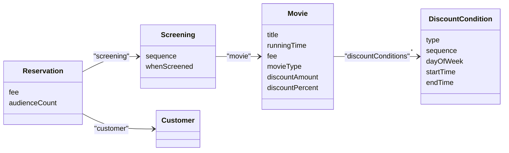
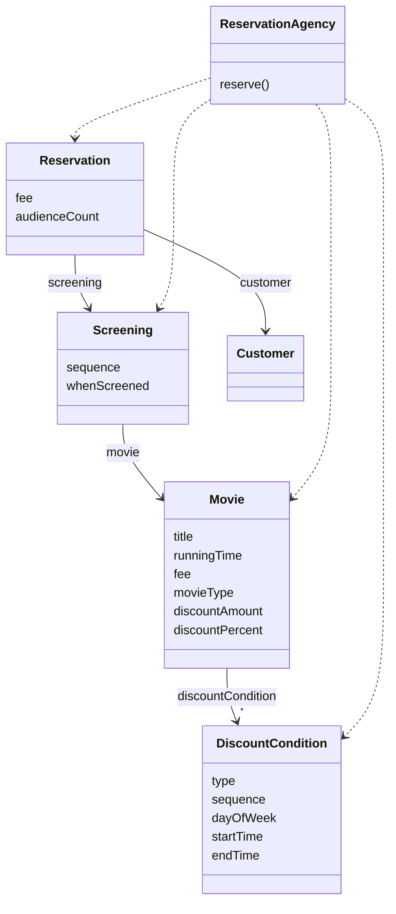
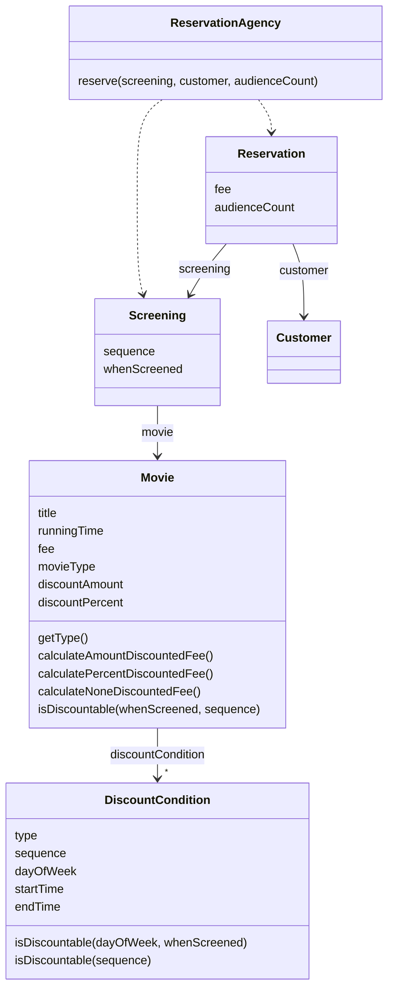

# 04. 설계 품질과 트레이드오프
## 01 데이터 중심의 영화 예매 시스템
> 데이터를 준비하자

책임 중심의 설계가 '책임이 무엇인가'를 묻는 것으로 시작한다면 데이터 중심의 설계는 객체가 내부에 저장해야하는 '데이터가 무엇인가'를 묻는 것으로 시작한다.

```java
public class Movie {
    private String title;
    private Duration runningTime;
    private Money fee;
    private List<DiscountCondition> discountConditionList;

    private MovieType movieType;
    private Money discountAmount;
    private double discountPercentage;
}
```
가장 두드러지는 차이점은 할인 조건의 목록이 인스턴스 변수로 `Movie` 안에 직접 포함돼 있다는 것이다.
또한 할인 정책을 `DiscountPolicy`라는 별도의 클래스로 분리했던 예전 예제와 달리
금액 할인 정책에 사용되는 할인 금액과 비율 할인 정책에 사용되는 할인 비율을 `Movie` 안에서 직접 정의하고 있다.

할인 정책은 영화별로 오직 하나만 지정할 수 있기에 한 시점에 `discountAmount`와 `discountPercentage` 중 하나의 값만 사용될 수 있다.
영화의 할인 정책의 종류는 어떻게 알 수 있을까? 할인 정책의 종류를 결정하는 것이 바로 `movieType`이다.

데이터 중심의 설계에서는 객체가 포함해야 하는 데이터에 집중한다.
객체의 종류를 저장하는 인스턴스 변수(movieType)와 인스턴스의 종류에 따라 배타적으로 사용될 인스턴스 변수를 하나의 클래스 안에 포함시키는 방식은 데이터 중심의 설계 안에서 흔히 볼수 있는 패턴이다.



> 영화를 예매하자

```java
public class ReservationAgency {

    public Reservation reserve(Screening screening, Customer customer, int audienceCount) {

        Movie movie = screening.getMovie();

        boolean discountable = false;
        for (DiscountCondition condition : movie.getDiscountConditionList()) {
            if (condition.getDiscountType() == DiscountType.PEROID) {
                discountable = screening.getWhenScreened().getDayOfWeek().equals(condition.getDayOfWeek())
                        && condition.getStartTime().compareTo(screening.getWhenScreened().toLocalTime()) <= 0
                        && condition.getEndTime().compareTo(screening.getWhenScreened().toLocalTime()) >= 0;
            } else {
                discountable = condition.getSequence() == screening.getSequence();
            }

            if (discountable) {
                break;
            }
        }

        Money fee;
        if (discountable) {
            Money discountAmount = Money.ZERO;
            switch (movie.getMovieType()) {
                case AMOUNT_DISCOUNT -> discountAmount = movie.getDiscountAmount();
                case PERCENT_DISCOUNT -> discountAmount = movie.getFee().times(movie.getDiscountPercentage());
                case NONE_DISCOUNT -> discountAmount = Money.ZERO;
            }

            fee = movie.getFee().minus(discountAmount);
        } else {
            fee = movie.getFee();
        }

        return new Reservation(customer, screening, fee, audienceCount);
    }
}
```
reserve 메서드는 크게 두 부분으로 나눌수 있다.
첫 번째는 `DiscountCondition`에 대해 루프를 돌면서 할인 가능 여부를 확인하는 for문이다.
두 번째는 `discountable` 변수의 값으 체크하고 적절한 활인 정책에 따라 예매 요금을 계산하는 if문이다.
책임 중심의 설계 방법과 비교해 보면서 두 방법의 장단점을 파악해보자.

## 02 설계 트레이드오프
> 캡슐화

변경될 가능성이 높은 부분을 구현이라고 부르고 상대적으로 안정적인 부분을 인터페이스라고 부른다.
캡슐화의 가장 중요한 원리는 불안정한 구현 세부사항을 안정적인 인터페이스 뒤로 캡슐화하는 것이다.
정리하면 캡슐화란 변경 가능성이 높은 부분을 객체 내부로 숨기는 추상화 기법이다.
변경될 수 있는 어떤 것이라도 캡슐화해야한다. 이것이 바로 객체지향 설계의 핵심이다.

> 응집도와 결합도

#### 응집도
모듈에 포함된 내부 요소들이 연관돼 있는 정도를 나타낸다.
모듈 내의 요소들이 하나의 목적을 위해 긴밀하게 협력한다면 그 모듈은 높은 응집도를 가진다.
모듈 내의 요소들이 서로 다른 목적을 추구한다면 그 모듈은 낮은 응집도를 가진다.

#### 결합도
의존성의 정도를 나타내며 다른 모듈에 대해 얼마나 많은 지식을 갖고 있는지 나타내는 척도다.
어떤 모듈이 다른 모듈에 대해 자세한 부분까지 알고 있다면 두 모듈은 높은 결합도를 가진다.
어떤 모듈이 다른 모듈에 대해 필요한 부분만 알고 있다면 두 모듈은 낮은 결합도를 가진다.

높은 응집도와 낮은 결합도를 추구하는 이유는 단 한가지다.
그것이 설계를 변경하기 쉽게 만들기 때문이다.

## 03 데이터 중심의 영화 예매 시스템의 문제점
> 캡슐화 위반

데이터 중심으로 설계한 `Movie` 클래스를 보면 오직 메서드를 통해서만 객체의 내부 상태에 접근할 수 있다는 것을 알 수 있다.
```java
public class Movie {
    private Money fee;
    
    public Money getFee() {
        return fee;
    }
    
    public void setFee(Money fee) {
        this.fee = fee;
    }
}
```
위 코드는 직접 객체의 내부에 접근할 수 없기 때문에 캡슐화의 원칙을 지키고 있는 것처럼 보인다.
하지만 `getFee()`, `setFee()` 메서드는 `Movie` 내부에 `Money` 타입의 fee라는 인스턴스 변수가 존재한다는 사실을 퍼블릭 인터페이스에 노골적으로 드러낸다.
`Moive`가 캡슐화의 원칙을 어기게 된 근본적인 원인은 객체가 수행할 책임이 아니라 내부에 저장할 데이터에 초점을 맞췄기 때문이다.

설계할 때 협력에 관해 고민하지 않으면 캡슐화를 위반하는 과도한 접근자와 수정자를 가지게 되는 경향이 있다.
객체가 사용될 문맥을 추측할 수밖에 없는 경우 개발자는 어떤 상황에서도 해당 객체가 사용될 수 있게 최대한 많은 접근자 메서드를 추가하게 되는 것이다.
앤런 홀럽(Allen Holub)은 이처럼 접근자와 수정자에 과도하게 의존하는 설계 방식을 `추측에 의한 설계 전략(design-by-guessing strategy)`라고 부른다.
그 결과, 캡슐화의 원칙을 위반하는 변경에 취약한 설계를 얻게 된다.

> 높은 결합도

데이터 중심 설계가 가지는 또 다른 단점은 여러 데이터 객체들을 사용하는 제어로직이 특정 객체 안에 집중되기 때문에 하나의 제어 객체가 다수의 데이터 객체에 강하게 결합된다는 것이다.
이 결합도로 인해 어떤 데이터 객체를 변경하더라도 제어 객체를 함께 변경할 수 밖에 없다.


영화 예매 시스템의 대부분의 제어 로직을 가지고 있는 `ReservationAgency`가 모든 데이터 객체에 의존한다.
`DiscountCondition`, `Screening`이 수정되면 `ReservationAgency`도 수정해야 한다.
시스템의 모든 변경이 `ReservationAgency`의 변경을 유발한다.

데이터 중심의 설계는 전체 시스템을 하나의 거대한 의존성 덩어리로 만들어 버리기 때문에 어떤 변경이라도 일단 발생하고 나면 시스템 전체가 요동칠 수밖에 없다.

> 낮은 응집도

서로 다른 이유로 변경되는 코드가 하나의 모듈 안에 공존할 때 응집도가 낮다고 말한다.
낮은 응집도는 두 가지 측면에서 설계에 문제를 일으킨다.

* 변경의 이유가 서로 다른 코드들을 하나의 모듈 안에 뭉쳐놓았기 때문에 변경과 아무 상관이 없는 코드들이 영향을 받게 된다.
    * `ReservationAgency` 안에 할인 정책을 선택하는 코드와 할인 조건을 판단하는 코드가 함께 존재하기 때문에 새로운 할인 정책을 추가하는 작업이 할인 조건에도 영향을 미칠 수 있다.
    * 어떤 코드를 수정한 후 아무런 상관도 없던 코드에 문제가 발생하는 것은 모듈의 응집도가 낮을 때 발생하는 대표적인 증상이다.
* 하나의 요구사항 변경을 반영하기 위해 동시에 여러 모듈을 수정해야 한다.
    * 응집도가 낮은 경우 모듈에 위치해야할 책임의 일부가 엉뚱한 곳에 위치하게 되기 때문이다.
    * 새로운 할인 정책이 추가 될 경우 `MovieType`에 새로운 할인 정책을 표현하는 열거형 값을 추가하고, `ReservationAgency`의 `reserve()` 메서드의 switch 구문에 새로운 case 절을 추가해야 한다.
    * 또한 새로운 할인 정책에 따라 할인 요금을 계산하기 위해 필요한 데이터도 `Movie`에 추가해야 한다.

어떤 요구사항 변경을 수용하기 위해 하나 이상의 클래스를 수정해야 하는 것은 응집도가 낮다는 증거다.

## 04 자율적인 객체를 향해
> 캡슐화를 지켜라

캡슐화는 설계의 제 1원리다.
낮은 응집도와 높은 결합도라는 문제로 몸살을 앓게 된 근본적인 원인은 캡슐화의 원칙을 위반했기 때문이다.

```java
class Rectangle {
    private int left;
    private int top;
    private int right;
    private int bottom;
    
    public Rectangle(int left, int top, int right, int bottom) {
        this.left = left;
        this.top = top;
        this.right = right;
        this.bottom = bottom;
    }
    
    public int getLeft() {
        return this.left;
    }
    
    public void setLeft(int left) {
        this.left = left;
    }

    public int getTop() {
      return this.top;
    }
  
    public void setTop(int top) {
      this.top = top;
    }

    public int getRight() {
      return this.right;
    }
  
    public void setRight(int right) {
      this.right = right;
    }

    public int getBottom() {
      return this.bottom;
    }
  
    public void setBottom(int bottom) {
      this.bottom = bottom;
    }
}
```

```java
class AnyClass {
    void anyMethod(Rectangle rectangle, int multiple) {
        rectangle.setRight(rectangle.getRight() * multiple);
        rectangle.setBottom(rectangle.getBottom() * multiple);
    }
}
```
사각형의 너비와 높이를 증가시키는 코드다.
이 코드는 많은 문제점이 도사리고 있다.
1. 코드 중복
    * 다른 곳에서도 사각형의 너비와 높이를 증가시키는 코드가 필요하다면 아마 그곳에서도 getter, setter를 호출하는 유사한 코드가 존재하게 될 것이다.
2. 변경에 취약
    * right와 bottom 대신 length, height를 이용해서 사각형을 표현하도록 수정한다면 getter, setter는 내부 구현을 인터페이스의 일부로 만들기 때문에 인스턴스 변수들의 존재를 외부에 노출하게 된다.
    * 결과적으로 각각의 getter, setter들은 getLength, setLength, getHeight, setHeight로 변경해야하고 이 변경은 getter, setter를 사용하는 모든 코드에 영향을 끼친다

```java
class Rectangle {
    private int left;
    private int top;
    private int right;
    private int bottom;
    
    public Rectangle(int left, int top, int right, int bottom) {
        this.left = left;
        this.top = top;
        this.right = right;
        this.bottom = bottom;
    }
    
    public void enlarge(int multiple) {
        right *= multiple;
        bottom *= multiple;
    }
}
```
Rectangle을 변경하는 주체를 외부 객체에서 Rectangle로 이동시켰다.
자신의 크기는 Rectangle 스스로가 증가시키도록 `책임을 이동`시킨 것이다. 이것이 바로 객체가 스스로 책임진다는 말의 의미다.

> 스스로 자신의 데이터를 책임지는 객체

객체는 단순한 데이터 제공자가 아니다.
객체 내부에 저장되는 데이터보다 객체가 협력에 참여하면서 수행할 책임을 정의하는 오퍼레이션이 더 중요하다.

"이 객체가 어떤 데이터를 포함해야 하는가?"라는 질문은 다음과 같은 두 개의 개별적인 질문으로 분리해야 한다.
* 이 객체가 어떤 데이터를 포함해야 하는가?
* 이 객체가 데이터에 대해 수행해야 하는 오퍼레이션은 무엇인가?

두 질문을 조합하면 객체의 내부 상태를 저장하는 방식과 저장된 상태에 대해 호출할 수 있는 오퍼레이션의 집합을 얻을 수 있다.
다시 말해 새로운 데이터 타입을 만들 수 있는 것이다.

```java
public class DiscountCondition {
    private DiscountType discountType;
    private int sequence;
    private DayOfWeek dayOfWeek;
    private LocalTime startTime;
    private LocalTime endTime;
}
```
첫 번째 질문은 어떤 데이터를 관리해야 하는 지를 묻는 것이다.
`DiscountCondition`이 관리하는 데이터를 결정해 놓았다.

두 번째 질문은 이 데이터에 대해 수행할 수 있는 오퍼레이션이 무엇인가를 묻는 것이다.
할인 조건에는 순번 조건과 기간 조건의 두 가지 종류가 존재한다.
`DiscountCondition`은 순번 조건일 경우 `sequence`를 이용해서 할인 여부를 결정하고,
기간 조건일 경우에는 `dayOfWeek`, `startTime`, `endTime`을 이용해 할인 여부를 결정한다.

두 가지 할인 조건을 판단할 수 있게 두 개의 `isDiscountable` 메서드가 필요하다.

```java
public class DiscountCondition {

    private DiscountType discountType;
    private int sequence;
    private DayOfWeek dayOfWeek;
    private LocalTime startTime;
    private LocalTime endTime;


    public boolean isDiscountable(DayOfWeek dayOfWeek, LocalTime time) {
        if (discountType != DiscountType.PEROID) {
            throw new IllegalArgumentException();
        }

        return this.dayOfWeek.equals(dayOfWeek)
                && !this.startTime.isAfter(time)
                && !this.endTime.isBefore(time);
    }

    public boolean isDiscountable(int sequence) {
        if (discountType != DiscountType.SEQUENCE) {
            throw new IllegalArgumentException();
        }

        return this.sequence == sequence;
    }
}
```

이제 `Movie`를 구현하자.
첫 번째 질문은 `Movie`가 어떤 데이터를 포함해야 하는가를 묻는 것이다.

```java
public class Movie {
    private String title;
    private Duration runningTime;
    private Money fee;
    private List<DiscountCondition> discountConditionList;

    private MovieType movieType;
    private Money discountAmount;
    private double discountPercentage;
}
```

두 번째 질문은 이 데이터를 처리하기 위해 어떤 오퍼레이션이 필요한지 묻는 것이다.
`Moive`가 포함하는 데이터를 살펴보면 영화 요금을 계산하는 오퍼레이션과 할인 여부를 판단하는 오퍼레이션이 필요할 것 같다.

먼저 요금을 계산하는 오퍼레이션을 구현하자.
요금을 계산하기 위해서는 할인 정책을 염두에 둬야 한다.
따라서 `DiscountCondition`과 마찬가지로 할인 정책의 타입을 반환하는 `getMovieType` 메서드와
정책별로 요금을 계산하는 세 가지 메서드를 구현해야 한다.

```java
public class Movie {
    private String title;
    private Duration runningTime;
    private Money fee;
    private List<DiscountCondition> discountConditionList;

    private MovieType movieType;
    private Money discountAmount;
    private double discountPercentage;

    public Money calculateAmountDiscountedFee() {
        if (movieType != MovieType.AMOUNT_DISCOUNT) {
            throw new IllegalStateException();
        }

        return fee.minus(discountAmount);
    }

    public Money calculatePercentDiscountedFee() {
        if (movieType != MovieType.PERCENT_DISCOUNT) {
            throw new IllegalStateException();
        }

        return fee.minus(fee.times(discountPercentage));
    }

    public Money calculateNoneDiscountedFee() {
        if (movieType != MovieType.NONE_DISCOUNT) {
            throw new IllegalStateException();
        }

        return fee;
    }
}
```
`Moive`는 `DiscountCondition`의 목록을 포함하기 때문에 할인 여부를 판단하는 오퍼레이션 역시 포함해야 한다.
`isDiscountable` 메서드를 추가하자.

```java
public class Movie {
  public boolean isDiscountable(LocalDateTime whenScreened, int sequence) {
    for (DiscountCondition discountCondition : discountConditionList) {
      if (discountCondition.getDiscountType() == DiscountType.PEROID) {
        if (discountCondition.isDiscountable(whenScreened.getDayOfWeek(), whenScreened.toLocalTime())) {
          return true;
        }
      } else {
        if (discountCondition.isDiscountable(sequence)) {
          return true;
        }
      }
    }

    return false;
  }
}
```

이제 `Screening`을 살펴보자.
`Screening`이 관리하는 데이터와 메서드다.

```java
public class Screening {

  private Movie movie;
  private int sequence;
  private LocalDateTime whenScreened;

  public Screening(Movie movie, int sequence, LocalDateTime whenScreened) {
    this.movie = movie;
    this.sequence = sequence;
    this.whenScreened = whenScreened;
  }

  public Money calculateFee(int audienceCount) {
    switch (movie.getMovieType()) {
      case AMOUNT_DISCOUNT:
        if (movie.isDiscountable(whenScreened, sequence)) {
          return movie.calculateAmountDiscountedFee().times(audienceCount);
        }
        break;
      case PERCENT_DISCOUNT:
        if (movie.isDiscountable(whenScreened, sequence)) {
          return movie.calculatePercentDiscountedFee().times(audienceCount);
        }
        break;
      case NONE_DISCOUNT:
        return movie.calculateNoneDiscountedFee().times(audienceCount);
    }
    return movie.calculateNoneDiscountedFee().times(audienceCount);
  }
  

  public Movie getMovie() {
    return movie;
  }

  public void setMovie(Movie movie) {
    this.movie = movie;
  }

  public int getSequence() {
    return sequence;
  }

  public void setSequence(int sequence) {
    this.sequence = sequence;
  }

  public LocalDateTime getWhenScreened() {
    return whenScreened;
  }

  public void setWhenScreened(LocalDateTime whenScreened) {
    this.whenScreened = whenScreened;
  }
}

```

`ReservationAgency`는 `Screening`의 `calculateFee` 메서드를 호출해 예매 요금을 계산한 후 계산되는 요금을 이용해 `Reservation`을 생성한다.
```java
public class ReservationAgency {

    public Reservation reservation(Screening screening, Customer customer, int audienceCount) {
        Money fee = screening.calculateFee(audienceCount);
        return new Reservation(customer, screening, fee, audienceCount);
    }
}
```
결합도 측면에서 `ReservationAgency`에 의존성이 몰려있던 첫 번째 설계보다는 개선된 것으로 보인다.
이 것은 두 번째 설계가 첫 번째 설계보다 내부 구현을 더 면밀하게 캡슐화 하고 있기 때문이다.



## 05 하지만 여전히 부족하다.
> 캡슐화 위반

`DiscountCondition`의 `isDiscountable` 메서드는 시그니처를 통해 객체 내부의 상태를 그대로 드러냈다.
`DiscountCondition`의 객체 내부의 상태가 변경되면 `isDiscountable`을 호출하는 모든 코드에 영향을 끼칠 것이다.
내부 구현의 변경이 외부로 퍼져나가는 파급 효과(ripple effect)는 캡슐화가 부족하다는 명백한 증거다.
따라서 변경 후의 설계는 자기 자신을 스스로 처리한다는 점에서 이전의 설계보다 분명히 개선됐지만 여전히 내부의 구현을 캡슐화하는 데는 실패한 것이다.

`Movie`의 요금 계산 메서드들은 객체의 파라미터나 반환 값을 내부에 포함된 속성에 대한 어떤 정보도 노출하지 않는다.
따라서 캡슐화의 원칙을 지키고 있다고 생각할 수도 있지만, `Movie` 역시 내부 구현을 인터페이스에서 노출시키고 있다.
여기서 노출시키는 것은 할인 정책의 종류다. `calculateAmountDiscountedFee`, `calculatePercentDiscountedFee`, `calculateNoneDiscountedFee` 라는
세 개의 메서드는 할인 정책의 세 가지 종류를 드러내고 있다.
만약 새로운 할인 정책이 추가 되거나 기존 할인 정책이 제거 된다면 이 메서드들에 의존하는 모든 클라이언트가 영향을 받을 것이다.

```
캡슐화의 진정한 의미
캡슐화는 단순히 객체 내부의 데이터를 외부로부터 감추는 것 이상을 의미한다.
캡슐화는 변경될 수 있는 어떤 것이다로 감추는 것을 의미한다.
내부 구현의 변경으로 인해 외부의 객체가 영향을 받는다면 캡슐화를 위반한 것이다.
```

> 높은 결합도

캡슐화의 위반으로 인해 `DiscountCondtion`의 내부 구현이 외부로 노출됐기 때문에 `Movie`와 `DiscountCondition` 사이의 결합도는 높을 수 밖에 없다.
두 객체 사이의 결합도가 높은 경우 한 객체의 구현을 변경할 경우 다른 객체에게 변경의 영향이 전파될 확률이 높다.

```java
public class Movie {
    
  public boolean isDiscountable(LocalDateTime whenScreened, int sequence) {
    for (DiscountCondition discountCondition : discountConditionList) {
      if (discountCondition.getDiscountType() == DiscountType.PEROID) {
        if (discountCondition.isDiscountable(whenScreened.getDayOfWeek(), whenScreened.toLocalTime())) {
          return true;
        }
      } else {
        if (discountCondition.isDiscountable(sequence)) {
          return true;
        }
      }
    }
    return false;
  }
  
}
```
* `DiscountCondition`의 기간 할인 조건의 명칭이 PERIOD에서 다른 값으로 변경된다면 `Movie`를 수정해야 한다.
* `DiscountCondition`의 종류가 추가되거나 삭제된다면 `Movie`의 `isDiscountable` 메서드의 `if ~ else` 구문을 수정해야 한다.
* `DiscountCondition`의 만족 여부를 판단하는데 필요한 정보가 변경되면 `Movie`의 `isDiscountable` 메서드 시그니처도 함께 변경이 되어야 한다.

`DiscountCondition`의 인터페이스가 아니라 구현을 변경해도 `Movie`를 변경해야 한다는 것은 결합도가 높다는 것을 의미한다.

> 낮은 응집도

앞에서 설명한 것처럼 `DiscountConditon`이 할인 여부를 판단하는데 필요한 정보가 변경된다면 `Movie`의 `isDiscountable` 메서드로 전달해야하는 파라미터의 종류를 변경해야 하고,
이로 인해 `Screening`에서 `Moive`의 `isDiscountable` 메서드를 호출하는 부분도 함께 변경해야 한다.
결과적으로 할인 조건의 종류를 변경하기 위해서는 `DiscountCondtion`, `Movie`, `Screening`을 함께 수정해야 한다.
하나의 변경을 수용하기 위해 코드의 여러 곳을 동시에 변경해야 한다는 것은 응집도가 낮다는 증거다.

응집도가 낮은 이유도 캡슐화를 위반했기 때문이다.
앞서 설명한 경우 `DiscountCondition`이나 `Movie`에 위치해야하는 로직이 `Screening`으로 새어나왔기 때문이다.

## 06 데이터 중심 설계의 문제점
> 데이터 중심 설계는 객체의 행동보다는 상태에 초점을 맞춘다.

데이터 중심의 설계를 시작할 때 던졌던 첫 번째 질무은 "이 객체가 포함해야하는 데이터가 무엇인가?"다.
데이터는 구현의 일부라는 사실을 명심하라.
데이터 주도 설계는 처음부터 데이터에 관해 결정하도록 강요하기 때문에 너무 이른 시기에 내부 구현에 초점을 맞추게 된다.

데이터 중심의 관점에서는 객체는 그저 단순한 데이터의 집합체일 뿐이다.
데이터 객체를 사용하는 절차를 분리된 별도의 객체 안에 구현하게 된다.
때문에 객체의 캡슐화는 완전히 무너질 수 밖에 없다.
데이터를 먼저 결정하고 데이터를 처리하는데 필요한 오퍼레이션을 나중에 결정하는 방식은 데이터에 관한 지식이 객체의 인터페이스에 고스란히 드러나게 된다.

> 데이터 중심 설계는 객체를 고립시킨 채 오퍼레이션을 정의하도록 만든다.

객체지향 애플리케이션을 구현한다는 것은 협력하는 객체들의 공동체를 구축한다는 것을 의미한다.
따라서 협력이라는 문맥 안에서 필요한 책임을 결정하고, 이를 수행할 적절한 객체를 결정하는 것이 가장 중요하다.

올바른 객체지향 설계의 무게 중심은 항상 객체 외부에 맞춰져 있어야 한다.
객체 내부에 어떤 상태를 가지고 그 상태를 어떻게 관리하는가는 부가적인 문제다.
중요한 것은 객체가 다른 객체와 `협력`하는 방법이다.

데이터 중심 설계에서 무게 중심은 객체의 내부로 향한다.
실행 문맥에 대한 고민 없이 객체가 관리할 데이터의 세부 정보를 먼저 결정한다.
객체의 구현이 이미 결정된 상태에서 다른 객체와 협력 방법을 고민하기 때문에
이미 구현된 객체의 인터페이스를 억지로 끼워맞춰줄 수 밖에 없다.
