# 05. 책임 할당하기
## 01 책임 주도 설계를 향해
> 데이터보다 행동을 먼저 결정하라

객체의 데이터에서 행동으로 무게 중심을 옮기기 위해서는 설계하기 위한 질문의 순서를 바꿔야 한다.
'이 객체가 수행해야 하는 책임은 무엇인가'를 결정하고 '이 책임을 수행하는데 필요한 데이터는 무엇인가'를 결정한다.
즉 책임을 결정한 후에 객체의 상태를 결정한다는 것이다.


> 협력이라는 문맥 안에서 책임을 결정하라

객체에게 적절한 책임을 할당하기 위해서는 협력이라는 문맥을 고려해야 한다.
협력이라는 문맥에서 적절한 책임이란 곧 클라이언트의 관점에서 적절한 책임을 의미한다.
올바른 객체지향 설계는 클라이언트가 전송할 메시지를 결정한 후에야 비로소 객체의 상태를 저장하는데 필요한 내부 데이터에 관해 고민하기 시작한다.

> 책임 주도 설계

* 시스템이 사용자에게 제공해야 하는 기능인 시스템 책임을 파악한다.
* 시스템 책임을 더 작은 책임으로 분할한다.
* 분할된 책임을 수행할 수 있는 적절한 객체 또는 역할을 찾아 책임을 할당한다.
* 객체가 책임을 수행하는 도중 다른 객체의 도움이 필요한 경우 이를 책임질 적절한 객체 또는 역할을 찾는다.
* 해당 객체 또는 역할에게 책임을 할당함으로써 두 객체가 협력하게 한다.

## 02 책임 할당을 위한 GRASP 패턴
GRASP는 "General Responsibility Assignment Software Pattern"(일반적인 책임 할당을 위한 소프트웨어 패턴)의 약자로 객체에게 책임을 할당할 때 지침으로
삼을 수 있는 원칙들의 집합을 패턴 형식으로 정리한 것이다.

> 도메인 개념에서 출발하기

설계를 시작하기 전에 도메인에 대한 개략적인 모습을 그려보는 것이 유용하다.
어떤 책임을 할당 해야 할 때 가장 먼저 고민해야 하는 유력한 후보는 바로 도메인 개념이다.

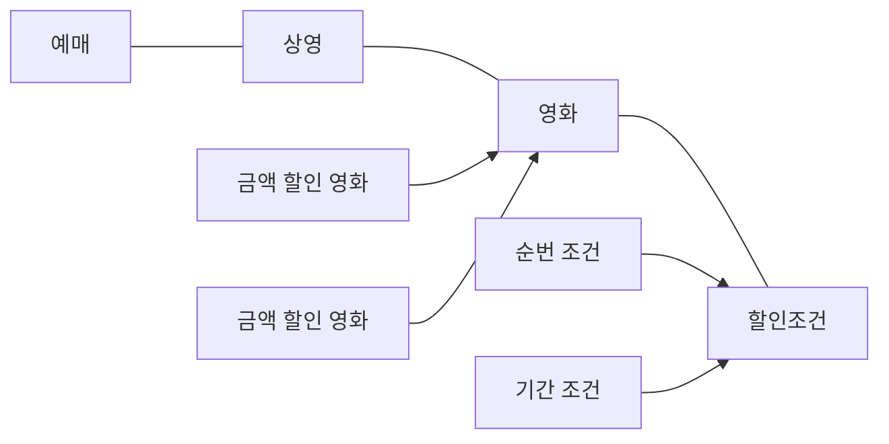
> 정보 전문가에게 책임을 할당하라

책임 주도 설계 방식의 첫 단계는 애플리케이션이 제공해야 하는 기능을 애플리케이션의 책임으로 생각하는 것이다.
이 책임을 애플리케이션에 대해 전송된 메시지로 간주하고 이 메시지를 책임질 첫 번째 객체를 선택하는 것으로 설계를 시작한다.

사용자에게 제공해야 하는 기능은 영화를 예매하는 것이다. 이를 책임으로 간주하면 애플리케이션은 영화를 예매할 책임이 있다고 할 수 있다.
이제 책임을 수행하는데 필요한 메시지를 결정해야 한다.
메시지는 메시지를 수신할 객체가 아니라 메시지를 전송할 객체의 의도를 반영해서 결정해야 한다.

첫 번째 질문은 다음과 같다.
`메시지를 전송할 객체는 무엇을 원하는가?`
협력을 시작하는 객체는 미정이지만 이 객체가 원하는 것은 바로 영화를 예매하는 것이다.
메시지의 이름은 `영화를 예매하라`가 적절한 것 같다.

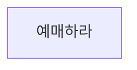

메시지를 결정했으므로 메시지에 적합한 객체를 선택해야 한다. 두번째 질문은 다음과 같다.
`메시지를 수신할 적합한 객체는 누구인가?`

객체에게 책임을 할당하는 첫 번째 원칙은 책임을 수행할 정보를 알고 있는 객체에게 책임을 할당하는 것이다.
`GRASP`에서는 이를 `INFORMATION EXPERT(정보 전문가)` 패턴이라고 부른다.

> INFORMATION EXPERT 패턴   
> 책임을 수행하는 데 필요한 정보를 가지고 있는 객체에게 할당하라.   
> 정보를 알고 있는 객체만이 책임을 어떻게 수행할지 스스로 결정할 수 있기 때문이다.   
> INFORMATION EXPERT 패턴을 따르면 정보와 행동을 최대한 가까운 곳에 위치시키기 때문에 캡슐화를 유지할 수 있다.   
> 필요한 정보를 가진 객체들로 책임이 분산되기 때문에 더 응집력있고 이해하기 쉬워진다. 따라서 높은 응집도가 가능하다.

책임을 수행하는 객체가 정보를 '알고' 있다고 해서 그 정보를 '저장'하고 있을 필요는 없다.
해당 정보를 제공할 수 있는 다른 객체를 알고 있거나 필요한 정보를 계산해서 제공할 수도 있다.
어떤 방식이건 정보 전문가가 데이터를 반드시 저장하고 있을 필요는 없다는 사실을 이해하는 것이 중요하다.

예매하는 데 필요한 정보를 가장 많이 알고 있는 객체는 상영이다.
상영은 영화에 대한 정보와, 상영 시간, 순서처럼 영화 예매에 필요한 다양한 정보를 알고 있다.

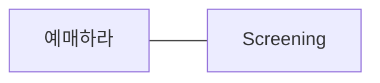

예매하라는 메시지를 수신했을 때 `Screening`이 수행해야하는 작업의 흐름을 생각해보자.
이제부터는 외부의 인터페이스가 아닌 `Screening`의 내부로 들어가 메시지를 처리하기 위해 필요한 절차와 구현을 고민해보는 것이다.

만약 스스로 처리할 수 없는 작업이 있다면 외부에 도음을 요청해야 한다.
이 요청이 외부로 전송해야 하는 새로운 메시지가 되고, 최종적으로 이 메시지가 새로운 객체의 책임으로 할당된다.
이 같은 연쇄적인 메시지 전송과 수신을 통해 협력 공동체가 구성되는 것이다.

예매하라 메시지를 완료하기 위해서는 예매 가격을 계산하는 작업이 필요하다.
예매 가격은 영화 한 편의 가격을 계산한 금액에 예매 인원수를 곱한 값으로 구할 수 있다.

따라서 영화 한 편의 가격을 알아야 한다. `Screening`은 가격을 계산하는 데 필요한 정보를 모르기 때문에 외부의 객체에게 도움을 요청해야 한다.
새로운 메시지 이름을 가격을 계산하라로 정한다.

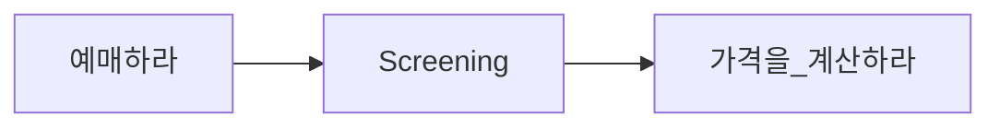

이제 메시지를 책임질 객체를 선택해야 한다. 영화 가격을 계산하는 데 필요한 정보를 알고 있는 전문가는 Movie가 될 것이다.

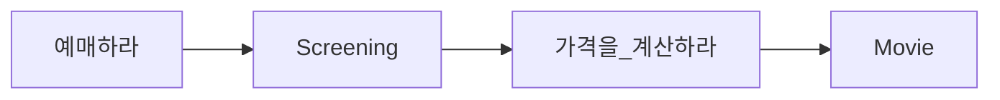
가격을 계산하기 위해 `Movie`가 어떤 작업을 해야 하는지 생각해보자.
요금을 계산하기 위해서는 먼저 영화가 할인 가능한지 판단한 후 할인 정책에 따라 할인 요금을 제외한 금액을 계산하면 된다.
이 중에서 `Movie`가 스스로 처리할 수 없는 일이 있다.
할인 조건에 따라 영화가 할인 가능한지를 판단 하는 것이다. 따라서 `Movie`는 할인 여부를 판단하라 메시지를 전송해 외부에 도움을 요청해야 한다.

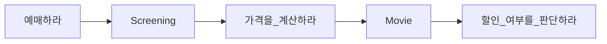

할인 여부를 한단하라 메시지를 책임질 객체를 선택한다.
할인 여부를 판단할 수 있는 정보를 가장 많이 알고 있는 객체는 `DiscountCondition`이다.

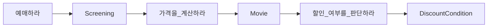
`DiscountCondition`은 자체적으로 할인 여부를 판단하는 데 필요한 모든 정보를 알고 있기 때문에 외부의 도움 없이 할인 여부를 판단할 수 있다.
따라서 `DiscountCondition`은 외부에 메시지를 전송하지 않는다.

이처럼 INFORMATION EXPERT 패턴을 따르는 것만으로도 자율성이 높은 객체들로 구성된 협력 공동체를 구축할 가능성이 높아지는 것이다.

> 높은 응집도와 낮은 결합도

설계는 트레이드오프 활동이라는 것을 기억하라.
동일한 기능을 구현할 수 있는 무수히 많은 설계가 존재한다.
몇 가지 설계중 한 가지를 선택해야 하는 경우가 빈번하게 발생한다.

이 경우 올바른 책임 할당을 위해 INFORMATION EXPERT 패턴 이외의 다른 책임 할당 패턴들을 함께 고려할 필요가 있다.
예를 들어, 방금 전 설계한 영화 예매 시스템에서는 할인 요금을 계산하기 위해 `Movie`가 `DiscountCondition`에 할인 여부를 판단하라 메시지를 전송한다.
그렇다면 이 설계의 대안으로 `Movie` 대신 `Screening`이 직접 `DisocuntCondition`과 협력하게 하는 것은 어떨까?

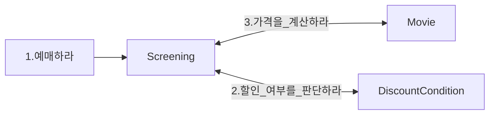
왜 우리는 이 설계 대신 `Movie`가 `DiscountCondition`과 협력하는 방법을 선택한 것일까?
그 이유는 응집도와 결합도에 있다. 높은 응집도와 낮은 결합도는 객체에 책임을 할당할 때 항상 고려해야 하는 기본 원리다.
GRASP에서는 이를 LOW COUPLING 패턴과 HIGH COHESION 패턴이라고 부른다.

`DiscountCondition`이 `Movie`와 `Screening` 중 어느 객체와 협력하는 것이 좋을까?
실마리는 결합도에 있다. `Movie`와 `DiscountConditoin`은 이미 결합돼 있기 때문에 `Movie`를 `DiscountCondition`과 협력하게 하면
설계 전체적으로 결합도를 추가하지 않고도 협력을 완성할 수 있다.

HIGH COHESION 패턴의 관점에서도 설계 대안들을 평가할 수 있다.
`Screening`의 가장 중요한 책임은 예매를 생성하는 것이다.
`Screening`이 `DiscountCondition`과 협력해야 한다면 영화 요금과 관련된 책임 일부를 떠안아야 할 것이다.
이 경우 `Screening`은 `DiscountCondition`이 할인 여부를 판단할 수 있고 `Movie`가 이 할인 여부를 필요로 한다는 사실 역시 알고 있어야 한다.
다시 말해 예메 요금을 계산하는 방식이 변경될 경우 `Screening`도 함께 변경해야 한다.

따라서 HIGH COHESION 패턴의 관점에서 `Movie`가 `DiscountCondition`과 협력하는 것이 더 나은 설계 대안이다.
책임을 할당하고 코드를 작성하는 매순간마다 LOW COUPLING, HIGH COHESION의 관점에서 전체적인 설계 품질을 검토하면
단순하면서도 재사용 가능하고 유연한 설계를 얻을 수 있을 것이다.

> 창조자에게 객체 생성 책임을 할당하라

영화 예매 협력의 최종 결과물은 `Reservation` 인스턴스를 생성하는 것이다.
이것은 협력에 참여하는 어떤 객체에게는 `Reservation` 인스턴스를 생성할 책임을 할당해야 한다는 것을 의미한다.
GRASP의 CREATOR(창조자) 패턴은 이 같은 경우에 사용할 수 있는 책임 할당 패턴으로서 객체를 생성할 책임을 어떤 객체에게 할당할지에 대한 지침을 제공한다.

`Reservation`을 잘 알고 있거나, 긴밀하게 사용하건, 초기화에 필요한 데이터를 가지고 있는 객체는 무엇인가?
바로 `Screening`이다. `Screening`은 예매 정보를 생성하는 데 필요한 영화, 상영 시간, 상영 순번 등의 정보에 대한 전문가이며,
예매 요금을 계산하는 데 필수정인 `Moive`도 알고 있다.
따라서 `Screening`을 `Reservation`의 CREATOR로 선택하는 것이 적절해 보인다.

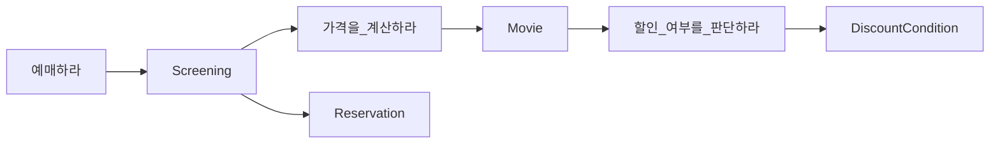
## 03 구현을 통한 검증
`Screening`은 영화를 예매할 책임을 맡으며 그 결과로 `Reservation` 인스턴스를 생성할 책임을 수행해야 한다.
`Screening`은 예매에 대한 정보 전문가인 동시에 `Reservation`의 창조자다.

협력의 관점에서 `Screening`은 '예매하라' 메시지에 응답할 수 있어야 한다.
이 메시지를 처리할 수 있는 메서드를 구현하자.

```java
public class Screening {
    
    public Reservation reserve(Customer customer, int audienceCount) {
        return null;
    }
}
```
책임이 결정됐으므로 책임을 수행하는데 필요한 인스턴스 변수를 결정해야 한다.
`Screening`은 상영시간, 상영 순번을 인스턴스 변수로 포함한다.
`Movie`에 '가격을 계산하라' 메시지를 전송해야 하기에 `Movie`에 대한 참조도 포함한다.

```java
public class Screening {
    
    private Movie movie;
    private int sequence;
    private LocalDateTime whenScreened;
    
    public Reservation reserve(Customer customer, int audienceCount) {
        return null;
    }
}
```
영화를 예매하기 위해서는 `Movie`에게 '가격을 계산하라' 메시지를 전송해서 계산된 요금을 반환받아야 한다.
`calculateFee` 메서드는 이렇게 반환된 요금에 예매 인원수를 곱해서 전체 예매 요금을 계산한 후 `Reservation`을 생성해서 반환한다.

```java
public class Screening {

    private Movie movie;
    private int sequence;
    private LocalDateTime whenScreened;

    public Reservation reserve(Customer customer, int audienceCount) {
        return new Reservation(customer, this, calculateFee(audienceCount), audienceCount);
    }

    private Money calculateFee(int audienceCount) {
        return movie.calculateMovieFee(this).times(audienceCount);
    }
}
```
`Screening`을 구현하는 과정에서 `Movie`에 전송하는 메시지의 시그니처를 `calculateMovieFee(Screening screening)`으로 선언했다는 사실을 주목하라.
이 메시지는 수신자인 `Movie`가 아니라 송신자인 `Screening`의 의도를 표현한다.
여기서 중요한 것은 `Screening`이 `Movie`의 내부 구현에 대한 어떤 지식도 없이 전송할 메시지를 결정했다는 것이다.
이처럼 `Movie`의 구현을 고려하지 않고 필요한 메시지를 결정하면 `Movie`의 내부 구현을 깔끔하게 캡슐화 할 수 있다.
메시지가 객체를 선택하도록 책임 주도 설계의 방식을 따르면 캡슐화와 낮은 결합도라는 목표를 비교적 손쉽게 달성할 수 있다.

`Movie`는 `Screening`과 협력하기 위해 `calculateMovieFee` 메시지에 응답하기 위해 메서드를 구현해야 한다.
```java
public class Movie {

    public Money calculateMovieFee(Screening screening) {
        return null;
    }
}
```
`Movie`는 기본 요금, 할인 조건, 할인 정책 등의 정보를 알아야 한다.
그리고 현재의 `Movie`가 어떤 할인 정책이 적용된 영화인지를 나타내기 위한 영화 종류를 인스턴스 변수로 포함한다.

```java
public class Movie {

    private String title;
    private Duration duration;
    private Money fee;
    private List<DiscountCondition> discountConditions;
    private MovieType movieType;
    private Money discountAmount;
    private double discountPercentage;
    
    public Money calculateMovieFee(Screening screening) {
        return null;
    }
}
```

`MovieType`은 할인 정책의 종류를 나열하는 단순한 열거형 타입이다.

```java
public enum MovieType {
    AMOUNT_DISCOUNT,
    PERCENT_DISCOUNT,
    NONE_DISCOUNT,
}
```
`Movie`는 먼저 `discountConditions`를 순회하면서 `DiscountCondition` 인스턴스에게 `isSatisfiedBy` 메시리를 전송해 할인 여부를 판단하도록 요청한다.
할인 조건에 만족하는 `DiscountCondition` 인스턴스가 존재한다면 할인 요금을 계산하기 위해 `calculateDiscountAmount`를 호출한다.
만족하는 할인 조건이 존재하지 않을 경우 기본 금액을 반환한다.

```java
public class Movie {

    private String title;
    private Duration duration;
    private Money fee;
    private List<DiscountCondition> discountConditions;
    private MovieType movieType;
    private Money discountAmount;
    private double discountPercentage;

    public Money calculateMovieFee(Screening screening) {
        if (isDiscountable(screening)) {
            return fee.minus(calculateDiscountAmount());
        }

        return fee;
    }

    private boolean isDiscountable(Screening screening) {
        return discountConditions.stream()
                .allMatch(condition -> condition.isSatisfiedBy(screening));
    }

    private Money calculateDiscountAmount() {
        return null;
    }
}
```
실제 요금을 계산하는 `calculateDiscountAmount` 메서드는 `movieType`의 값에 따라 적절한 메서드를 호출한다.
```java
public class Movie {
    
    private Money calculateDiscountAmount() {
        switch (movieType) {
            case AMOUNT_DISCOUNT:
                return calculateAmountDiscountAmount();
            case PERCENT_DISCOUNT:
                return calculatePercentDiscountAmount();
            default:
                return calculateNoneDiscountAmount();
        }
    }

    private Money calculateAmountDiscountAmount() {
        return discountAmount;
    }

    private Money calculatePercentDiscountAmount() {
        return fee.times(discountPercentage);
    }

    private Money calculateNoneDiscountAmount() {
        return Money.ZERO;
    }
}
```

`Movie`는 `DiscountCondition`에 '할인 여부를 판단하라' 메시지를 전송한다.
`DiscountCondition`은 이 메시지를 처리하기 위해 `isSatisfiedBy` 메서드를 구현해야 한다.

```java
public class DiscountCondition {
    public boolean isSatisfiedBy(Screening screening) {
        return false;
    }
}
```
`DiscountCondition`은 기간 조건을 위한 요일(dayOfWeek), 시작 시간(startTime), 종료 시간(endTime)과 순번 조건을 위한 상영 순번(sequence)을 인스턴스 변수로 포함한다.
추가적인 할인 조건의 종류(type)를 인스턴스 변수로 포함한다.
`isSatisfiedBy` 메서드는 type 값에 따라 적절한 메서드를 호출한다.

```java
public class DiscountCondition {

    private DiscountConditionType type;
    private int sequence;
    private DayOfWeek dayOfWeek;
    private LocalTime startTime;
    private LocalTime endTime;
    
    public boolean isSatisfiedBy(Screening screening) {
        if (type == DiscountConditionType.PERIOD) {
            return isSatisfiedByPeriod(screening);
        }

        return isSatisfiedBySequence(screening);
    }

    private boolean isSatisfiedByPeriod(Screening screening) {
        return dayOfWeek.equals(screening.getWhenScreened().getDayOfWeek())
                && !startTime.isAfter(screening.getWhenScreened().toLocalTime())
                && !endTime.isBefore(screening.getWhenScreened().toLocalTime());
    }

    private boolean isSatisfiedBySequence(Screening screening) {
        return sequence == screening.getSequence();
    }
}
```

`DiscountConditionType`은 할인 조건의 종류를 나열한 열거형 타입이다.
```java
public enum DiscountConditionType {
    SEQUENCE,
    PERIOD,
}
```
구현이 완료됐다. 하지만 몇 가지 문제점이 숨어 있다.

> DiscountCondition 개선하기

가장 큰 문제점은 변경에 취약한 클래스를 포함하고 있다는 것이다.
변경에 취약한 클래스란 코드를 수정해야 하는 이유를 하나 이상 가지는 클래스다.
`DiscountCondition`은 다음과 같은 서로 다른 세 가지 이유로 변경 될 수 있다.

1. 새로운 할인 조건 추가
    * `isSatisfiedBy` 메서드 안의 `if ~ else` 구문을 수정해야 한다.
2. 순번 조건을 판단하는 로직 변경
    * `isSatisfiedBySequence` 메서드의 내부 구현을 수정해야 한다.
3. 기간 조건을 판단하는 로직 변경
    * `isSatisfiedByPeriod` 메서드의 내부 구현을 수정해야 한다.

`DiscountCondition`은 하나 이상의 변경 이유를 가지기 때문에 응집도가 낮다.
응집도가 낮다는 것은 서로 연관성 없는 기능이나 데이터가 하나의 클래스에 뭉쳐져 있다는 것을 의미한다.
변경의 이유에 따라 클래스를 분리해야 한다.

`isSatisfiedBySequence` 메서드와 `isSatisfiedByPeriod` 메서드는 서로 다른 이유로 변경된다.
`DiscountCondition`은 서로 다른 이유로, 서로 다른 시점에 변경될 확률이 높다.

설계를 개선하는 작업은 변경의 이유가 하나 이상인 클래스를 찾는 것으로부터 시작하는 것이 좋다.
변경의 이유가 하나 이상인 클래스에는 위험 징후를 또렷하게 드러내는 몇 가지 패턴이 존재한다는 점이다.

첫 번째 패턴은 <U>인스턴스 변수가 초기화 되는 시점</U>이다.
응집도가 높은 클래스는 인스턴스를 생성할 때 모든 속성을 함께 초기화 한다.
응집도가 낮은 클래스는 객체의 속성 중일부만 초기화하고 일부는 초기화 되지 않은 상태로 남겨진다.
`DiscountConditon`은 순번 조건을 표현하는 경우 sequence는 초기화 되지만 dayOfWeek, startTime, endTime은 초기화 되지 않는다.
반대로 기간 조건을 표현하는 경우에는 dayOfWeek, startTime, endTime은 초기화 되지만 sequence는 초기화되지 않는다.
클래스의 속성이 서로 다른 시점에 초기화 되거나 일부만 초기화된다는 것은 응집도가 낮다는 증거다.
따라서 초기화 속성을 기준으로 코드를 분리해야 한다.

두 번째 패턴은 <U>메서드들이 인스턴스 변수를 사용하는 방식</U>이다.
모든 메서드가 객체의 모든 속성을 사용한다면 클래스의 응집도는 높다고 볼 수 있다.
반면 메서드들이 사용하는 속성에 따라 그룹이 나뉜다면 클래스의 응집도가 낮다고 볼 수 있다.
`DiscountCondition`의 `isSatisfiedBySequence` 메서드와 `isSatisfiedByPeriod` 메서드가 이 경우에 해당한다.
이 경우 클래스의 응집도를 높이기 위해 속성 그룹과 해당 그룹에 접근하는 메서드 그룹을 기준으로 코드를 분리해야 한다.

> 타입 분리하기

`DiscountConditon`의 가장 큰 문제점은 순번 조건과 기간 조건이라는 두 개의 독립적인 타입이 하나의 클래스 안에 공존하고 있다는 점이다.
가장 먼저 떠오르는 해결 방법은 두 타입을 `SequenceCondition`과 `PeriodCondition`이라는 두 개의 클래스로 분리하는 것이다.

```java
public class PeriodCondition {

    private DayOfWeek dayOfWeek;
    private LocalTime startTime;
    private LocalTime endTime;

    public PeriodCondition(DayOfWeek dayOfWeek, LocalTime startTime, LocalTime endTime) {
        this.dayOfWeek = dayOfWeek;
        this.startTime = startTime;
        this.endTime = endTime;
    }

    public boolean isSatisfiedBy(Screening screening) {
        return dayOfWeek.equals(screening.getWhenScreened().getDayOfWeek())
                && !startTime.isAfter(screening.getWhenScreened().toLocalTime())
                && !endTime.isBefore(screening.getWhenScreened().toLocalTime());
    }
    
}
```
```java
public class SequenceCondition {

    private int sequence;

    public SequenceCondition(int sequence) {
        this.sequence = sequence;
    }

    public boolean isSatisfiedBy(Screening screening) {
        return sequence == screening.getSequence();
    }
}
```
클래스를 분리하면서 앞에서 인스턴스 변수 초기화, 메서드들이 인스턴스 변수를 사용하는 방식 문제를 해결했다.
하지만 클래스를 분리한 후에 새로운 문제가 나타났다.
`Movie`와 협력하는 클래스는 `DiscountCondition` 하나뿐이다.
수정 후 `Movie`는 `SequenceCondition`, `PeriodCondition` 클래스들의 인스턴스와 협력할 수 있어야 한다.

문제를 해결 하기 위해 `Movie` 클래스 안에서 `SequenceCondition` 목록과 `PeriodCondition` 목록을 따로 유지하는 것이다.
하지만 이 방법은 새로운 문제점을 야기한다.

1. `Movie`가 `SequenceCondition`, `PeriodCondition` 양쪽 모두에게 결합된다.
2. 새로운 할인 조건을 추가되면 또 다른 목록을 `Movie` 안에 만들어야 한다.

> 다형성을 통해 분리하기

`Movie` 입장에서 보면 `SequenceCondition`, `PeriodCondition`은 아무 차이도 없다.
둘다 할인 여부를 판단하는 동일한 책임을 수행하고 있을 뿐이다.
할인 가능 여부를 반환해 주기만 하면 `Movie`는 객체가 `SequenceCondition`의 인스턴스인지, `PeriodCondition`의 인스턴스인지는 상관하지 않는다.

이 시점이 되면 자연스럽게 `역할`의 개념이 등장한다.
역할은 협력 안에서 대체 가능성을 의미하기 때문에 `SequenceCondition`, `PeriodCondition`에 역할의 개념을 적용하면 `Movie`가 구체적인 클래스는 알지 못한 채 오직 역할에 대해서만 결합되도록 의존성을 제한할 수 있다.

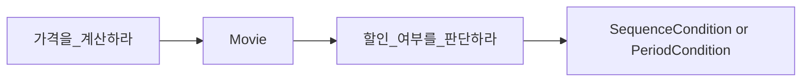
역할을 사용하면 객체의 구체적인 타입을 추상화할 수 있다.
역할을 대체할 클래스들 사이에 구현을 공유해야 할 필요가 있다면 추상 클래스를 사용하면 된다.
구현을 공유할 필요 없이 역할을 대체하는 객체들의 책임만 정의하고 싶다면 인터페이스를 사용하면 된다.

`SequenceCondition`과 `PeriodCondition`은 구현을 공유할 필요는 없다. 따라서 `DiscountCondition`이라는 인터페이스를 이용해 역할을 구현하자.

```java
public interface DiscountCondition {
    boolean isSatisfiedBy(Screening screening);
}
```

```java
public class SequenceCondition implements DiscountCondition{

    private int sequence;

    public SequenceCondition(int sequence) {
        this.sequence = sequence;
    }

    @Override
    public boolean isSatisfiedBy(Screening screening) {
        return sequence == screening.getSequence();
    }
}
```
```java
public class PeriodCondition implements DiscountCondition{

    private DayOfWeek dayOfWeek;
    private LocalTime startTime;
    private LocalTime endTime;

    public PeriodCondition(DayOfWeek dayOfWeek, LocalTime startTime, LocalTime endTime) {
        this.dayOfWeek = dayOfWeek;
        this.startTime = startTime;
        this.endTime = endTime;
    }

    @Override
    public boolean isSatisfiedBy(Screening screening) {
        return dayOfWeek.equals(screening.getWhenScreened().getDayOfWeek())
                && !startTime.isAfter(screening.getWhenScreened().toLocalTime())
                && !endTime.isBefore(screening.getWhenScreened().toLocalTime());
    }
}
```
이제 `Movie`는 협력하는 객체의 구체적인 타입을 몰라도 상관없다.
협력하는 객체가 `DiscountCondition` 역할을 수행할 수 있도 `isSatisfiedBy` 메시지를 이해할 수 있다는 사실만 알고 있어도 충분하다.
`Movie`와 `DiscountConditon` 사이의 협력은 다형적이다.
객체의 타입에 따라 변하는 행동이 있다면 타입을 분리하고 변화하는 행동을 각 타입의 책임으로 할당하라는 것이다.
GRASP에서는 이를 POLYMORPHISM(다형성) 패턴이라고 부른다.

> 변경으로부터 보호하기

`DiscountCondition`이라는 역할이 `Movie`로부터 `PeriodCondition`과 `SequenceCondition`의 존재를 감춘다는 사실에 주목하라.
`DiscountCondition`이라는 추상화가 구체적인 타입을 캡슐화한다.
`Movie`의 관점에서는 `DiscountCondition`의 타입이 캡슐화된다는 것은 새로운 `DiscountCondition` 타입을 추가하더라도 `Movie`가 영향을 받지 않는다는 것을 의미한다.
`Movie`에 대한 어떤 수정도 필요 없다.
`DiscountCondition` 인터페이스를 실체화하는 클래스를 추가하는 것으로 할인 조건의 종류를 확장할 수 있다.
이처럼 변경을 캡슐화하도록 책임을 할당하는 것을 GRASP에서는 PROTECTED VARIATIONS(변경 보호)패턴이라고 부른다.

하나의 클래스가 여러 타입의 행동을 구현하고 있는 것처럼 보인다면 클래스를 분해하고 POLYMORPHISM 패턴에 따라 책임을 분산 시켜라.
예측 가능한 변경으로 인해 여러 클래스들이 불안정해진다면 PROTECTED VARIATIONS 패턴에 따라 안정적인 인터페이스 뒤로 변경을 캡슐화하라.

> Movie 개선하기

`Movie` 역시 `DiscountCondition`과 동일한 문제가 있다.
금액 할인 정책 영화와 비율 할인 정책 영화라는 두 가지 타입을 하나의 클래스 안에 구현하고 있기 때문에 하나 이상의 이유로 변경될 수 있다.
응집도가 낮은 것이다.

역할의 개념을 도입해서 협력을 다형적으로 만들면된다. POLYMORPHISM 패턴을 사용해 서로 다른 행동을 타입별로 분리하면 다형성의 혜택을 누릴 수 있다.

금액 할인 정책과 관련된 인스턴스 변수와 메서드를 옮길 클래스의 이름으로는 `AmountDiscountMovie`가 적합할 것 같다.
비율 할인 정책과 관련된 인스턴스 변수와 메서드를 옮길 클래스는 `PercentDiscountMovie`로 명명하자.
할인 정책을 적용하지 않는 경우는 `NoneDiscountMovie`로 명명하자.

`DiscountCondition`의 경우에는 역할을 수행할 클래스들 사이에 공유할 구현이 없기 때문에 인터페이스를 이용했다.
`Movie`의 경우 구현을 공유할 필요가 있다. 따라서 추상 클래스를 이용해 역할을 구현한다.

```java
public abstract class Movie {

    private String title;
    private Duration duration;
    private Money fee;
    private List<DiscountCondition> discountConditions;

    public Movie(String title, Duration duration, Money fee, DiscountCondition ... discountCondition) {
        this.title = title;
        this.duration = duration;
        this.fee = fee;
        this.discountConditions = List.of(discountCondition);
    }

    public Money calculateMovieFee(Screening screening) {
        if (isDiscountable(screening)) {
            return fee.minus(calculateDiscountAmount());
        }

        return fee;
    }

    private boolean isDiscountable(Screening screening) {
        return discountConditions.stream()
                .allMatch(condition -> condition.isSatisfiedBy(screening));
    }

    abstract protected Money calculateDiscountAmount();

    protected Money getFee() {
        return fee;
    }
}
```
```java
public class AmountDiscountMovie extends Movie {

    private Money discountAmount;

    public AmountDiscountMovie(String title, Duration duration, Money fee, Money discountAmount, DiscountCondition... discountCondition) {
        super(title, duration, fee, discountCondition);
        this.discountAmount = discountAmount;
    }

    @Override
    protected Money calculateDiscountAmount() {
        return discountAmount;
    }
}
```
```java
public class PercentDiscountMovie extends Movie {

    private double percent;

    public PercentDiscountMovie(String title, Duration duration, Money fee, double percent, DiscountCondition... discountCondition) {
        super(title, duration, fee, discountCondition);
        this.percent = percent;
    }

    @Override
    protected Money calculateDiscountAmount() {
        return getFee().times(percent);
    }
}
```
```java
public class NoneDiscountMovie extends Movie {

    public NoneDiscountMovie(String title, Duration duration, Money fee, DiscountCondition... discountCondition) {
        super(title, duration, fee, discountCondition);
    }

    @Override
    protected Money calculateDiscountAmount() {
        return Money.ZERO;
    }
}
```
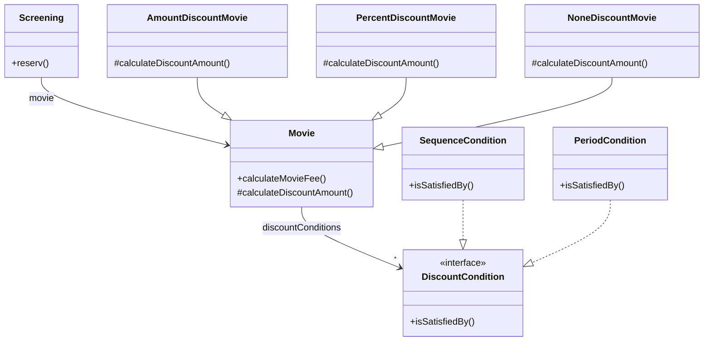
결론은 데이터가 아닌 책임을 중심으로 설계하라는 것이다.
객체에게 중요한 것은 상태가 아니라 행동이다.
객체지향 설계의 기본은 책임과 협력에 초점을 맞추는 것이다.

> 변경과 유연성

설계를 주도하는 것은 변경이다.
개발자로서 변경에 대비할 수 있는 두 가지 방법이 있다.
하나는 코드를 이해하고 수정하기 쉽도록 최대한 단순하게 설계하는 것이다.
다른 하나는 코드를 수정하지 않고도 변경을 수용할 수 있또록 코드를 더 유연하게 만드는 것이다.
대부분의 경우에 전자가 더 좋은 방법이지만 유사한 변경이 반복적으로 발생하고 있다면 복잡성이 상승하더라도 유연성을 추가하는 두 번째 방법이 더 좋다.

현재의 설계에서는 할인 정책을 구현하기 위해 상속을 이용하고 있기 때문에 실행 중에 영화의 할인 정책을 변경하기 위해서는
새로운 인스턴스를 생성한 후 필요한 정보를 복사해야 한다.
또한 변경 전후의 인스턴스가 개념적으로 동일한 객체를 가리키지만 물리적으로 서로 다른 객체이기 때문에 식별자의 관점에서 혼란스러울 수 있다.

해결 방법은 상속 대신 합성을 사용하는 것이다.
`Movie`의 상속 계층 안에 구현된 할인 정책을 독립적인 `DiscountPolicy`로 분리한 후 `Movie`에 합성시키면 유연한 설계가 된다.

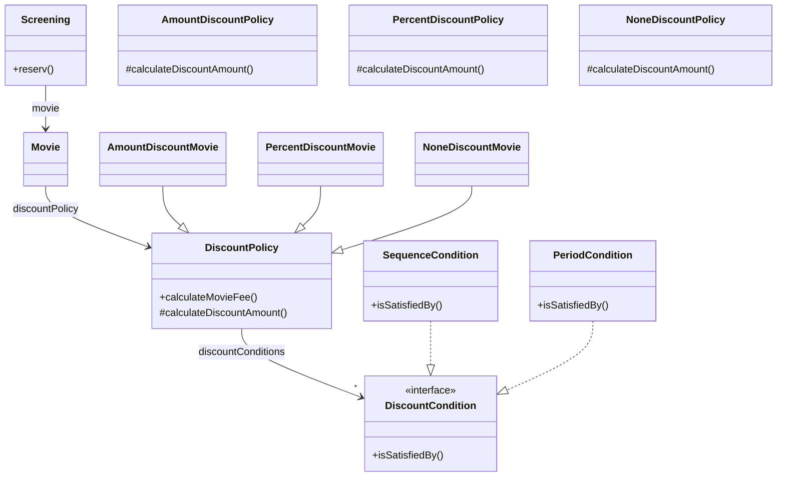

이제 금액 할인 정책이 적용된 영화를 비율 할인 정책으로 바꾸는 일은 `Movie`에 연결된 `DiscountPolicy`의 인스턴스를 교체하는 단순한 작업으로 바뀐다.

```java
Movie moive = new Movie(
        "타이타닉",
        Duration.ofMinutes(120),
        Money.wons(10000),
        new AmountDiscountPolicy(...)
);

movie.changeDiscountPolicy(new PercentDiscountPolicy(...));
```
유연성은 의존성 관리의 문제다. 요소들 사이의 의존성의 정도가 유연성의 정도를 결정한다.
유연성의 정도에 따라 결합도를 조절할 수 있는 능력은 객체지향 개발자가 갖춰야 하는 중요한 기술 중 하나다.

## 04 책임 주도 설계의 대안
책임 주도 설계에 익숙해지기 위해서는 부단한 노력과 시간이 필요하다.
설계를 진행하는 동안 데이터가 아닌 책임 관점에서 사고하기 위해서는 충분한 경험과 학습이 필요하다.

책임과 객체 사이에서 방황할 때 돌파구를 찾기 위해 선택하는 방법은 최대한 빠르게 목적한 기능을 수행하는 코드를 작성하는 것이다.
아무것도 없는 상태에서 책임과 협력에 관해 고민하기 보다는 일단 실행되는 코드를 작성하는 것이다.
일단 실행되는 코드를 얻고 난 후에 코드 상에 명확하게 드러나는 책임들을 올바른 위치로 이동시키는 것이다.

주의할 점은 코드를 수정한 후에 겉으로 드러나는 동작이 바뀌어서는 안된다는 것이다.
이처럼 이해하기 쉽고 수정하기 쉬운 소프트웨어로 개선하기 위해 겉으로 보이는 동작은 바꾸지 않은 채
내부 구조를 변경하는 것을 리팩터링이라고 부른다.

> 메서드 응집도

데이터 중심으로 설계된 영화 예매 시스템에서 도메인 객체들은 단지 데이터의 집합일 뿐이며 영화 예매를 처리하는 모든 절차는 `ReservationAgency`에 집중돼 있었다.
따라서 `ReservationAgency`에 포함된 로직들을 적절한 객체의 책임으로 분배하면 책임 주도 설계와 거의 유사한 결과를 얻을 수 있다.

```java
public class ReservationAgency {

    public Reservation reservation(Screening screening, Customer customer, int audienceCount) {

        Movie movie = screening.getMovie();

        boolean discountable = false;
        for (DiscountCondition condition : movie.getDiscountConditionList()) {
            if (condition.getDiscountType() == DiscountType.PEROID) {
                discountable = screening.getWhenScreened().getDayOfWeek().equals(condition.getDayOfWeek())
                        && condition.getStartTime().compareTo(screening.getWhenScreened().toLocalTime()) <= 0
                        && condition.getEndTime().compareTo(screening.getWhenScreened().toLocalTime()) >= 0;
            } else {
                discountable = condition.getSequence() == screening.getSequence();
            }

            if (discountable) {
                break;
            }
        }

        Money fee;
        if (discountable) {
            Money discountAmount = Money.ZERO;
            switch (movie.getMovieType()) {
                case AMOUNT_DISCOUNT -> discountAmount = movie.getDiscountAmount();
                case PERCENT_DISCOUNT -> discountAmount = movie.getFee().times(movie.getDiscountPercentage());
                case NONE_DISCOUNT -> discountAmount = Money.ZERO;
            }

            fee = movie.getFee().minus(discountAmount);
        } else {
            fee = movie.getFee();
        }

        return new Reservation(customer, screening, fee, audienceCount);
    }
}
```

`ReservationAgency`의 `reserve` 메서드는 길이가 너무 길고 이해하기도 어렵다.
긴 메서드는 다양한 측면에서 코드의 유지 보수에 부정적인 영향을 미친다.

* 어떤 일을 수행하는지 한눈에 파악하기 어렵기 때문에 코드를 전체적으로 이해하는 데 너무 많은 시간이 걸린다.
* 하나의 메서드 안에서 너무 많은 작업을 처리하기 때문에 변경이 필요할 때 수정해야할 부분을 찾기 어렵다.
* 메서드 내부의 일부 로직만 수정하더라도 메서드의 나머지 부분에서 버그가 발생할 확률이 높다.
* 로직의 일부만 재사용하는 것이 불가능하다.
* 코드를 재사용하는 유일한 방법은 원하는 코드를 복사해서 붙여넣는 것뿐이므로 코드 중복을 초래하기 쉽다.

긴 메서드는 응집도가 낮기 때문에 이해하기 어렵고 재사용하기 어려우며 변경하기도 어렵다.
마이클 페더스는 이런 메서드를 `몬스터 메서드(monster method)`라고 부른다.

응집도가 낮은 메서드는 로직의 흐름을 이해하기 위해 주석이 필요한 경우가 대부분이다.
주석을 추가하는 대신 메서드를 작게 분해해서 각 메서드의 응집도를 높여라.
작은 메서드들로 조합된 메서드는 마치 주석들을 나열한 것처럼 보이기 때문에 코드를 이해하기도 쉽다.

```java
public class ReservationAgencyRefactor {

    public Reservation reservation(Screening screening, Customer customer, int audienceCount) {
        boolean discountable = checkDiscountable(screening);
        Money fee = calculateFee(screening, discountable, audienceCount);
        return createReservation(screening, customer, audienceCount, fee);
    }

    private boolean checkDiscountable(Screening screening) {
        return screening.getMovie()
                .getDiscountConditions()
                .stream()
                .anyMatch(condition -> isDiscountable(condition, screening));
    }

    private boolean isDiscountable(DiscountCondition condition, Screening screening) {
        if (condition.getType() == DiscountConditionType.PERIOD) {
            return isSatisfiedByPeriod(condition, screening);
        }

        return isSatisfiedBySequence(condition, screening);
    }

    private boolean isSatisfiedByPeriod(DiscountCondition condition, Screening screening) {
        return screening.getWhenScreened().getDayOfWeek().equals(condition.getDayOfWeek())
                && !condition.getStartTime().isAfter(screening.getWhenScreened().toLocalTime())
                && !condition.getEndTime().isBefore(screening.getWhenScreened().toLocalTime());
    }

    private boolean isSatisfiedBySequence(DiscountCondition condition, Screening screening) {
        return screening.getSequence() == condition.getSequence();
    }


    private Money calculateFee(Screening screening, boolean discountable, int audienceCount) {
        if (discountable) {
            return screening.getMovie()
                    .getFee()
                    .minus(calculateDiscountedFee(screening.getMovie()))
                    .times(audienceCount);
        }
        return screening.getMovie().getFee().times(audienceCount);
    }

    private Money calculateDiscountedFee(Movie movie) {
        switch (movie.getMovieType()) {
            case AMOUNT_DISCOUNT:
                return calculateAmountDiscountedFee(movie);
            case PERCENT_DISCOUNT:
                return calculatePercentDiscountedFee(movie);
            case NONE_DISCOUNT:
                return calculateNoneDiscountedFee(movie);
        }
        throw new IllegalArgumentException("Invalid movie type");
    }

    private Money calculateAmountDiscountedFee(Movie movie) {
        return movie.getDiscountAmount();
    }

    private Money calculatePercentDiscountedFee(Movie movie) {
        return movie.getFee().times(movie.getDiscountPercentage());
    }

    private Money calculateNoneDiscountedFee(Movie movie) {
        return Money.ZERO;
    }

    private Reservation createReservation(Screening screening, Customer customer, int audienceCount, Money fee) {
        return new Reservation(customer, screening, fee, audienceCount);
    }
}
```
비록 클래스의 길이는 더 길어졌지만 일반적으로 명확성의 가치가 클래스의 길이보다 더 중요하다.
코드를 작은 메서드들로 분해하면 전체적인 흐름을 이해하기도 쉬워진다.
동시에 너무 많은 세부사항을 기억하도록 강요하는 코드는 이해하기도 어렵다.
큰 메서드를 작은 메서드들로 나누면 한 번에 기억해야 하는 정보를 줄일 수 있다.
더 세부적인 정보가 필요하면 그때 각 메서드의 세부적인 구현을 확인하면 되기 때문이다.

> 객체를 자율적으로 만들자

자신이 소유하고 있는 데이터를 자기 스스로 처리하도록 만드는 것이 자율적인 객체를 만드는 지름길이다.
메서드가 사용하는 데이터를 저장하고 있는 클래스로 메서드를 이동시키면 된다.
어떤 데이터를 사용하는지 가장 쉽게 알 수 있는 방법은 메서드 안에서 어떤 클래스의 접근자 메서드를 사용하는지 파악하는 것이다.

```java
public class ReservationAgency {
    private boolean isDiscountable(DiscountCondition condition, Screening screening) {
        if (condition.getType() == DiscountConditionType.PERIOD) {
          return isSatisfiedByPeriod(condition, screening);
        }
      
        return isSatisfiedBySequence(condition, screening);
    }
    
    private boolean isSatisfiedByPeriod(DiscountCondition condition, Screening screening) {
        return screening.getWhenScreened().getDayOfWeek().equals(condition.getDayOfWeek())
                && !condition.getStartTime().isAfter(screening.getWhenScreened().toLocalTime())
                && !condition.getEndTime().isBefore(screening.getWhenScreened().toLocalTime());
    }
    
    private boolean isSatisfiedBySequence(DiscountCondition condition, Screening screening) {
        return screening.getSequence() == condition.getSequence();
    }
}
```
`ReservationAgency`의 `isDiscountable`는 `DiscountCondtion`의 `getType` 메서드를 호출해서 할인 조건의 타입을 알아낸 후 타입에 따라
`isSatisfiedByPeriod`나 `isSatisfiedBySequence`를 호출한다.
`isSatisfiedByPeriod`와 `isSatisfiedBySequence`의 내부 구현 역시 할인 여부를 판단하기 위해 `DiscountCondtion`의 접근자 메서드를 이용해 데이터를 가져온다.
두 메서드를 데이터가 존재하는 `DiscountCondition`으로 이동하자.

```java
public class DiscountCondition {

    private DiscountConditionType type;
    private int sequence;
    private DayOfWeek dayOfWeek;
    private LocalTime startTime;
    private LocalTime endTime;

    public boolean isDiscountable(Screening screening) {
        if (type == DiscountConditionType.PERIOD) {
            return isSatisfiedByPeriod(screening);
        }

        return isSatisfiedBySequence(screening);
    }
    
    public boolean isSatisfiedBy(Screening screening) {
        if (type == DiscountConditionType.PERIOD) {
            return isSatisfiedByPeriod(screening);
        }

        return isSatisfiedBySequence(screening);
    }

    private boolean isSatisfiedByPeriod(Screening screening) {
        return dayOfWeek.equals(screening.getWhenScreened().getDayOfWeek())
                && !startTime.isAfter(screening.getWhenScreened().toLocalTime())
                && !endTime.isBefore(screening.getWhenScreened().toLocalTime());
    }

    private boolean isSatisfiedBySequence(Screening screening) {
        return sequence == screening.getSequence();
    }
}
```
`DiscountCondition`의 `isDiscountable` 메서드는 외부에서 호출 가능해야 하므로 `private`에서 `public`으로 변경했다.
기존 `isDiscountable` 메서드는 `DiscountCondition`의 인스턴스를 인자로 받아야 했지만 이제 `DiscountCondition`의 일부가 됐기 때문에
인자로 전달 받을 필요가 없어졌다.
이처럼 메서드를 다른 클래스로 이동시킬 때는 인자에 정의된 클래스 중 하나로 이동하는 경우가 일반적이다.

이제 `DiscountConditoin` 내부에서만 `DiscountCondition` 인스턴스 변수에 접근한다.
따라서 모든 접근자 메서드를 제거할 수 있다.
이를 통해 내부 구현을 캡슐화 할 수 있다.
할인 조건을 계산하는 데 필요한 모든 로직이 `DiscountCondition`에 모여있기 때문에 응집도 역시 높아졌다.