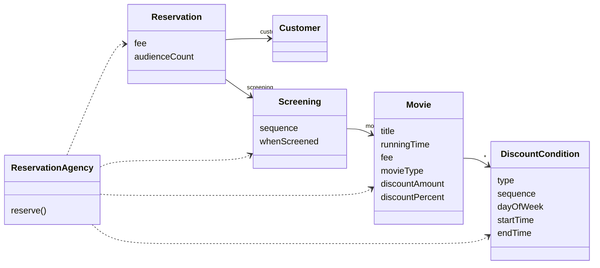
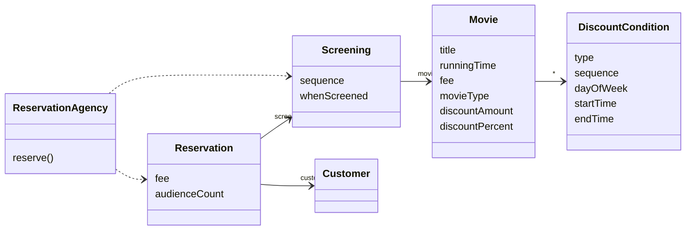

# 06. 메시지와 인터페이스
## 01 협력과 메시지
> 클라이언트-서버 모델

두 객체 사이의 협력 관계를 설명하기 위해 사용하는 전통적인 메타포는 `클라이언트-서버` 모델이다.
협력 안에서 메시지를 전송하는 객체를 클라이언트, 메시지를 수신하는 객체를 서버라고 부른다.
협력은 클라이언트가 서버의 서비스를 요청하는 단방향 상호작용이다.

> 메시지와 메시지 전송

메시지(message)는 객체들이 협력하기 위해 사용할 수 있는 유일한 의사소통 수단이다.
한 객체가 다른 객체에게 도음을 요청하는 것을 메시지 전송(message sending) 또는 메시지 패싱(message passing)이라고 부른다.
이때 메시지를 전송하는 객체를 메시지 전송자(message sender)라고 부르고 메시지를 수신하는 객체를 메시지 수신자(message receiver)라고 부른다.
클라이언트-서버 모델에서는 메시지 전송자를 클라이언트, 메시지 수신자를 서버라고 부르기도 한다.

메시지는 오퍼레이션명(operation name)과 인자(argument)로 구성되며 메시지 전송은 여기에 메시지 수신자를 추가한 것이다.
따라서 메시지 전송은 메시지 수신자, 오퍼레이션명, 인자의 조합이다.
`condition`.`isSatisfiedBy(screening)` => `수신자`.`오퍼레이션명(인자)`

> 메시지와 메서드

메시지와 메서드의 구분은 메시지 전송자와 메시지 수신자가 느슨하게 결합될 수 있게 한다.

메시지 전송자는 자신이 어떤 메시지를 전송해야 하는지만 알면 된다.
수신자가 어떤 클래스의 인스턴스인지, 어떤 방식으로 요청을 처리하는지 모르더라도 원활한 협력이 가능하다.

메시지 수신자 역시 누가메시지를 전송하는지 알 필요가 없다.
단지 메시지가 도착했다는 사실만 알면 된다.
메시지 수신자는 메시지를 처리하기 위해 필요한 메서드를 스스로 결정할 수 있는 자율권을 누린다.

> 퍼블릭 인터페이스와 오퍼레이션

객체는 안과 밖을 구분하는 뚜렷한 경계를 가진다.
외부의 객체는 오직 객체가 공개하는 메시지를 통해서만 객체와 상호작용할 수 있다.
객체가 의사소통을 위해 외부에 공개하는 메시지의 집합을 `퍼블릭 인터페이스`라고 부른다.

퍼블릭 인터페이스에 포함된 메시지를 `오퍼레이션`이라고 부른다.
오퍼레이션은 수행 가능한 어떤 행동에 대한 추상화다.
그에 비해 메시지를 수신했을 때 실제로 실행되는 코드는 메서드라고 부른다.

오퍼레이션: `DiscountCondition` 인터페이스에 정의된 `isSatisfiedBy`
메서드: `SequenceCondition`과 `PeriodCondition`의 `isSatisfiedBy`

> 시그니처

오퍼레이션(또는 메서드)의 이름과 파라미터 목록을 합쳐서 `시그니쳐(signature)`라고 부른다.
오퍼레이션은 실행 코드 없이 시그니처만을 정의한 것이다.
메서드는 이 시그니처에 구현을 더한 것이다.

## 02 인터페이스와 설계 품질
> 디미터 법칙

```java
public class ReservationAgency {

    public Reservation reservation(Screening screening, Customer customer, int audienceCount) {

        Movie movie = screening.getMovie();

        boolean discountable = false;
        for (DiscountCondition condition : movie.getDiscountConditionList()) {
            if (condition.getDiscountType() == DiscountType.PEROID) {
                discountable = screening.getWhenScreened().getDayOfWeek().equals(condition.getDayOfWeek())
                        && condition.getStartTime().compareTo(screening.getWhenScreened().toLocalTime()) <= 0
                        && condition.getEndTime().compareTo(screening.getWhenScreened().toLocalTime()) >= 0;
            } else {
                discountable = condition.getSequence() == screening.getSequence();
            }

            if (discountable) {
                break;
            }
        }
        
      ...
    }
}
```
절차적인 방식의 영화 예매 시스템 코드중 할인 가능 여부를 체크하는 코드이다.
`ReservationAgency`와 인자로 전달된 `Screening` 사이의 결합도가 너무 높기 때문에
`Screening`의 내부 구현을 변경할 때마다 `ReservationAgency`도 함께 변경된다는 것이다.
문제의 원인은 `ReservationAgency`가 `Screening`뿐만 아니라 `Moive`와 `DiscountCondition`에도 직접 접근하기 때문이다.


* `Screening`이 `Movie`를 포함하지 않도록 변경되거나
* `Movie`가 `DiscountCondition`을 포함하지 않아도 되도록 변경되거나
* `DiscountCondition` 내부에 sequence를 포함하지 않게 된거나
* sequence가 int가 아니라 `Sequence`라는 클래스로 변경된거나

`ReservationAgency`는 사소한 변경에도 흔들리는 의존성의 집결지다.
이처럼 협력하는 객체의 내부 구조에 대한 결합으로 인해 발생하는 설계 문제를 해결하기 위해 제안된 원칙이 바로 `디미터 법칙`이다.   
디미터 법칙을 간단하게 요약하면 '객체의 내부 구조에 강하게 결합되지 않도록 협력 경로를 제한하라'이다.

* 낯선 자에게 말하지 말라
* 오직 인접한 이웃하고만 말하라
* 오직 하나의 도트(.)만 사용하라

내부의 메서드가 아래 조건을 만족하는 인스턴스에만 메시지를 전송하도록 프로그래밍해야 한다고 이해해도 무방하다.
* this 객체
* 메서드의 매개변수
* this의 속성
* this의 속성인 컬렉션의 요소
* 메서드 내에서 생성된 지역 객체

```java
public class ReservationAgency {

    public Reservation reservation(Screening screening, Customer customer, int audienceCount) {
        Money fee = screening.calculateFee(audienceCount);
        return new Reservation(customer, screening, fee, audienceCount);
    }
}
```
결합도 문제를 해결한 `ReservationAgency` 코드이다.
메서드의 인자로 전달된 `Screening` 인스턴스에게만 메시지를 전송한다.
`ReservationAgency`는 `Screening` 내부에 대한 어떤 정보도 알지 못한다.
`ReservationAgency`가 `Screening`의 내부 구조에 결합돼 있지 않기 때문에 `Screening`의 내부 구현을 변경할 때 `ReservationAgency`를 함께 변경할 필요가 없다.



다음은 디미터 법칙을 위반하는 전형적인 모습의 코드이다.

```java
screening.getMovie().getDiscountConditions();
```

메시지 전송자가 수신자의 내부 구조에 대해 물어보고 반환받은 요소에 대해 연쇄적으로 메시지를 전송한다.   
이와 같은 코드를 `기차 충돌(train wreck)`이라고 부르는데 여러 대의 기차가 한줄로 늘어서 충돌한 것처럼 보이기 때문이다.   
메시지 전송자는 메시지 소수신자의 내부 정보를 자세히 알게 된다.    
따라서 메시지 수신자의 캡슐화는 무너지고 메시지 전송자가 메시지 수신자의 내부 구현에 강하게 결합된다.

디미터 법칙을 따르도록 코드를 개선하면 메시지 전송자는 더 이상 메시지 수신자의 내부 구조에 관해 묻지 않게 된다.
단지 자신이 원하는 것이 무엇인지 명시하고 단순히 수행하도록 요청한다.

```java
screening.calculateFee(audienceCount);
```

> 묻지 말고 시켜라

절차적인 코드는 정보를 얻은 후에 결정한다.
객체지향 코드는 객체에게 그것을 하도록 시킨다.
객체의 정보를 이용하는 행동을 객체의 외부가 아닌 내부에 위치시키기 때문에 자연스럽게 정보와 행동을 동일한 클래스 안에 두게 된다.
내부의 상태를 묻는 오퍼레이션을 인터페이스에 포함시키고 있다면 더 나은 방법은 없는지 고민해보라.
내부의 상태를 이용해 어떤 결정을 내리는 로직이 객체 외부에 존재하는가? 그렇다면 해당 객체가 책임져야 하는 어떤 행동이 외부로 누수된 것이다.

> 의도를 드러내는 인터페이스

메서드를 명명하는 두 가지 방법

1. '어떻게' 수행하는지를 나타내도록 이름 짓기
2. '무엇'을 하는지를 나타내도록 이름 짓기

#### '어떻게' 수행하는지 나타내는 메서드
```java
public class PeriodCondition {
    public boolean isSatisfiedByPeriod(Screening screening) {...}
}

public class SequenceCondition {
  public boolean isSatisfiedBySequence(Screening screening) {...}
}
```
* 클라이언트 관점에서 `isSatisfiedByPeriod`, `isSatisfiedBySequence` 모두 할인 조건을 판단하는 동일한 작업을 수행한다. 하지만 메서드 이름이 다르기 때문에 두 메서드가 동일한 작업을 수행한다는 사실을 알아채기 어렵다.
* 캡슐화를 위반한다. 클라이언트로 하여금 객체의 종류를 알게 한다.
  `PeriodCondition`의 인스턴스인 경우 `isSatisfiedByPeriod` 메서드를 호출하고 `SequenceCondition`의 인스턴스인 경우 `isSatisfiedBySequence`를 호출하기 때문에 인스턴스의 종류가 변경되면 호출하는 메서드도 같이 변경이 되어야 한다.

#### '무엇'을 하는지 나타내는 메서드
```java
public interface DiscountCondition {
    boolean isSatisfiedBy(Screening screening);
}

public class PeriodCondition implements DiscountCondition {
    public boolean isSatisfiedBy(Screening screening) {...}
}

public class SequenceCondition implements DiscountCondition {
  public boolean isSatisfiedBy(Screening screening) {...}
}
```
* `isSatisfiedBy`로 동일한 목적을 가진다는 것을 명확하게 표현한다.
* `PeriodCondition`와 `SequenceCondition`을 동일한 타입으로 선언하기 위해 `DiscountCondition` 인터페이스를 실체화하게 한다. 클라이언트 입장에서 두 메서드를 동일한 방식으로 사용할 수 있게 된다.

> 함께 모으기

```java
public class Theater {

    private TicketSeller ticketSeller;

    public Theater(TicketSeller ticketSeller) {
        this.ticketSeller = ticketSeller;
    }

    public void enter(Audience audience) {
        if (audience.getBag().hasInvitation()) {
            audience.getBag().setTicket(ticketSeller.getTicketOffice().getTicket());
        } else {
            Ticket ticket = ticketSeller.getTicketOffice().getTicket();
            audience.getBag().minusAmount(ticket.getFee());
            ticketSeller.getTicketOffice().plusAmount(ticket.getFee());
            audience.getBag().setTicket(ticket);
        }
    }
}
```
`Theater`의 `enter` 메서드는 디미터 법칙을 위반한 코드의 전형적인 모습을 보여준다.
`Theater`가 인자로 전달된 `audience`와 인스턴스 변수인 `ticketSeller`에 메시지를 전송하는 것은 문제가 없다.
문제는 `Theater`가 `audience`와 `ticketSeller` 내부에 포함된 객체에게도 직접 접근한다는 것이다.

```java
audience.getBag().setTicket(ticket);
```
`enter` 메서드에서 발췌한 이 코드는 디미터 법칙을 위반할 때 나타나는 기차 충돌 스타일의 전형적인 모습을 보여준다.
`Theater`는 `Audience`뿐만 아니라 `Audience` 내부의 `Bag`에도 메시지를 전송한다.
결과적으로 `Theater`는 `Audience`의 퍼블릭 인터페이스뿐만 아니라 내부 구조에 대해서도 결합된다.

근본적으로 디미터 법칙을 위반하는 설계는 '인터페이스와 구현의 분리 원칙'을 위반한다.
`Audience`가 `Bag`을 포함한다는 사실은 `Audience`의 내부 구현에 속하며 `Audience`는 자신의 내부 구현을 자유롭게 변경할 수 있엉 ㅑ한다.
그러나 퍼블릭 인터페이스에 `getBag()`을 포함시키는 순간 객체의 구현이 퍼블릭 인터페이스를 통해 외부에 새어나가 버리고 만다.
따라서 디미터 법칙을 위반한다는 것은 클라이언트에게 구현을 노출한다는 것을 의미하며,
그 결과 작은 요구사항 변경에도 쉽게 무너지는 불안정한 코드를 얻게 된다.

디미터 법칙을 위반한 코드는 사용하기도 어렵다.
클라이언트 객체의 개발자는 `Audience`의 퍼블릭 인터페이스뿐만 아니라 내부 구조까지 속속들이 알고 있어야 하기 때문이다.

#### 묻지 말고 시켜라
`Theater`는 `TicketSeller`와 `Audience`의 내부 구조에 관해 묻지 말고 원하는 작업을 시켜야 한다.
묻지 말고 시켜라 스타일을 따르는 퍼블릭 인터페이스를 가져야 한다.

```java
public class Theater {

    private TicketSeller ticketSeller;

    public Theater(TicketSeller ticketSeller) {
        this.ticketSeller = ticketSeller;
    }

    public void enter(Audience audience) {
        ticketSeller.setTicket(audience);
    }
}
```
`Theater`는 자신의 자신의 속성으로 포함하고 있는 `TicketSeller`의 인스턴스에만 메시지를 전송하게 됐다.
```java
public class TicketSeller {

    private final TicketOffice ticketOffice;

    public TicketSeller(TicketOffice ticketOffice) {
        this.ticketOffice = ticketOffice;
    }

    public void setTicket(Audience audience) {
        if (audience.getBag().hasInvitation()) {
            audience.getBag().setTicket(ticketOffice.getTicket());
        } else {
            Ticket ticket = ticketOffice.getTicket();
            audience.getBag().minusAmount(ticket.getFee());
            ticketOffice.plusAmount(ticket.getFee());
            audience.getBag().setTicket(ticket);
        }
    }
}
```
`TicketSeller`가 원하는 것은 `Audience`가 `Ticket`을 보유하도록 하는 것이다.
따라서 `Audience`에게 `setTicket` 메서드를 추가하고 스스로 티켓을 가지도록 만들자.
```java
public class Audience {

    private Bag bag;

    public Audience(Bag bag) {
        this.bag = bag;
    }

    public Long setTicket(Ticket ticket) {
        if (bag.hasInvitation()) {
            bag.setTicket(ticket);
            return 0L;
        } else {
            bag.setTicket(ticket);
            bag.minusAmount(ticket.getFee());
            return ticket.getFee();
        }
    }
}
```
```java
public class TicketSeller {

    private final TicketOffice ticketOffice;

    public TicketSeller(TicketOffice ticketOffice) {
        this.ticketOffice = ticketOffice;
    }

    public void setTicket(Audience audience) {
        ticketOffice.plusAmount(audience.setTicket(ticketOffice.getTicket()));
    }
}
```
`Audience`의 `setTicket` 메서드를 살펴보면 `Bag`에게 원하는 일을 시키기 전에
`hasInvitation` 메서드를 이용해 초대권을 가지고 있는지 묻는다.
따라서 `Audience`는 디미터 법칙을 위반한다.
`Audience`의 `setTicket` 메서드 구현을 `Bag`의 `setTicket`으로 이동시키자.

```java
public class Bag {
    public Long setTicket(Ticket ticket) {
        if (hasInvitation()) {
          this.ticket = ticket;
          return 0L;
        } else {
          this.ticket = ticket;
          minusAmount(ticket.getFee());
          return ticket.getFee();
        }
    }
    
    private void minusAmount(Long amount) {
      this.amount -= amount;
    }

    private boolean hasInvitation() {
      return invitation != null;
    }
}
```
```java
public class Audience {

    private Bag bag;

    public Audience(Bag bag) {
        this.bag = bag;
    }

    public Long setTicket(Ticket ticket) {
        return bag.setTicket(ticket);
    }
}
```
디미터 법칙과 묻지 말고 시켜라 스타일을 따르면 자연스럽게 자율적인 객체로 구성된 유연한 협력을 얻게 된다.
구현이 객체의 퍼블릭 인터페이스에 노출되지 않기 때문에 객체 사이의 결합도는 낮아진다.
책임이 잘못된 곳에 할당될 가능성이 낮아지기 때문에 객체의 응집도 역시 높아진다.

#### 인터페이스에 의도를 드러내자

```java
public class TicketSeller {
    public void setTicket(Audience audience) {...}
}

public class Audience {
    public Long setTicket(Ticket ticket) {...}
}

public class Bag {
    public Long setTicket(Ticket ticket) {...}
}
```
`TicketSeller`, `Audience`, `Bag`의 `setTicket`은 같은 이름이지만 다른 의도를 가지고 있다.
메서드를 직접 개발한 개발자는 이 사실을 알지만 퍼블릭 인터페이스를 해석하고 사용해야하는 개발자는 차이점을 명확하게 이해할 수 없다.

`Theater`의 의도는 `Audience`에게 티켓을 판매하는 것이다.
`Audience`의 의도는 `Bag`에게 티켓을 보관하게 하도록 하는 것이다.
의도가 드러나도록 각 객체의 퍼블릭 인터페이스를 수정해보자.

```java
public class TicketSeller {
    public void sellTo(Audience audience) {...}
}

public class Audience {
    public Long buy(Ticket ticket) {...}
}

public class Bag {
    public Long hold(Ticket ticket) {...}
}
```
## 03 원칙의 함정
디미터 법칙과 묻지 말고 시켜라 스타일은 객체의 퍼블릭 인터페이스를 깔끔하고 유연하게 만들 수 있는 훌륭한 설계 원칙이다.
하지만 절대적인 법칙은 아니다.
원칙을 아는 것보다 더 중요한 것은 언제 원칙이 유용하고 언제 유용하지 않은지를 판단할 수 있는 능력을 기르는 것이다.

> 디미터 법칙은 하나의 도트(.)를 강제하는 규칙이 아니다.

```java
IntStream.of(1, 15 ,20 ,3, 9).filter(x -> x > 10).distinct().count();
```
위 코드에서 `of`, `filter`, `distict` 메서드는 모두 IntStream이라는 동일한 클래스의 인스턴스를 반환한다.
즉 이들은 IntStream의 인스턴스를 또 다른 IntStream의 인스턴스로 변환한다.
따라서 이 코드는 디미터 법칙을 위반하지 않는다.
IntStream의 내부 구조가 외부로 노출됐는가? 그렇지 않다.
기차 충돌 처럼 보이는 코드라도 객채의 내부 구현에 대한 어떤 정보도 외부로 노출하지 않는다면 그것은 디미터 법칙을 준수한 것이다.

여러분이 이런 종류의 코드와 마주쳐야 하는 위기의 순간이 온다면 스스로에게 다음과 같은 질문을 하기 바란다.
'과연 여러 개의 도트를 사용한 코드가 객체의 내부 구조를 노출하고 있는가?'

> 결합도와 응집도의 충돌

안타깝게도 묻지 말고 시켜라와 디미터 법칙을 준수하는 것이 항상 긍정적인 결과로만 귀결되는 것은 아니다.
모든 상황에서 맹목적으로 위임 메서드를 추가하면 같은 퍼블릭 인터페이스 안에 어울리지 않는 오퍼레이션들이 공존하게 된다.
결과적으로 상관 없는 책임들을 한꺼번에 떠안게 되기 때문에 결과적으로 응집도가 낮아진다.

로버트 마틴은 디미터 법칙의 위변 여부는 묻는 대상이 객체인지, 자료 구조인지에 달려 있다고 설명한다.
객체는 내부 구조를 숨겨야 하므로 디미터 법칙을 따르는 것이 좋지만 자료 구조는 당연히 내부를 노출해야 하므로 디미터 법칙을 적용할 필요가 없다.

객체에게 시키는 것이 항상 가능한 것은 아니다.
가끔씩은 물어야 한다. 여기서 강조하고 싶은 것은 소프트웨어 설계에 법칙이란 존재하지 않는다는 것이다. 원칙을 맹신하지 마라
원칙이 적절한 상황과 부적절한 상황을 판단할 수 있는 안목을 길러라.

## 04 명령-쿼리 분리 원칙
가끔씩은 필요에 따라 물어야 한다는 사실에 납득했다면 `명령-쿼리 분리(Command-Query Separation)` 원칙을 알아두면 도움이 될 것이다.

어떤 절차를 묶어 호출 가능하도록 이름을 부여한 기능 모듈을 루틴(routine)이라고 부른다.
루틴은 다시 프로시저(Procedure)와 함수(Function)으로 구분할 수있다.
프로지어와 함수는 부수효과와 반환값의 유무라는 측면에 명확하게 구분된다.
프로시저는 정해진 절차에 따라 내부의 상태를 변경하는 루틴의 한 종류이다.
함수는 어떤 절차에 따라 필요한 값을 계산해서 반환하는 루틴의 한 종류이다.

* 프로시저: 부수효과를 발생시킬 수 있지만 값을 반환할 수 없다.
* 함수: 값을 반환할 수있지만 부수효과를 발생시킬 수 없다.

`명령`과 `쿼리`는 객체의 인터페이스 측면에서 프로시저와 함수를 부르는 또 다른 이름이다.
객체의 상태를 수정하는 오퍼레이션을 명령이라고 부르고, 객체와 관련된 정보를 반환하는 오퍼레이션을 쿼리라고 부른다.
개념적으로 명령은 프로시저와 동일하고 쿼리는 함수와 동일하다.

명령-쿼리 분리 원칙의 요지는 오퍼레이션은 부수효과를 발생시키는 명령이거나 부수효과를 발생시키지 않는 쿼리중 하나여야 한다는 점이다.
* 객체의 상태를 변경하는 명령은 반환값을 가질 수 없다.
* 객체의 정보를 반환하는 쿼리는 상태를 변경할 수 없다.

이것을 한 문장으로 표현하면 '질문이 답변을 수정해서는 안 된다'는 것이다.

> 반복 일정의 명령과 쿼리 분리하기

```java
public class Event {

    private String subject;
    private LocalDateTime from;
    private Duration duration;

    public Event(String subject, LocalDateTime from, Duration duration) {
        this.subject = subject;
        this.from = from;
        this.duration = duration;
    }

    public boolean isSatisfied(RecurringSchedule schedule) {
        if (from.getDayOfWeek() != schedule.getDayOfWeek()
            || !from.toLocalTime().equals(schedule.getFrom())
            || ! duration.equals(schedule.getDuration())) {
            reschedule(schedule);
            return false;
        }

        return true;
    }

    private void reschedule(RecurringSchedule schedule) {
        from = LocalDateTime.of(from.toLocalDate().plusDays(daysDistance(schedule)), schedule.getFrom());
        duration = schedule.getDuration();
    }

    private long daysDistance(RecurringSchedule schedule) {
        return schedule.getDayOfWeek().getValue() - from.getDayOfWeek().getValue();
    }
}
```
```java
public class RecurringSchedule {

    private String subject;
    private DayOfWeek dayOfWeek;
    private LocalTime from;
    private Duration duration;

    public RecurringSchedule(String subject, DayOfWeek dayOfWeek, LocalTime from, Duration duration) {
        this.subject = subject;
        this.dayOfWeek = dayOfWeek;
        this.from = from;
        this.duration = duration;
    }

    public String getSubject() {
        return subject;
    }

    public DayOfWeek getDayOfWeek() {
        return dayOfWeek;
    }

    public LocalTime getFrom() {
        return from;
    }

    public Duration getDuration() {
        return duration;
    }
}
```

```java
public class Event {
  public boolean isSatisfied(RecurringSchedule schedule) {
      if (from.getDayOfWeek() != schedule.getDayOfWeek()
              || !from.toLocalTime().equals(schedule.getFrom())
              || ! duration.equals(schedule.getDuration())) {
        return false;
      }
    
      return true;
  }
}
```
* isSatisfied 메서드는 `Event`가 `RecurringSchedule`의 조건에 부합하는지 판단한 후 true / false를 반환한다. 따라서 개념적으로 쿼리다.
* isSatisfied 메서드는 `Event`가 `RecurringSchedule`의 조건에 부합하지 않을 경우 `Event`의 상태를 조건에 부합하도록 변경한다. 따라서 부수효과를 가지는 명령이다.

명령과 쿼리를 뒤섞으면 실행 결과를 예측하기가 어려워질 수 있다.
`isSatisfied`처럼 겉으로 보기에는 쿼리처럼 보이지만 내부적으로 부수효과를 가지는 메서드는 이해하기 어렵고,
잘못 사용하기 쉬우며, 버그를 양산하는 경향이 있다.

```java
public class Event {
    
    public boolean isSatisfied(RecurringSchedule schedule) {
        if (from.getDayOfWeek() != schedule.getDayOfWeek()
            || !from.toLocalTime().equals(schedule.getFrom())
            || ! duration.equals(schedule.getDuration())) {
            return false;
        }

        return true;
    }

    public void reschedule(RecurringSchedule schedule) {
        from = LocalDateTime.of(from.toLocalDate().plusDays(daysDistance(schedule)), schedule.getFrom());
        duration = schedule.getDuration();
    }
}
```
수정 후의 `isSatisfied` 메서드는 부수효과를 가지지 않기 때문에 순수한 쿼리가 됐다.
`Event`는 명령과 쿼리를 분리한 상태이므로 인터페이스를 훑어 보는 것만으로도 `isSatisfied` 메서드가 쿼리이고, `reschedule` 메서드가 명령이라는 사실을 한눈에 알 수 있다.

명령과 쿼리를 분리하면서 `reschedule` 메서드의 가시성이 `public`으로 변경됐다는 점을 눈여겨보라.
`reschedule` 메서드를 외부에서 직접 접근할 수 있으므로 이제 `Event`가 `RecurringSchedule`의 조건을 만족하지 않을 경우 `reschedule` 메서드를 호출할지 여부를
`Event`를 사용하는 쪽에서 결정할 수 있다.

```java
if (!event.isSatisfied(schedule)) {
    event.reschedule(schdule);  
}
```

> 명령-쿼리 분리와 참조 투명성

부수효과를 이야기할 대 빠질 수 없는 것이 바로 `참조 투명성`이다.
참조 투명성이란 "어떤 표현식 e가 있을 때 e의 값으로 e가 나타나는 모든 위치를 교체하더라도 결과가 달라지지 않는 특성"을 의미한다.

객체지향 패러다임이 객체의 상태 변경이라는 부수효과를 기반으로 하기 때문에 참조 투명성은 예외에 가깝다.
객체지향의 세상에서 발을 내 딘는 숙나 견고하다고 생각했던 바닥에 심각한 균형이 생기기 시작한다는 것을 알게 된다.
하지만 명령-쿼리 분리 원칙은 부수효과를 가지는 명령으로부터 부수효과를 가지지 않는 쿼리를 명백하게 분리함으로써 제한적이나마 참조 투명성의 혜택을 누릴 수 있게 된다.
`reschdule` 메서드를 호출하지 않는 한 `isSatisfied` 메서드를 어떤 순서로 몇 번 호출하건 상관없이 항상 결과는 동일한 것이다.

> 책임에 초점을 맞춰라

디미터 법칙을 준수하고 묻지 말고 시켜라 스타일을 따르면서도 의도를 드러내는 인터페이스를 설계하는 아주 쉬운 방법이 있다.
메시지를 먼저 선택하고 그 후에 메시지를 처리할 객체를 선택하는 것이다.
명령과 쿼리를 분리하고 계약에 의한 설계 개념을 통해 객체의 협력 방식을 명시적으로 드러낼 수 있는 방법이 있다.
객체의 구현 이전에 객체 사이의 협력에 초점을 맞추고 협력 방식을 단순하고 유연하게 만드는 것이다.
이 모든 방식의 중심에는 객체가 수행할 책임이 위치한다.