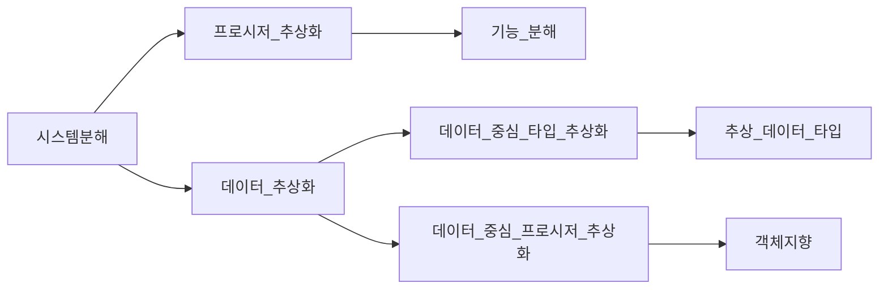
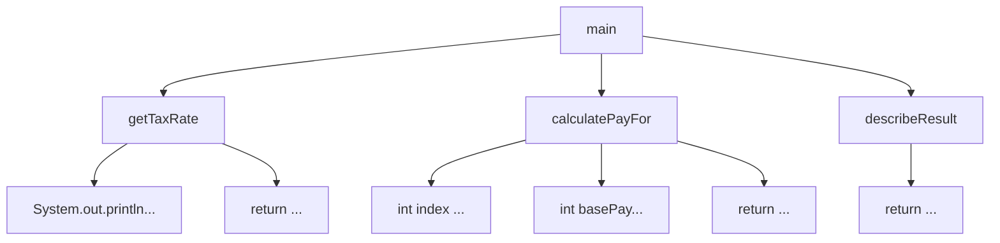

# 07. 객체 분해
## 01 프로시저 추상화와 데이터 추상화
모든 프로그래밍 패러다임은 추상화와 분해의 관점에서 설명할 수 있다.
현대적인 프로그래밍 언어를 특징 짓는 중요한 두 가지 추상화 메커니즘은 `프로시저 추상화`와 `데이터 추상화`다.

* 프로시저 추상화
    * 소프트웨어가 무엇을 해야하는지를 추상화 한다.
* 데이터 추상화
    * 소프트웨어가 무엇을 알아야 하는지 추상화한다.

소프트웨어는 데이터를 이용해 정보를 표현하고 프로시저를 이용해 데이터를 조작한다.



## 02 프로시저 추상화와 기능 분해
> 메인 함수로서의 시스템

기능 분해의 관점에서 추상화의 단위는 프로시저이며 시스템은 프로시저를 단위로 분해된다.
시스템은 필요한 더 작은 작업으로 분해될 수 있는 하나의 커다란 메인 함수다.
전통적 기능 분해 방법은 하향식(Top-Down Approach)을 따른다.
시스템을 구성하는 가장 최상위 기능을 정의하고, 이 최상위 기능을 좀 더 작은 단계의 하위 기능으로 분해해 나가는 방법을 말한다.
분해는 세분화된 마지막 하위 기능이 프로그래밍 언어로 구현 가능한 수준이 될 때까지 계속된다.
각 세분화 단계는 바로 위 단계보다 더 구체적이어야 한다.(정제된 기능은 자신의 바로 상위 기능보다 덜 추상적이어야 한다.)

> 급여 관리 시스템

이번에 살펴볼 예제는 간단한 급여 관리 시스템이다.
직원들이 실제로 지급받게 되는 급여는 다음 공식에 따라 계산된다.    

`급여 = 기본급 - (기본급 * 소득세율)`   

급여 관리 시스템을 구현하기 위해 기능 분해 방법을 이용하겠다.
최상위의 추상적인 함수 정의에서 출발해서 단계적인 정제 걸차를 따라 시스템을 구축한다.
기능분해의 초점은 하나의 문장으로 표현된 기능을 여러 개 더 작은 기능으로 분해하는 것이다.

급여 관리 시스템에 대한 추상적인 최상위 문장을 기술함으로써 시작하자.
이 문장은 급여 관리 시스템을 시작하는 메인 프로시저로 구현될 것이다.     

`직원 급여를 계산한다.`  

기능 분해 방법에 따라 이 프로시저를 실제로 급여를 계산하는 데 필요한 좀 더 세분화된 절차로 구체화해야 한다.
급여를 계산하는 데 필요한 정보는 직원의 이름과 소득세율이다.
직원의 이름은 프로시저의 인자로 전달받고 소득세율은 사용자로부터 직접 입력 받기로 결정했다고 가정하자.
```
직원의 급여를 계산한다.
   * 사용자로부터 소득세율을 입력 받는다.
   * 직원의 급여를 계산한다.
   * 양식에 맞게 결과를 출력한다.
```
각 정제 단계는 이전 문장의 추상화 수준을 감소시켜야 한다.
개발자는 각 단계에서 불완전하고 좀 더 구체화될 수 있는 문장이 남았는지 검토한다.
정제 가능한 문장이 존재하면 동일한 과정을 거쳐 구현이 가능할 정도로 충분히 저수준의 문장이 될 때까지 기능을 분해해야 한다.

```
직원의 급여를 계산한다.
   * 사용자로부터 소득세율을 입력 받는다.
        * "세율을 입력하세요: "라는 문장을 화면에 출력한다.
        * 키보드를 통해 세율을 입력 받는다. 
   * 직원의 급여를 계산한다.
        * 전역 변수에 저장된 직원의 기본급 정보를 얻는다.
        * 급여를 계산한다.
   * 양식에 맞게 결과를 출력한다.
        * "이름: {직원명}, 급여: {계산된 금액}" 형식에 따라 출력 문자열을 생성한다.
```


> 급여 관리 시스템 구현

이제 구현을 시작해보자. 앞에서 정의한 급여 관리 시스템의 최상위 문장은 다음과 같다.

`직원의 급여를 계산한다.`

```java
public void main(String name) {
    
}
```
이제 최상위 함수를 구현하기 위해 세분화한 내용을 이용해 메인 메서드의 내부를 채울 차례다.

```java
public void main(String name) {
    float taxRate = getTaxRate();
    float pay = calculatePayFor(name, taxRate);
    System.out.println(describeResult(name, pay));
}
```
사용자로부터 소득세율을 입력받는 getTaxRate 메서드는 다음과 같은 두개의 절차로 분해할 수 있다.

* "세율을 입력하세요: "라는 문장을 화면에 출력한다.
* 키보드를 통해 세율을 입력 받는다.

이 절차는 언어나 라이브러리에서 제공하는 기능을 이용해 충분히 구현 가능한 수준이다.
따라서 getTaxRate 메서드를 다음과 같이 구현할 수 있다.
```java
private float getTaxRate() {
    Scanner scanner = new Scanner(System.in);
    System.out.println("세율을 입력하세요: ");
    return sc.nextFloat();
}
```
급여를 계산하는 코드는 기본급 정보를 이용해 급여를 계산하는 두 개의 단계로 구현할 수 있다.

* 전역 변수에 저장된 직원의 기본급 정보를 얻는다.
* 급여를 계산한다.

급여를 계산하기 위해서는 애플리케이션 내부에 직원 목록과 기본급에 대한 정보를 유지하고 있어야 한다.
직원의 목록은 EMPLOYEES라는 전역 변수에, 직원별 기본급은 BASE_PAYS라는 전역 변수에 저장하기로 한다.

```java
String[] EMPLOYEES = {"직원A", "직원B", "직원C"};
int[] BASE_PAYS = {400, 300, 250};
```
급여를 계산하는 calculatePayFor 메서드는 파라미터로 전달된 직원의 이름을 이용해 EMPLOYEES 배열안에서 인덱스를 알아낸 후 BASE_PAYS의 해당 인덱스에 위치한 기본급 정보를 얻는다.
지급될 급여는 `기본급 - (기본급 * 소득세율)` 공식에 따라 계산된 후 반환된다.

```java
private calculatePayFor(String name, float taxRate) {
    int index = Arrays.asList(EMPLOYEES).indexOf(name);
    int basePay = BASE_PAYS[index];
    return basePay - (basePay * taxRate);
}
```
급여를 계산했으므로 마지막 급여 내역을 출력 양식에 맞게 포매팅한 후 반환하면 모든 작업이 완료된다.

* "이름: {직원명}, 급여: {계산된 금액}" 형식에 따라 출력 문자열을 생성한다.

```java
private String describeResult(String name, float pay) {
    StringBuilder sb = new StringBuilder();
    sb.append("이름: ").append(name).append(", 급여: ").append(pay);
    return sb.toString();
}
```


이처럼 하향식 기능 분해는 논리적이고 체계적인 시스템 개발 절차를 제시한다.
커다란 기능을 좀 더 작은 기능으로 단계적으로 정제해 가는 과정은 구조적이며 체계적인 동시에 이상적인 방법으로까지 보일 것이다.
문제는 우리가 사는 세계는 그렇게 체계적이지도, 이상적이지도 않다는 점이다.

> 하향식 기능 분해의 문제점

하향식 기능 분해 방법은 겉으로는 이상적인 방법으로 보일 수 있겠지만 실제로 설계에 적용하다 보면 당므고 ㅏ같은 다양한 문제에 직면한다.

* 시스템은 하나의 메인 함수로 구성돼 있지 않다.
* 기능 추가나 요구사항 변경으로 인해 메인 함수를 빈번하게 수정해야 한다.
* 비즈니스 로직이 사용자 인터페이스와 강하게 결합된다.
* 하향식 분해는 너무 이른 시기에 함수들의 실행 순서를 고정시키기 때문에 유연성과 재사용성이 저하 된다.
* 데이터 형식이 변경될 경우 파급효과를 예측할 수 없다.

하향식 접근법과 기능 분해가 가지는 근본적인 문제점은 변경에 취약한 설계를 낳는다는 것이다.

**하나의 메인 함수라는 비현실적인 아이디어**  
대부분의 시스템에서 하나의 메인 기능이란 개념은 존재하지 않는다.
하향식 접근법은 하나의 알고리즘을 구현하거나 배치 처리를 구현하기에는 적합하지만 현대적인 상호작용 시스템을 개발하는 데는 적합하지 않다.
현대적인 시스템은 동등한 수준의 다양한 기능으로 구성된다.

**메인 함수의 빈번한 재설계**  
하향식 기능분해의 경우에는 새로운 기능을 추가할 때마다 매번 메인 함수를 수정해야 한다.
기존 로직과 아무런 상관이 없는 새로운 함수의 적절한 위치를 확보해야 하기 때문에 메인 함수의 구조를 급격하게 변경할 수밖에 없는 것이다.

**비즈니스 로직과 사용자 인터페이스의 결합**  
하향식 접근법은 사용자 인터페이스 로직과 비즈니스 로직을 한데 섞기 때문에 사용자 인터페이스를 변경하는 경우 비즈니스 로직까지 변경에 영향을 받게 된다.   
따라서 하향식 접근법은 근본적으로 변경에 불안정한 아키텍처를 낳는다.
하향식 접근법은 기능을 분해하는 과정에서 사용자 인터페이스의 관심사와 비즈니스 로직의 관심사를 동시에 고려하도록 가용하기 때문에 "관심사의 분리"라는 아키텍처 설계의 목적을 달성하기 어렵다.

**성급하게 결정된 실행 순서**  
하향식 접근법의 설계는 처음부터 구현을 염두에 두기 때문에 자연스럽게 함수들의 실행 순서를 정의하는 시간 제약을 강조한다.
메인 함수가 작은 함수들로 분해되기 위해서는 우선 함수들의 순서를 결정해야 한다.
실행 순서나 조건, 반복과 같은 제어 구조를 미리 결정하지 않고는 분해를 진행할 수 없기 때문에 기능 분해 방식은 중앙집중 제어스타일의 형태를 띤다.
모든 중요한 제어 흐름의 결정이 상위 함수에서 이루어지고 하위 함수는 상위 함수의 적절한 흐름에 따라 적절한 시점에 호출된다.
결과적으로 기능을 추가하거나 변경하는 작업은 매번 기존에 결정된 함수의 제어구조를 변경하도록 만든다.

**데이터 변경으로 인한 파급효과**  
하향식 기능 분해의 가장 큰 문제점은 어떤 데이터를 어떤 함수가 사용하고 있는지 추적하기 어렵다는 것이다.
따라서 데이터 변경으로 인해 어떤 함수가 영향을 받을지 예상하기 어렵다.
개별 함수의 입장에서 사용하는 데이터를 파악하는 것은 어렵지 않다.
함수의 본체를 열어 참조하고 있는 모든 지역 변수, 인자, 전역 변수를 살펴보면 된다.
반대로 어떤 데이턱 ㅏ어떤 함수에 의존하고 있는지를 파악하는 것은 어려운 일인데 모든 함수를 열어 데이터를 사용하고 있는지를 모두 확인해봐야 하기 때문이다.

> 언제 하향식 분해가 유용한가?

하향식 분해는 작은 프로그램과 개별 알고리즘을 위해서는 유용한 패러다임으로 남아 있다.
프로그래밍 과정에서 이미 해결된 알고리즘을 문서화하고 서술하는 데는 훌륭한 기법이다.
그러나 실제로 동작하는 커다락 소프트웨어를 설계하는 데 적합한 방법은 아니다.

## 03 모듈

> 정보 은닉과 모듈

정보 은닉은 외부에 감춰야 하는 비밀에 따라 시스템을 분할하는 모듈 분할 원리다.
모듈은 변경될 가능성이 있는 비밀을 내부로 감추고, 잘 정의되고 쉽게 변경되지 않을 퍼블릭 인터페이스를 외부에 제공해서 내부의 비밀에 함부로 접근하지 못하게 한다.
모듈은 다음과 같은 두 가지 비밀을 감춰야 한다.

* 복잡성: 모듈이 너무 복잡한 경우 이해하고 사용하기가 어렵다. 외부에 모듈을 추상화할 수 있는 간단한 인터페이스를 제공해서 모듈의 복잡도를 낮춘다.
* 변경 가능성: 변경 가능한 설계 결정이 외부에 노출될 경우 실제 변경이 발생했을 때 파급효과가 커진다. 변경 발생 시 하나의 모듈만 수정하면 되도록 변경 가능한 설계 결정을 모듈 내부로 감추고 외부에는 쉽게 변경되지 않을 인터페이스를 제공한다.

시스템의 가장 일반적인 비밀은 데이터다. 비밀이 반드시 데이터일 필요는 없으며 복잡한 로직이나 변경 가능성이 큰 자료 구조일 수도 있다. 그럼에도 변경 시 시스템을 굴복시키는 대부분의 경우는 데이터가 변경되는 경우다.
급여 관리 시스템을 구원할 수 있는 방법 역시 함께 사용되는 데이터를 자신의 비밀로 삼는 모듈을 만드는 것이다.
모듈을 이용해 직원 정보라는 비밀을 내부로 감추고 외부에 대해서는 퍼블릭 인터페이스만 노출시켜야 한다.

> 모듈의 장점과 한계

* 모듈 내부의 변수가 변경되더라도 모듈 내부에만 영향을 미친다.
  * 모듈을 사용하면 모듈 내부에 정의된 변수를 직접 참조하는 코드의 위치를 모듈 내부로 제한할 수 있다.
  * 데이터가 변경됐을 때 영향을 받는 함수를 찾기 위해 해당 데이터를 정의한 모듈만 검색하면 된다.
  * 데이터 변경으로 인한 파급효과를 제어할 수 있기 때문에 코드를 수정하고 디버깅하기가 더 용이하다.
* 비즈니스 로직과 사용자 인터페이스에 대한 관심사를 분리한다.
  * 수정된 코드에서 Employees 모듈은 비즈니스 로직과 관련된 관심사만을 담당하며 사용자 인터페이스와 관련된 관심사는 모두 Employees 모듈을 사용하는 main 함수쪽에 위치한다.
  * 사용자 인터페이스를 추가하더라도 Employees 모듈에 포함된 비즈니스 로직은 변경되지 않는다.
* 전역 번수와 전역 함수를 제거함으로써 네임스페이스 오염을 방지한다.
  * 모듈의 한 가지 용도는 네임스페이스를 제공하는 것이다.
  * 변수와 함수를 모듈 내부에 포함시기키 때문에 다른 모듈에서도 동일한 이름을 사용할 수 있게 된다.
  * 모듈은 전역 네임스페이스의 오염을 방지하는 동시에 이름 충돌의 위험을 완화한다.

모듈은 기능이 아니라 변경의 정도에 따라 시스템을 분해하게 한다.
각 모듈은 외부에 감춰야 하는 비밀과 관련성 높은 데이터와 함수의 집학이다.
따라서 모듈 내부는 높은 응집도를 유지한다.
모듈과 모듈 사이에는 퍼블릭 인터페이스를 통해서만 통신해야 한다. 따라서 낮은 결합도를 유지한다.

메인 함수를 정의하고 필요에 따라 더 세 부적인 함수로 분해하는 하향식 기능 분해와 달리 모듈은 감춰야 할 데이터를 결정하고 이 데이터를 조작하는 데 필요한 함수를 결정한다.
다시 말해 기능이 아니라 데이터를 중심으로 시스템을 분해하는 것이다.
모듈은 데이터와 함수가 통합된 한 차원 높은 추상화를 제공하는 설계 단위다.

비록 모듈이 프로시저 추상화보다는 높은 추상화 개념을 제공하지만 태생적으로 변경을 관리하기 위한 구현 기법이기 때문에 추상화 관점에서의 한계점이 명확하다.
모듈의 가장 큰 단점은 인스턴스의 개념을 제공하지 않는다는 점이다.
Employees 모듈은 단지 회사의 모든 직원 정보를 가지고 있는 모듈일 뿐이다.
좀 더 높은 수준의 추상화를 위해서는 직원 전체가 아니라 개별 직원을 독립적인 단위로 다룰 수 있어야 한다.
다시 말해 다수의 직원 인스턴스가 존재하는 추상화 메커니즘이 필요한 것이다.
이를 만족시키기 위해 등장한 개념이 바로 추상 데이터 타입이다.

## 04 데이터 추상화와 추상 데이터 타입
## 05 클래스
