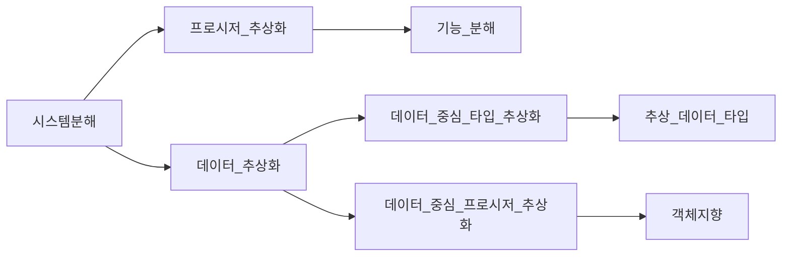
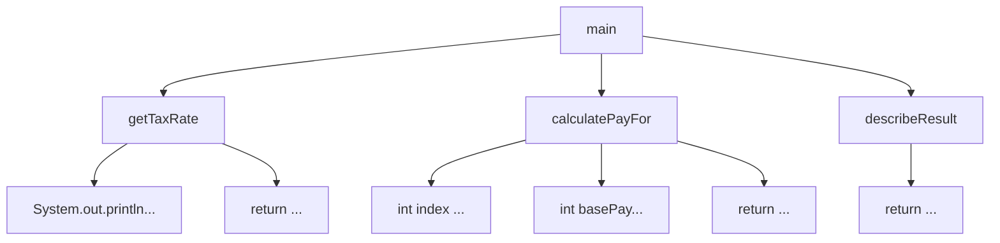

# 07. 객체 분해
## 01 프로시저 추상화와 데이터 추상화
모든 프로그래밍 패러다임은 추상화와 분해의 관점에서 설명할 수 있다.
현대적인 프로그래밍 언어를 특징 짓는 중요한 두 가지 추상화 메커니즘은 `프로시저 추상화`와 `데이터 추상화`다.

* 프로시저 추상화
    * 소프트웨어가 무엇을 해야하는지를 추상화 한다.
* 데이터 추상화
    * 소프트웨어가 무엇을 알아야 하는지 추상화한다.

소프트웨어는 데이터를 이용해 정보를 표현하고 프로시저를 이용해 데이터를 조작한다.



## 02 프로시저 추상화와 기능 분해
> 메인 함수로서의 시스템

기능 분해의 관점에서 추상화의 단위는 프로시저이며 시스템은 프로시저를 단위로 분해된다.
시스템은 필요한 더 작은 작업으로 분해될 수 있는 하나의 커다란 메인 함수다.
전통적 기능 분해 방법은 하향식(Top-Down Approach)을 따른다.
시스템을 구성하는 가장 최상위 기능을 정의하고, 이 최상위 기능을 좀 더 작은 단계의 하위 기능으로 분해해 나가는 방법을 말한다.
분해는 세분화된 마지막 하위 기능이 프로그래밍 언어로 구현 가능한 수준이 될 때까지 계속된다.
각 세분화 단계는 바로 위 단계보다 더 구체적이어야 한다.(정제된 기능은 자신의 바로 상위 기능보다 덜 추상적이어야 한다.)

> 급여 관리 시스템

이번에 살펴볼 예제는 간단한 급여 관리 시스템이다.
직원들이 실제로 지급받게 되는 급여는 다음 공식에 따라 계산된다.    

`급여 = 기본급 - (기본급 * 소득세율)`   

급여 관리 시스템을 구현하기 위해 기능 분해 방법을 이용하겠다.
최상위의 추상적인 함수 정의에서 출발해서 단계적인 정제 걸차를 따라 시스템을 구축한다.
기능분해의 초점은 하나의 문장으로 표현된 기능을 여러 개 더 작은 기능으로 분해하는 것이다.

급여 관리 시스템에 대한 추상적인 최상위 문장을 기술함으로써 시작하자.
이 문장은 급여 관리 시스템을 시작하는 메인 프로시저로 구현될 것이다.     

`직원 급여를 계산한다.`  

기능 분해 방법에 따라 이 프로시저를 실제로 급여를 계산하는 데 필요한 좀 더 세분화된 절차로 구체화해야 한다.
급여를 계산하는 데 필요한 정보는 직원의 이름과 소득세율이다.
직원의 이름은 프로시저의 인자로 전달받고 소득세율은 사용자로부터 직접 입력 받기로 결정했다고 가정하자.
```
직원의 급여를 계산한다.
   * 사용자로부터 소득세율을 입력 받는다.
   * 직원의 급여를 계산한다.
   * 양식에 맞게 결과를 출력한다.
```
각 정제 단계는 이전 문장의 추상화 수준을 감소시켜야 한다.
개발자는 각 단계에서 불완전하고 좀 더 구체화될 수 있는 문장이 남았는지 검토한다.
정제 가능한 문장이 존재하면 동일한 과정을 거쳐 구현이 가능할 정도로 충분히 저수준의 문장이 될 때까지 기능을 분해해야 한다.

```
직원의 급여를 계산한다.
   * 사용자로부터 소득세율을 입력 받는다.
        * "세율을 입력하세요: "라는 문장을 화면에 출력한다.
        * 키보드를 통해 세율을 입력 받는다. 
   * 직원의 급여를 계산한다.
        * 전역 변수에 저장된 직원의 기본급 정보를 얻는다.
        * 급여를 계산한다.
   * 양식에 맞게 결과를 출력한다.
        * "이름: {직원명}, 급여: {계산된 금액}" 형식에 따라 출력 문자열을 생성한다.
```


> 급여 관리 시스템 구현

이제 구현을 시작해보자. 앞에서 정의한 급여 관리 시스템의 최상위 문장은 다음과 같다.

`직원의 급여를 계산한다.`

```java
public void main(String name) {
    
}
```
이제 최상위 함수를 구현하기 위해 세분화한 내용을 이용해 메인 메서드의 내부를 채울 차례다.

```java
public void main(String name) {
    float taxRate = getTaxRate();
    float pay = calculatePayFor(name, taxRate);
    System.out.println(describeResult(name, pay));
}
```
사용자로부터 소득세율을 입력받는 getTaxRate 메서드는 다음과 같은 두개의 절차로 분해할 수 있다.

* "세율을 입력하세요: "라는 문장을 화면에 출력한다.
* 키보드를 통해 세율을 입력 받는다.

이 절차는 언어나 라이브러리에서 제공하는 기능을 이용해 충분히 구현 가능한 수준이다.
따라서 getTaxRate 메서드를 다음과 같이 구현할 수 있다.
```java
private float getTaxRate() {
    Scanner scanner = new Scanner(System.in);
    System.out.println("세율을 입력하세요: ");
    return sc.nextFloat();
}
```
급여를 계산하는 코드는 기본급 정보를 이용해 급여를 계산하는 두 개의 단계로 구현할 수 있다.

* 전역 변수에 저장된 직원의 기본급 정보를 얻는다.
* 급여를 계산한다.

급여를 계산하기 위해서는 애플리케이션 내부에 직원 목록과 기본급에 대한 정보를 유지하고 있어야 한다.
직원의 목록은 EMPLOYEES라는 전역 변수에, 직원별 기본급은 BASE_PAYS라는 전역 변수에 저장하기로 한다.

```java
String[] EMPLOYEES = {"직원A", "직원B", "직원C"};
int[] BASE_PAYS = {400, 300, 250};
```
급여를 계산하는 calculatePayFor 메서드는 파라미터로 전달된 직원의 이름을 이용해 EMPLOYEES 배열안에서 인덱스를 알아낸 후 BASE_PAYS의 해당 인덱스에 위치한 기본급 정보를 얻는다.
지급될 급여는 `기본급 - (기본급 * 소득세율)` 공식에 따라 계산된 후 반환된다.

```java
private calculatePayFor(String name, float taxRate) {
    int index = Arrays.asList(EMPLOYEES).indexOf(name);
    int basePay = BASE_PAYS[index];
    return basePay - (basePay * taxRate);
}
```
급여를 계산했으므로 마지막 급여 내역을 출력 양식에 맞게 포매팅한 후 반환하면 모든 작업이 완료된다.

* "이름: {직원명}, 급여: {계산된 금액}" 형식에 따라 출력 문자열을 생성한다.

```java
private String describeResult(String name, float pay) {
    StringBuilder sb = new StringBuilder();
    sb.append("이름: ").append(name).append(", 급여: ").append(pay);
    return sb.toString();
}
```


이처럼 하향식 기능 분해는 논리적이고 체계적인 시스템 개발 절차를 제시한다.
커다란 기능을 좀 더 작은 기능으로 단계적으로 정제해 가는 과정은 구조적이며 체계적인 동시에 이상적인 방법으로까지 보일 것이다.
문제는 우리가 사는 세계는 그렇게 체계적이지도, 이상적이지도 않다는 점이다.

> 하향식 기능 분해의 문제점

> 언제 하향식 분해가 유용한가?

## 03 모듈
## 04 데이터 추상화와 추상 데이터 타입
## 05 클래스
