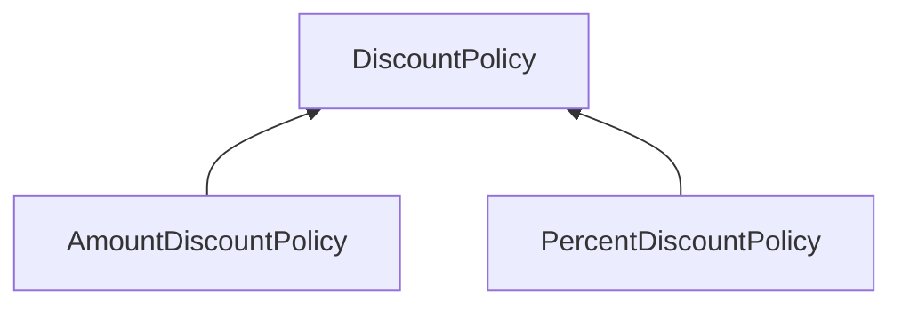
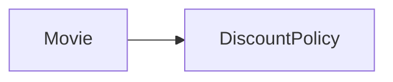

# 08. 의존성 관리하기
## 01 의존성 이해하기
> 변경과 의존성

어떤 객체가 협력하기 위해 다른 객체를 필요로 할 때 두 객체 사이에 의존성이 존재하게 된다.
의존성은 실행 시점과 구현 시점에 서로 다른 의미를 가진다.

* 실행 시점: 의존하는 객체가 정상적으로 동작하기 위해서는 실행 시에 의존 대상 객체가 반드시 존재해야 한다.
* 구현 시점: 의존 대상 객체가 변경될 경우 의존하는 객체도 함께 변경된다.

의존성이 가지는 근본적인 특징은 자신이 의존하는 대상이 변경될 때 함께 변경될 수 있다는 것이다.

> 의존성 전이

의존성은 전이 될 수 있다.
의존성이 실제 전이될지 여부는 변경의 방향과 캡슐화의 정도에 따라 달라진다.

의존성은 전이 될 수 있기 때문에 의존성의 종류를 직접 의존성(direct dependency)과 간접 의존성(indirect dependency)으로 나누기도 한다.

* 직접 의존성: 한 요소가 다른 요소에게 직접 의존하는 경우를 가리킨다. 이 경우 의존성은 그 요소의 코드에 명시적으로 드러난다.
* 간접 의존성: 직접적인 관계는 존재하지 않지만 의존성 전이에 의해 영향이 전파되는 경우를 가리킨다. 이 경우 코드안에 명시적으로 드러나지 않는다.

> 런타임 의존성과 컴파일타임 의존성

의존성과 관련해 다뤄야 하는 또 다른 주제는 런타임 의존성과 컴파일타임 의존성의 차이다.
런타임 의존성과 컴파일타임 의존성이 다를 수 있다는 것이다.



`Movie` 클래스에서 `AmountDiscountPolicy` 클래스와 `PercentDiscountPolicy` 클래스로 향하는 어떤 의존성도 존재하지 않는다.
`Movie` 클래스는 오직 추상 클래스인 `DiscountPolicy` 클래스에만 의존한다.
`Moive` 클래스의 코드를 살펴보면 `AmountDiscountPolicy`, `PercentDiscountPolicy`에 대해 언급조차 하지 않는다.

하지만 런타임 의존성을 살펴보면 상황이 달라진다.
코드를 작성하는 시점의 `Movie` 클래스는 `AmountDiscountPolicy`, `PercentDiscountPolicy`의 인스턴스를 전혀 알지 못하지만
실행 시점의 `Movie` 인스턴스는 `AmountDiscountPolicy`, `PercentDiscountPolicy`의 인스턴스와 협력할 수 있어야 한다.

협력을 위한 좋은 방법은 `Movie` 인스턴스가 `AmountDiscountPolicy`, `PercentDiscountPolicy`를 포괄하는 `DiscountPolicy`라는 추상 클래스에 의존하도록 하고
이 컴파일 타임 의존성을 실행 시에 `AmountDiscountPolicy`, `PercentDiscountPolicy`의 인스턴스에 대한 런타임 의존성으로 대체하게 하는 것이다.

이것이 핵심이다. 유연하고 재사용 가능한 설계를 창조하기 위해서는 동일한 소스코드 구조를 가지고 다양한 실행 구조를 만들 수 있어야 한다.
컴파일타임 구조와 런타임 구조 사이의 거리가 멀면 멀수록 설계가 유연해지고 재사용 가능해진다.

> 컨텍스트 독립성

클래스가 특정한 문맥에 강하게 결합될 수록 다른 문맥에서 사용하기는 더 어려워진다.
클래스가 사용될 특정한 문맥에 대해 최소한의 가정만 이뤄져 있다면 다른 문맥에서 재사용하기가 더 수월히진다.
이를 컨텍스트 독립성이라고 부른다.
컨텍스트에 대한 정보가 적으면 적을 수록 더 다양한 컨텍스트에서 재사용 될 수 있기 때문이다.

> 의존성 해결하기

컴파일타임 의존성을 실행 컨텍스트에 맞는 적절한 런타임 의존성으로 교체하는 것을 의존성 해결이라고 부른다.
의존성을 해결하기 위해서는 일반적으로 다음과 같은 세 가지 방법을 사용한다.

* 객체를 생성하는 시점에 생성자를 통해 의존성 해결
* 객체 생성 후 setter 메서드를 통해 의존성 해결
* 메서드 실행 시 인자를 이용해 의존성 해결

## 02 유연한 설계

> 의존성과 결합도

의존성은 협력을 위해 반드시 필요한 것이다.
컨텍스트 독립적인 의존성은 바람직한 의존성이고, 특정 컨텍스트에 강하게 결합된 의존성은 바람직하지 않은 의존성이다.
바람직한 의존성과 바람직하지 못한 의존성을 가리키는 용어가 존재한다. '결합도'가 바로 그것이다.

* 바람직한 의존성 = 느슨한 결합도, 약한 결합도
* 바람직하지 못한 결함도 = 단단한 결합도, 강한 결합도

> 지식이 결합을 낳는다

한 요소가 다른 요소에 대해 더 많은 정보를 알고 있을수록 두 요소는 강하게 결합된다.
반대로 한 요소가 다른 요소에 대해 적은 정보를 알고 있을수록 두 요소는 약하게 결합된다.

> 추상화에 의존하라

추상화란 어떤 양상, 세부사항, 구조를 좀 더 명확하게 이해하기 위해 특정 절차나 물체를 의도적으로 생략하거나 감춤으로써 복잡도를 극복하는 방법이다.

일반적으로 추상화와 결합도의 관점에서 의존성 대상을 다음과 같이 구분하는 것이 유용하다.
오른쪽으로 갈 수록 클라이언트가 알아야하는 지식의 양이 적어지기 때문에 결합도가 느슨해진다.
```
구체 클래스 의존성 < 추상 클래스 의존성 < 인터페이스 의존성
```
추상 클래스는 메서드의 내부 구현과 자식 클래스의 종류에 대한 지식을 클라이언트에게 숨길 수 있다.
하지만 추상 클래스의 클라이언트는 여전히 협력하는 대상이 속한 클래스 상속 계층이 무엇인지에 대해서는 알고 있어야 한다.

인터페이스에 의존하면 상속 계층을 모르더라도 협력이 가능해진다.
인터페이스 의존성은 협력하는 객체가 어떤 메시지를 수신할 수 있는지에 대한 지식만을 남기기 때문에 추상 클래스 의존성보다 결합도가 낮다.

> 명시적인 의존성

숨겨진 의존성
```java
public class Movie {
    private DiscountPolicy discountPolicy;
    
    public Movie() {
        this.discountPolicy = new AmountDiscoutPolicy();
    }
}
```

명시적인 의존성
```java
public class Movie {
    private DiscountPolicy discountPolicy;
    
    public Movie(DiscountPolicy discountPolicy) {
        this.discountPolicy = discountPolicy;
    }
}
```
의존성은 명시적으로 표현되야 한다.
의존성을 구현 내부에 숨겨두지 마라. 
유연하고 재사용 가능한 설계란 퍼블릭 인터페이스를 통해 의존성이 명시적으로 드러나는 설계다.
명시적인 의존성을 사용해야만 퍼블릭 인터페이스를 통해 컴파일타임 의존성을 런타임 의존성으로 교체할 수 있다.

> new는 해롭다

결합도 측면에서 new가 해로운 이유는 크게 두가지다.

* new 연산자를 사용하기 위해서는 구체 클레스의 이름을 직접 기술해야 한다. 따라서 new를 사용하는 클라이언트는 추상화가 아닌 구체 클래스에 의존할 수 밖에 없기 때문에 결합도가 높아진다.
* new 연산자는 생성하려는 구체 클래스뿐만 아니라 어떤 인자를 이용해 클래스의 생성자를 호출해야 하는지도 알아야 한다. 따라서 new 연산자를 사용하면 클라이언트가 알아야하는 지식의 양이 늘어나기 때문에 결합도가 높아진다.

> 가끔은 생성해도 무방하다

클래스 안에서 객체의 인스턴스를 직접 생성하는 방식이 유용한 경우도 있다.
주로 협력하는 기본 객체를 설정하고 싶은 경우가 여기에 속한다.
예를 들어, Movie가 대부분의 경우에는 AmountDiscountPolicy와 협력하고 가끔씩만 PercentDiscountPolicy와 협력한다고 가정해보자.
이런 상황에서 모든 경우에 인스턴스를 생성하는 책임을 클라이언트로 옮긴다면 클라이언트들 사이에 중복 코드가 늘어나고 Movie의 사용성도 나빠질 것이다.

이 문제를 해결하기 위해 기본 객체를 생성하는 생성자를 추가하고 이 생성자에서 DiscountPolicy의 인스턴스를 인자로 받는 생성자를 체이닝 하는 것이다.

```java
class Movie {
    private DiscountPolicy discountPolicy;
    
    public Movie() {
        this(new AmountDiscoutPolicy());
    }
    
    public Movie(DiscountPolicy discountPolicy) {
        this.discountPolicy = discountPolicy;
    }
}
```
여기서 눈여겨볼 부분은 첫 번째 생성자의 내부에서 두 번째 생성자를 호출한다는 것이다.
다시 말해 생성자가 체인처럼 연결된다. 이제 클라이언트는 대부분의 경우에 추가된 간략한 생성자를 통해서 AmountDiscountPolicy의 인스턴스와 협력하면서도
컨텍스트에 적절한 DiscountPolicy의 인스턴스로 의존성을 교체할 수 있다.

> 표준 클래스에 대한 의존은 해롭지 않다

의존성이 불편한 이유는 그것이 항상 변경에 대한 영향을 암시하기 때문이다.
변경될 활율이 거의 없는 클래스라면 의존성이 문제가 되지 않는다.
예를 들어, JDK의 표준 컬렉션 라이브러리에 속하는 ArrayList의 경우에는 다음과 같이 직접 생성해서 대입하는 것이 일반적이다.

```java
import java.util.ArrayList;

public abstract class DiscountPolicy {
    private List<DiscountCondition> conditions = new ArrayList<>();
}
```

> 컨텍스트 확장하기

Movie가 유연하다는 사실을 입증하기 위해 지금까지와 다른 컨텍스트에서 Movie를 확장해서 재사용하는 두 가지 예를 살펴보자.

첫 번째는 할인 혜택을 제공하지 않는 영화의 예메 요금을 계산하는 경우다.
할인할 금액으로 0원을 반환하는 NoneDiscountPolicy 클래스를 추가하고 DiscountPolicy의 자식으 클래스로 만드는 것이다.

```java
public class NoneDiscountPolicy extends DiscountPolicy {
    @Override
    protected Money getDiscountAmount(Screening screening) {
        return Money.ZERO;
    }
}
```

```java
Movie avatar = new Movie("아바타", Duration.ofMinutes(120), Money.wons(10000), new NoneDiscountPolicy());
```

두 번째 예는 중복 적용이 가능한 할인 정책을 구현하는 것이다.
중복할인 정책을 구현하는 OverlappedDiscountPolicy를 DiscountPolicy의 자식 클래스로 만들면 기존의 Movie와 DiscountCondition 사이의 협력 방식을 수정하지 않고도 여러 개의 할인 정책을 적용할 수 있다.

```java
import java.util.ArrayList;

public class OverlappedDiscountPolicy extends DiscountPolicy {
    private List<DiscoundPolicy> discountPolices = new ArrayList<>();
    
    public OverlappedDiscountPolicy(DiscountPolicy ...discountPolicies) {
        this.discountPolices = discountPolicies;
    }

    @Override
    protected Money getDiscountAmount(Screening screening) {
        Money result =  Money.ZERO;
        for (DiscountPolicy each : discountPolices) {
            result = result.plus(each.calculateDiscountAmount(screening));
        }
        return result;
    }
}
```
```java
Movie avatar = new Movie(
        "아바타", 
        Duration.ofMinutes(120), 
        Money.wons(10000), 
        new OverlappedDiscountPolicy(
                new AmountDiscountPolicy(...),
                new PercentDiscountPolicy(...)
        )
);
```

> 조합 가능한 해동

다양한 종류의 할인 정책이 필요한 컨텍스트에서 Movie를 재사용할 수 있었던 이유는 코드를 직접 수정하지 않고도 협력 대상인 DiscountPolicy 인스턴스를 교체할 수 있었기 때문이다.
유연하고 재사용 가능한 설계는 작은 객체들의 행동을 조합함으로써 새로운 행동을 이끌어낼 수 있는 설계다.
훌륭한 객체 지향 설계란 객체가 어떻게 하는지 표현하는 것이 아니라 객체들의 조합을 선언적으로 표현함으로써 객체들이 무엇을 하는지를 표현하는 설계다.
그리고 지금까지 설명한 것처럼 이런 설계를 창조하는 데 있어서 핵심은 의존성을 관리하는 것이다.