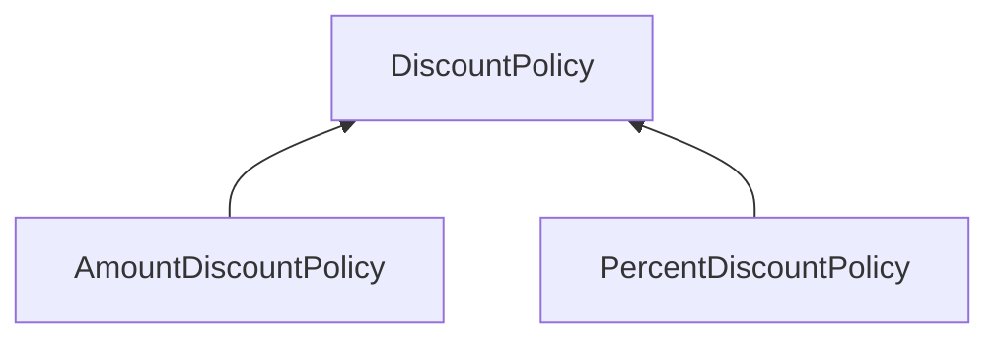
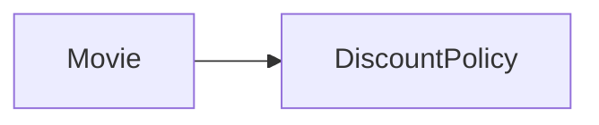

# 08. 의존성 관리하기
## 01 의존성 이해하기
> 변경과 의존성

어떤 객체가 협력하기 위해 다른 객체를 필요로 할 때 두 객체 사이에 의존성이 존재하게 된다.
의존성은 실행 시점과 구현 시점에 서로 다른 의미를 가진다.

* 실행 시점: 의존하는 객체가 정상적으로 동작하기 위해서는 실행 시에 의존 대상 객체가 반드시 존재해야 한다.
* 구현 시점: 의존 대상 객체가 변경될 경우 의존하는 객체도 함께 변경된다.

의존성이 가지는 근본적인 특징은 자신이 의존하는 대상이 변경될 때 함께 변경될 수 있다는 것이다.

> 의존성 전이

의존성은 전이 될 수 있다.
의존성이 실제 전이될지 여부는 변경의 방향과 캡슐화의 정도에 따라 달라진다.

의존성은 전이 될 수 있기 때문에 의존성의 종류를 직접 의존성(direct dependency)과 간접 의존성(indirect dependency)으로 나누기도 한다.

* 직접 의존성: 한 요소가 다른 요소에게 직접 의존하는 경우를 가리킨다. 이 경우 의존성은 그 요소의 코드에 명시적으로 드러난다.
* 간접 의존성: 직접적인 관계는 존재하지 않지만 의존성 전이에 의해 영향이 전파되는 경우를 가리킨다. 이 경우 코드안에 명시적으로 드러나지 않는다.

> 런타임 의존성과 컴파일타임 의존성

의존성과 관련해 다뤄야 하는 또 다른 주제는 런타임 의존성과 컴파일타임 의존성의 차이다.
런타임 의존성과 컴파일타임 의존성이 다를 수 있다는 것이다.

`Movie` 클래스에서 `AmountDiscountPolicy` 클래스와 `PercentDiscountPolicy` 클래스로 향하는 어떤 의존성도 존재하지 않는다.
`Movie` 클래스는 오직 추상 클래스인 `DiscountPolicy` 클래스에만 의존한다.
`Moive` 클래스의 코드를 살펴보면 `AmountDiscountPolicy`, `PercentDiscountPolicy`에 대해 언급조차 하지 않는다.

하지만 런타임 의존성을 살펴보면 상황이 달라진다.
코드를 작성하는 시점의 `Movie` 클래스는 `AmountDiscountPolicy`, `PercentDiscountPolicy`의 인스턴스를 전혀 알지 못하지만
실행 시점의 `Movie` 인스턴스는 `AmountDiscountPolicy`, `PercentDiscountPolicy`의 인스턴스와 협력할 수 있어야 한다.

협력을 위한 좋은 방법은 `Movie` 인스턴스가 `AmountDiscountPolicy`, `PercentDiscountPolicy`를 포괄하는 `DiscountPolicy`라는 추상 클래스에 의존하도록 하고
이 컴파일 타임 의존성을 실행 시에 `AmountDiscountPolicy`, `PercentDiscountPolicy`의 인스턴스에 대한 런타임 의존성으로 대체하게 하는 것이다.

이것이 핵심이다. 유연하고 재사용 가능한 설계를 창조하기 위해서는 동일한 소스코드 구조를 가지고 다양한 실행 구조를 만들 수 있어야 한다.
컴파일타임 구조와 런타임 구조 사이의 거리가 멀면 멀수록 설계가 유연해지고 재사용 가능해진다.

> 컨텍스트 독립성

클래스가 특정한 문맥에 강하게 결합될 수록 다른 문맥에서 사용하기는 더 어려워진다.
클래스가 사용될 특정한 문맥에 대해 최소한의 가정만 이뤄져 있다면 다른 문맥에서 재사용하기가 더 수월히진다.
이를 컨텍스트 독립성이라고 부른다.
컨텍스트에 대한 정보가 적으면 적을 수록 더 다양한 컨텍스트에서 재사용 될 수 있기 때문이다.

> 의존성 해결하기

컴파일타임 의존성을 실행 컨텍스트에 맞는 적절한 런타임 의존성으로 교체하는 것을 의존성 해결이라고 부른다.
의존성을 해결하기 위해서는 일반적으로 다음과 같은 세 가지 방법을 사용한다.

* 객체를 생성하는 시점에 생성자를 통해 의존성 해결
* 객체 생성 후 setter 메서드를 통해 의존성 해결
* 메서드 실행 시 인자를 이용해 의존성 해결

## 02 유연한 설계