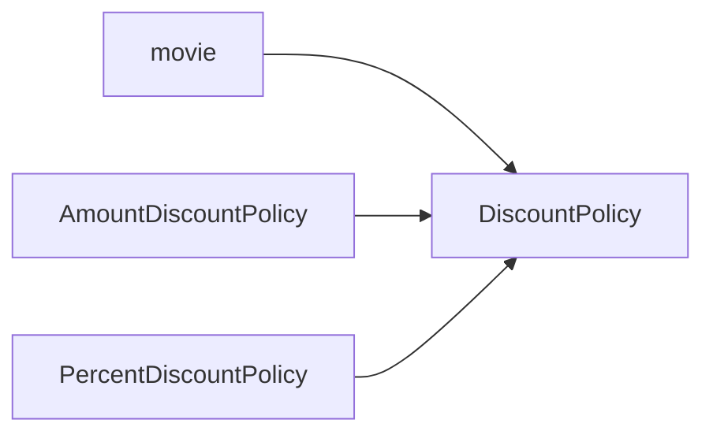
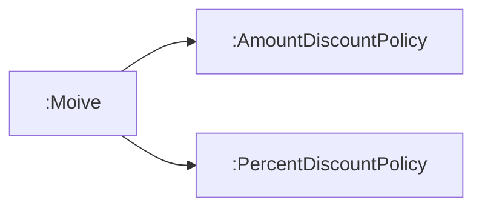

# 09. 유연한 설계
## 01 개방-폐쇄 원칙
소프트웨어 개체는 확장에 대해 열려 있어야하고, 수정에 대해서는 닫혀 있어야 한다.

> 컴파일타임 의존성을 고정시키고 런타임 의존성을 변경하라

컴파일타임 의존성


런타임 의존성

의존성 관점에서 개방-폐쇄 원칙을 따르는 설계란 컴파일 타임 의존성은 유지하면서 런타임 의존성의 가능성을 확장하고 수정할 수 있는 구조라고 할 수 있다.

> 추상화가 핵심이다

개방-폐쇄 원칙의 핵심은 추상화에 의존하는 것이다.

추상화란 핵심적인 부분만 남기고 불필요한 부분은 생략함으로써 복잡성을 극복하는 기법이다.
개방-폐쇄 원칙의 관점에서 생략되지 않고 남겨지는 부분은 다양한 상황에서의 공통점을 반영한 추상화의 결과물이다.
공통적인 부분은 문맥이 바뀌더라도 변하지 않아야 한다.
추상화 부분은 수정에 대해 닫혀 있다.
생략된 부분은 확장의 여지를 남긴다. 이것이 추상화가 개방-폐쇄 원칙을 가능하게 만드는 이유다.

## 02 생성 사용 분리
유연하고 재사용 가능한 설계를 원한다면 객체와 관련된 두 가지 책임을 서로 다른 객체로 분리해야 한다.
하나는 객체를 생성하는 것이고, 다른 하나는 객체를 사용하는 것이다.
객체에 대한 생성과 사용을 분리해야 한다.

> FACTORY 추가하기

```java
public class Factory {

    public Movie createAvatarMovie() {
        return new Movie("아바타", Duration.ofMinutes(120), Money.wons(10000), new AmountDiscountPolicy());
    }
}
```

```java
public class Client {

    private final Factory factory;

    public Client(Factory factory) {
        this.factory = factory;
    }

    public Money getAvatarFee() {
        return factory.createAvatarMovie().getFee();
    }
}
```
FACTORY를 사용하면 Movie와 AmountDiscountPolicy를 생성하는 책임 모두를 FACTORY로 이동할 수 있다.
이제 Client에는 사용과 관련된 책임만 남게 되는데 하나는 FACTORY를 통해 생성된 Movie 객체를 얻기 위한 것이고
다른 하나는 Movie를 통해 가격을 계산하는 것이다.
Client는 오직 사용과 관련된 책임만 지고 생성과 관련된 어떤 지식도 가지지 않을 수 있다.

> 순수한 가공물에게 책임 할당하기

책임 할당의 가장 기본이되는 원칙은 책임을 수행하는데 필요한 정보를 가장 많이 알고 있는 INFORMATION EXPERT에게 책임을 할당하는 것이다.
도메인 모델은 INFORMATION EXPERT를 찾기 위해 참조할 수 있는 일차적인 재료다. 
어떤 책임을 할당하고 싶다면 제일 먼저 도메인 모델 안의 개념 중에서 적절한 후보가 존재하는지 찾아봐야 한다.
종종 도메인 개념을 표현하는 객체에게 책임을 할당하는 것만으로는 부족한 경우가 발생한다.
도메인 모델은 설계를 위한 중요한 출발점이지만 단지 출발점이라는 사실을 명심해야 한다.
실제로 동작하는 애플리케이션은 데이터베이스 접근을 위한 객체와 같이 도메인 개념들을 초월하는 기계적인 개념들도 필요로 할 수 있다.

이 경우 도메인 개념을 표현한 객체가 아닌 설계자가 편의를 위해 임의로 만들어낸 가공의 객체에게 책임을 할당해서 문제를 해결해야 한다.
크레이그 라만은 이처럼 책임을 할당하기 위해 창조되는 도메인과 무관한 인공적인 객체를 PURE FABRICATION(순수한 가공물)이라고 부른다.

## 03 의존성 주입

사용하는 객체가 아닌 외부의 독립적인 객체가 인스턴스를 생성한 후 이를 전달해서 의존성을 해결하는 방법을 의존성 주입이라고 부른다.
의존성 주입에서는 의존성을 해결하는 세 가지 방법을 가리키는 별도의 용어를 정의한다.

* 생성자 주입(constructor injection): 객체를 생성하는 시점에 생성자를 통한 의존성 해결
* setter 주입(setter injection): 객체 생성 후 setter 메서드를 통한 의존성 해결
* 메서드 주입(method injection): 메서드 실행 시 인자를 이용한 의존성 해결

생성자 주입
```java
Movie avatar = new Movie(
        "아바타", 
        Duration.ofMinutes(120), 
        Money.wons(10000), 
        new OverlappedDiscountPolicy(
                new AmountDiscountPolicy(...),
                new PercentDiscountPolicy(...)
        )
);
```

setter 주입
```java
movie.setDiscountPolicy(new AmountDiscountPolicy(...));
```
setter 주입의 장점은 의존성 대상을 런타임에 변경할 수 있다는 것이다.
반면 객체가 올바로 생성되기 위해 어떤 의존성이 필수적인지를 명시적으로 표현할 수 없다는 단점이 있다.

메서드 주입
```java
avatar.calculateDiscountAmount(screening, new AmountDiscountPolicy(...));
```

> 숨겨진 의존성은 나쁘다

의존성 주입외에도 의존성을 해결할 수 있는 다양한 방법이 존재한다.
그중에 가장 널리 사용되는 대표적인 방법은 SERVICE LOCATOR 패턴이다.

SERVICE LOCATOR는 의존성을 해결할 객체들을 보관하는 일종의 저장소다.
객체가 직접 SERVICE LOCATOR에게 의존성을 해결해줄 것을 요청한다.

```java
public Movie {
    private DiscountPolicy discountPolicy;
    
    public Movie(String title, Duration runningTime, Money fee) {
        this.title = title;
        this.runningTime = runningTime;
        this.fee = fee;
        this.discountPolicy = ServiceLocator.discountPolicy();
    }
}
```

Moive 인스턴스를 생성할 때는 다음과 같이 생성하면 된다.
```java
Movie avatar = new Movie("아바타", Duration.ofMinutes(120), Money.wons(10000));
```
SERVICE LOCATOR가 의존성을 간단히 해결해주는 것 처럼보이지만 의존성을 감춘다는 큰 단점이 있다.
숨겨진 의존성이 가지는 가장 큰 문제점은 의존성을 이해하기 위해 코드의 내부 구현을 이해할 것을 강요한다는 것이다.
따라서 숨겨진 의존성은 캡슐화를 위반한다.
가능하다면 의존성을 명시적으로 표현할 수 있는 기법을 사용하라.

## 04 의존성 역전 원칙
> 추상화와 의존성 역전

1. 상위 수준의 모듈은 하위 수준의 모듈에 의존해서는 안된다. 둘 모두 추상화에 의존해야 한다.
2. 추상화는 구체적인 사항에 의존해서는 안 된다. 구체적인 사항은 추상화에 의존해야 한다.

이를 의존성 역전 원칙(Dependency Inversion Principle)이라고 부른다.

> 의존성 역전 원칙과 패키지

유연하고 재사용 가능하며 컨텍스트에 독립적인 설계는 전통적인 패러다임이 고수하는 의존성의 방향을 역전시킨다.
전통적인 패러다임에서 상위 수준 모듈이 하위 수준 모듈에 의존했다면 객체지향 패러다임에서는 상위 수준 모듈과 하위 수준 모듈이 모두 추상화의 의존한다.
전통적인 패러다임에서는 인터페이스가 하위 수준 모듈에 속했다면 객체지향 패러다임에서는 인터페이스가 상위 수준 모듈에 속한다.

훌륭한 객체지향 설계를 위해서는 의존성을 역전시켜야 한다.
그리고 의존성을 역전시켜야만 유연하고 재사용 가능한 설계를 얻을 수 있다. 이것이 핵심이다.

## 05 유연성에 대한 조언

> 유연한 설계는 유연성이 필요할 때만 옳다

변경하기 쉽고 확장하기 쉬운 구조를 만들기 위해선느 단순함과 명확함의 미덕을 버리게 될 가능성이 높다.
유연한 설계라는 말의 이면에는 복잡한 설계라는 의미가 숨어있다.
유연성은 항상 복잡성을 수반한다.
유연함은 단순성과 명확성의 희생 위에 자라난다.
불필요한 유연성은 불필요한 복잡성을 낳는다.

> 협력과 책임이 중요하다

설계를 유연하게 만들기 위해서는 협력에 참여하는 객체가 다른 객체에게 어떤 메시지를 전송하는지가 중요하다.
설계를 유연하게 만들기 위해서는 먼저 역할, 책임, 협력에 초점을 맞춰야 한다.
다양한 컨텍스트에서 협력을 재사용할 필요가 없다면 설계를 유연하게 만들 당위성도 함께 서라진다.

