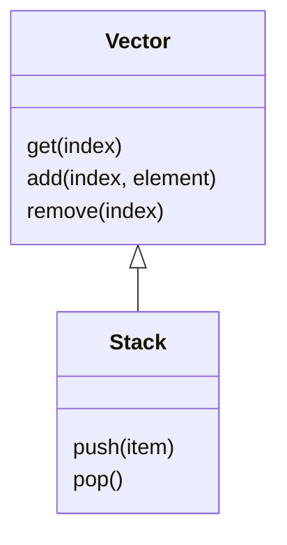
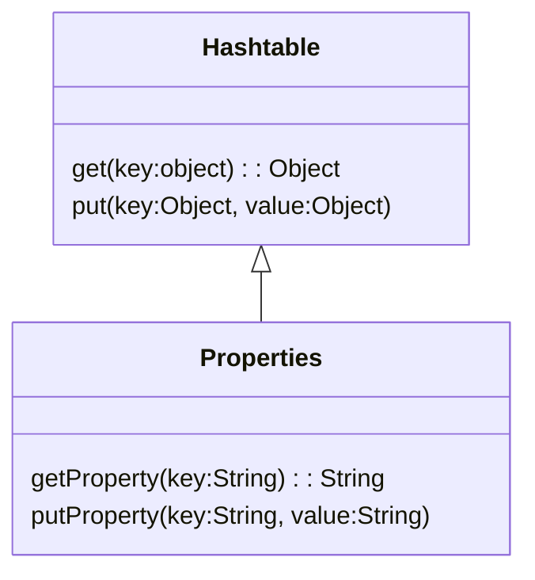
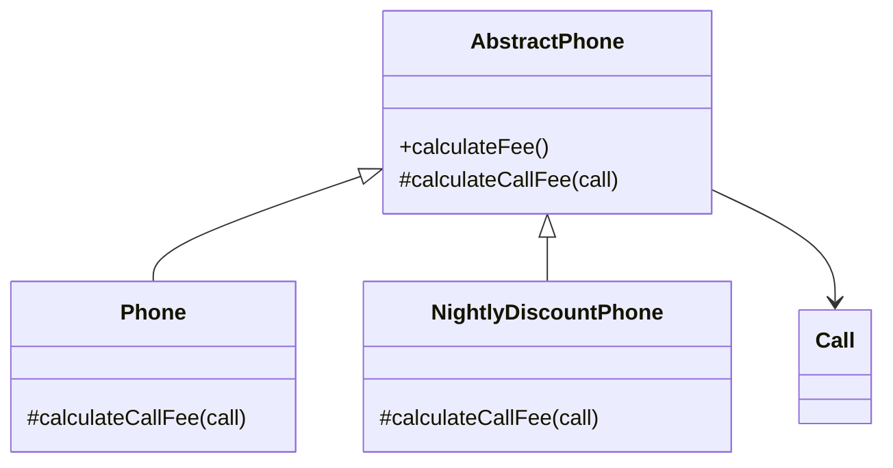
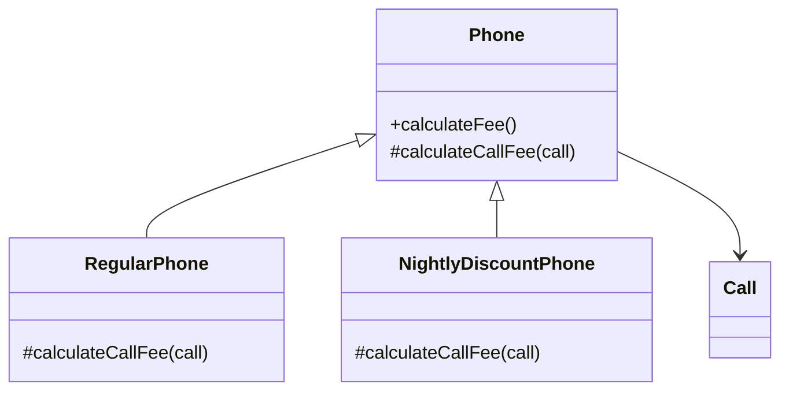

# 10. 상속과 코드 재사용
## 01 상속과 중복 코드
> DRY 원칙

중복 코드는 변경을 방해한다. 이것이 중복 코드를 제거해야하는 가장 큰 이유다.
중복 코드가 가지는 가장 큰 문제는 코드를 수정하는 데 필요한 노력을 몇 배로 증가시킨다는 것이다.
수정과 테스트에 드는 비용을 증가시킨다.
신뢰할 수 있고 숮어하기 쉬운 소프트웨어를 만드는 효과적인 방법 중 하나는 줍옥을 제거하는 것이다.
`Don't Repeat Yourself`의 첫 글자를 모아 만든 용어로 동일한 지식을 중복하지 말라는 것이다.

> 중복과 변경

중복 코드를 제거하지 않은 상태에서 코드를 수정할 수 있는 유일한 방법은 새로운 중복 코드를 추가하는 것 뿐이다.
새로운 중복 코드를 추가하는 과정에서 코드의 일관성이 무너질 위험이 항상 도사리고 있다.
중복 코드가 늘어날 수록 애플리케이션은 변경에 취약해지고 버그가 발생할 가능성이 높아진다는 것이다.
중복 코드의 양이 많아질 수록 버그의 수는 증가하며 그에 비례해 코드를 변경하는 속도는 점점 더 느려진다. 

> 상속을 이용해서 중복 코드 제거하기

상속의 기본 아이디어는 매우 간단하다.
이미 존재하는 클래스와 유사한 클래스가 필요하다면 코드를 복사하지 말고 상속을 이용해 코드를 재사용하라는 것이다.

```java
public class NightlyDiscountPhone extends Phone {

    private static final int LATE_NIGHT_HOUR = 22;

    private Money nightlyAmount;

    public NightlyDiscountPhone(Money nightlyAmount, Money regularAmount, Duration seconds) {
        super(regularAmount, seconds);
        this.nightlyAmount = nightlyAmount;
    }

    @Override
    public Money calculateFee() {
        Money result = super.calculateFee();

        Money nightlyFee = Money.ZERO;
        for (Call call : getCalls()) {
            if (call.getFrom().getHour() >= LATE_NIGHT_HOUR) {
                nightlyFee = nightlyFee.plus(
                        nightlyAmount.times(call.getDuration().getSeconds() / getSeconds().getSeconds())
                );
            }
        }

        return result.minus(nightlyFee);
    }
}
```
상속은 결합도를 높인다. 그리고 상속이 초래하는 부모 클래스와 자식 클래스 사이의 강한 결합이 코드를 수정하기 어렵게 만든다.

> 강하게 결합된 Phone과 NightlyDiscountPhone

NightlyDiscountPhone을 Phone의 자식 클래스로 만든 이유는 Phone의 코드를 재사용하고 중복 코드를 제거하기 위해서다.
하지만 세금을 부과하는 로직을 추가하기 위해 Phone의 코드를 수정할 때 유사한 코드를 NightlyDiscountPhone에도 추가해야 했다.
코드의 중복을 제거하기 위해 상속을 했음에도 새로운 중복 코드를 만들어야 하는 것이다.

이것은 NightlyDiscountPhone이 Phone의 구현에 너무 강하게 결합돼 있기 때문에 발생하는 문제다.
따라서 우리는 상속을 사용할 때 다음과 같은 경고에 귀 기울일 필요가 있다.

```java
자식 클래스의 메서드 안에서 super 참조를 이용해 부모 클래스의 메서드를 직접 호출할 경우 두 클래스는 강하게 결합된다. super 호출을 제거할 수 있는 방법을 찾아 결합도를 제거하라.
```
이처럼 상속 관계로 연결된 자식 클래스가 부모 클래스의 변경에 취약해지는 현상을 가리켜 취약한 기반 클래스 문제라고 부른다.

## 02 취약한 기반 클래스 문제

> 불필요한 인터페이스 상속 문제




Stack과 Properties의 예는 퍼블릭 인터페이스에 대한 고려 없이 단순히 코드 재사용을 위해 상속을 이용하는 것이 얼마나 위험한지를 잘 보여준다.
객체지향의 핵심은 객체들의 협력이다.
단순히 코드를 재사용하기 위해 불필요한 오퍼레이션이 인터페이스에 스며들도록 방치해서는 안 된다.
따라서 상속을 사용할 때 알아둬야 하는 두 번째 주의사항은 다음과 같다.

```
상속받은 부모 클래스의 메서드가 자식 클래스 내부 구조에 대한 규칙을 깨트릴 수 있다.
```

> 메서드 오버라이딩의 오작용 문제

```
자식 클래스가 부모 클래스의 메서드를 오버라이딩 할 경우 부모 클래스가 자신의 메서드를 사용하는 방법에 자식 클래스가 결합될 수 있다.
```

설계는 트레이드오프 활동이라는 사실을 기억하라.
상속은 코드 재사용을 위해 캡슐화를 희생한다.
완벽한 캡슐화를 원한다면 코드 재사용을 포기하거나 상속 이외의 다른 방법을 사용해야 한다.

> 부모 클래스와 자식 클래스의 동시 수정 문제

상속을 사용하려면 자식 클래스가 부모 클래스의 구현에 강하게 결합되기 때문에 이 문제를 피하기는 어렵다.
결합도란 다른 대상에 대해 알고 있는 지식의 양이다.
상속은 기본적으로 부모 클래스의 구현을 재사용한다는 기본 전제를 따르기 때문에 자식 클래스가 부모 클래스의 내부에 대해 속속들이 알도록 강요한다.
따라서 코드 재사용을 위한 상속은 부모 클래스와 자식 클래스를 강하게 결합시키기 때문에 함께 수정해야 하는 상황 역시 빈번하게 발생할 수밖에 없는 것이다.

## 03 Phone 다시 살펴보기

> 추상화에 의존하자

취약한 기반 클래스 문제를 해결하는 가장 일반적인 방법은 자식 클래스가 부모 클래스의 구현이 아닌 추상화에 의존하도록 만드는 것이다.

* 두 메서드가 유사하게 보인다면 차이점을 메서드로 추출하라. 메서드 추출을 통해 두 메서드를 동일한 형태로 보이도록 만들 수 있다.
* 부모 클래스의 코드를 하위로 내리지 말고 자식 클래스의 코드를 상위로 올려라. 부모 클래스의 구체적인 메서드를 자식 클래스로 내리는 것보다 자식 클래스의 추상 메서드를 부모 클래스로 올리는 것이 재사용성과 응집도 측면에서 더 뛰어난 결과로 얻을 수 있다.

> 차이를 메서드로 추출하라

가장 먼저 할 일은 중복 코드 안에서 차이점을 별도의 메서드로 추출하는 것이다.
이것은 흔히 말하는 "변하는 것으로부터 변하지 않는 것을 분리하라", 또는 "변하는 부분을 찾고 이를 캡슐화하라"라는 조언을 메서드 수준에서 적용한 것이다.

> 중복 코드를 부모 클래스로 올려라



> 추상화가 핵심이다

공통 코드를 이동시킨 후에 각 클래스는 설 ㅗ다른 변경의 이유를 가진다는 것에 주목하라.
AbstractPhone은 전체 통화 목록을 계산하는 방법이 바뀔 경우에만 변경된다.
Phone은 일반 요금제의 통화 한 건을 계산하는 방식이 바뀔 경우에만 변경된다.
NightlyDiscountPhone은 심야 할인 요금제의 통화 한 건을 계산하는 방식이 바뀔 경우에만 변경된다.
단일 책임 원칙을 준수하기 때문에 응집도가 높다.
클래스들이 추상화에 의존하기 때문에 얻어지는 장점이다.

> 의도를 드러내는 이름 선택하기


* Phone -> RegularPhone
* AbstractPhone -> Phone

> 세금 추가하기

세금은 모든 요금제에 공통으로 적용돼야 하는 요구사항이다.
따라서 공통 코드를 담고 있는 추상 클래스인 Phone을 수정하면 모든 자식 클래스 간에 수정사항을 공유할 수 있을 것이다.

Phone에 인스턴스 변수인 taxRate를 추가했고 두 인스턴스 변수의 값을 초기화하는 생성자를 추가했다.
이로 인해 RegularPhone과 NightlyDiscountPhone의 생성자 역시 taxRate를 초기화하기 위해 수정해야 한다.

클래스 사이의 상속은 자식 클래스가 부모 클래스가 구현한 행동뿐만 아니라 인스턴스 변수에 대해서도 결합되게 만든다.
상속으로 인한 클래스 사이의 결합을 피할수 있는 방법은 없다.
상속은 어떤 방식으로든 부모 클래스와 자식 클래스를 결합시킨다.

## 04 차이에 의한 프로그래밍
기존 코드와 다른 부분만을 추가함으로써 애플리케이션의 기능을 확장하는 방법을 차이에 의한 프로그래밍이라고 부른다.
상속을 이용하면 이미 존재하는 클래스의 코드를 쉽게 재사용할 수 있기 때문에 애플리케이션의 점진적인 정의가 가능해진다.
차이에 의한 프로그래밍의 목표는 중복 코드를 제거하고 코드를 재사용하는 것이다.

상속의 오용과 남용은 애플리케이션을 이해하고 확장하기 어렵게 만든다.
정말로 필요한 경우에만 상속을 사용하라.

상속은 코드 재사용과 과련된 대부분의 경우에 우아한 해결 방법이 아니다.
상속의 단점은 피하면서 코드를 재사용할 수 있는 더 좋은 방법은 합성이다.
