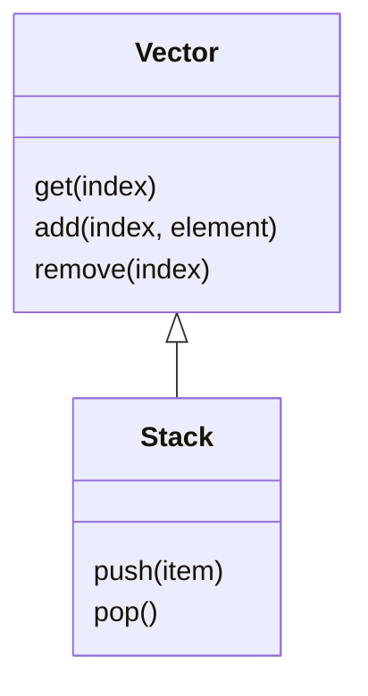
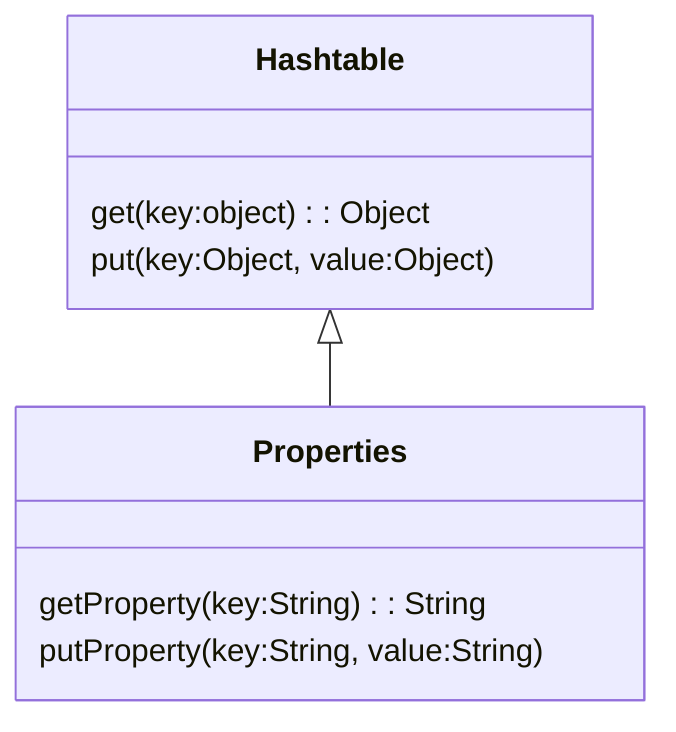

# 10. 상속과 코드 재사용
## 01 상속과 중복 코드
> DRY 원칙

중복 코드는 변경을 방해한다. 이것이 중복 코드를 제거해야하는 가장 큰 이유다.
중복 코드가 가지는 가장 큰 문제는 코드를 수정하는 데 필요한 노력을 몇 배로 증가시킨다는 것이다.
수정과 테스트에 드는 비용을 증가시킨다.
신뢰할 수 있고 숮어하기 쉬운 소프트웨어를 만드는 효과적인 방법 중 하나는 줍옥을 제거하는 것이다.
`Don't Repeat Yourself`의 첫 글자를 모아 만든 용어로 동일한 지식을 중복하지 말라는 것이다.

> 중복과 변경

중복 코드를 제거하지 않은 상태에서 코드를 수정할 수 있는 유일한 방법은 새로운 중복 코드를 추가하는 것 뿐이다.
새로운 중복 코드를 추가하는 과정에서 코드의 일관성이 무너질 위험이 항상 도사리고 있다.
중복 코드가 늘어날 수록 애플리케이션은 변경에 취약해지고 버그가 발생할 가능성이 높아진다는 것이다.
중복 코드의 양이 많아질 수록 버그의 수는 증가하며 그에 비례해 코드를 변경하는 속도는 점점 더 느려진다. 

> 상속을 이용해서 중복 코드 제거하기

상속의 기본 아이디어는 매우 간단하다.
이미 존재하는 클래스와 유사한 클래스가 필요하다면 코드를 복사하지 말고 상속을 이용해 코드를 재사용하라는 것이다.

```java
public class NightlyDiscountPhone extends Phone {

    private static final int LATE_NIGHT_HOUR = 22;

    private Money nightlyAmount;

    public NightlyDiscountPhone(Money nightlyAmount, Money regularAmount, Duration seconds) {
        super(regularAmount, seconds);
        this.nightlyAmount = nightlyAmount;
    }

    @Override
    public Money calculateFee() {
        Money result = super.calculateFee();

        Money nightlyFee = Money.ZERO;
        for (Call call : getCalls()) {
            if (call.getFrom().getHour() >= LATE_NIGHT_HOUR) {
                nightlyFee = nightlyFee.plus(
                        nightlyAmount.times(call.getDuration().getSeconds() / getSeconds().getSeconds())
                );
            }
        }

        return result.minus(nightlyFee);
    }
}
```
상속은 결합도를 높인다. 그리고 상속이 초래하는 부모 클래스와 자식 클래스 사이의 강한 결합이 코드를 수정하기 어렵게 만든다.

> 강하게 결합된 Phone과 NightlyDiscountPhone

NightlyDiscountPhone을 Phone의 자식 클래스로 만든 이유는 Phone의 코드를 재사용하고 중복 코드를 제거하기 위해서다.
하지만 세금을 부과하는 로직을 추가하기 위해 Phone의 코드를 수정할 때 유사한 코드를 NightlyDiscountPhone에도 추가해야 했다.
코드의 중복을 제거하기 위해 상속을 했음에도 새로운 중복 코드를 만들어야 하는 것이다.

이것은 NightlyDiscountPhone이 Phone의 구현에 너무 강하게 결합돼 있기 때문에 발생하는 문제다.
따라서 우리는 상속을 사용할 때 다음과 같은 경고에 귀 기울일 필요가 있다.

```java
자식 클래스의 메서드 안에서 super 참조를 이용해 부모 클래스의 메서드를 직접 호출할 경우 두 클래스는 강하게 결합된다. super 호출을 제거할 수 있는 방법을 찾아 결합도를 제거하라.
```
이처럼 상속 관계로 연결된 자식 클래스가 부모 클래스의 변경에 취약해지는 현상을 가리켜 취약한 기반 클래스 문제라고 부른다.

## 02 취약한 기반 클래스 문제

> 불필요한 인터페이스 상속 문제




Stack과 Properties의 예는 퍼블릭 인터페이스에 대한 고려 없이 단순히 코드 재사용을 위해 상속을 이용하는 것이 얼마나 위험한지를 잘 보여준다.
객체지향의 핵심은 객체들의 협력이다.
단순히 코드를 재사용하기 위해 불필요한 오퍼레이션이 인터페이스에 스며들도록 방치해서는 안 된다.
따라서 상속을 사용할 때 알아둬야 하는 두 번째 주의사항은 다음과 같다.

```
상속받은 부모 클래스의 메서드가 자식 클래스 내부 구조에 대한 규칙을 깨트릴 수 있다.
```


> 메서드 오버라이딩의 오작용 문제

> 부모 클래스와 자식 클래스의 동시 수정 문제

## 03 Phone 다시 살펴보기
## 04 차이에 의한 프로그래밍