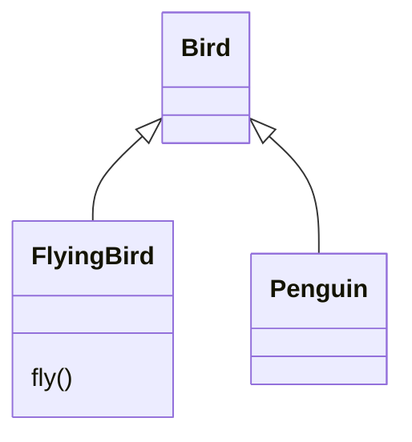
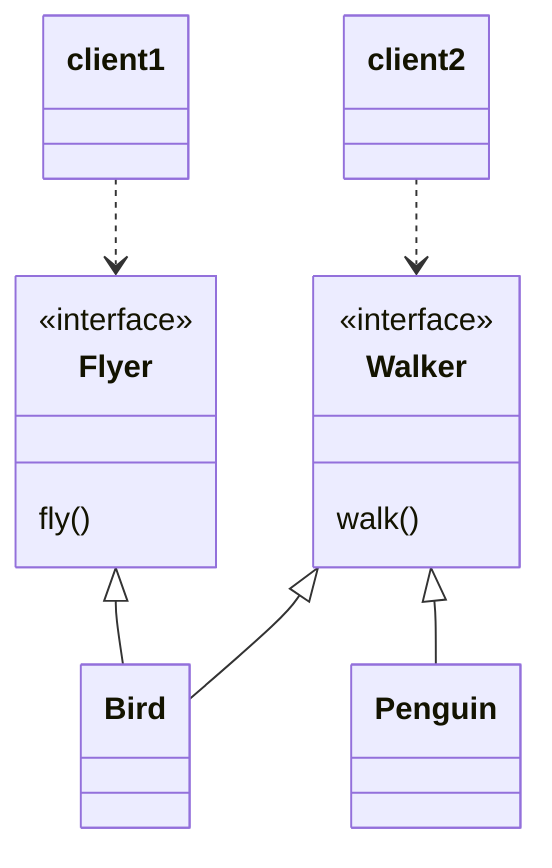
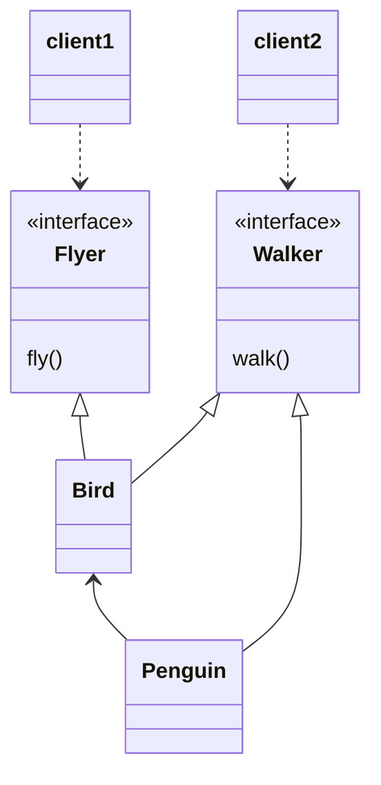

# 13. 서브클래싱과 서브타이핑

상속의 첫 번째 용도는 타입 계층을 구현하는 것이다.
타입 계층 안에서 부모 클래스는 일반적인 개념을 구현하고 자식 클래스는 특수한 개념을 구현한다.
타입 계층의 관점에서 부모 클래스는 자식 클래스의 일반화이고, 자식 클래스는 부모 클래스의 특수화이다.

상속의 두 번째 용도는 코드 재사용이다.
상속을 사용하면 점진적으로 애플리케이션의 기능을 확장할 수 있다.
하지만 재사용을 위해 상속을 사용할 경우 부모 클래스와 자식 클래스가 강하게 결합되기 때문에 변경하기 어려운 코드를 얻게 될 확률이 높다.

## 01 타입

> 개념 관점의 타입

개념 관점의 타입이란 우리가 인지하는 세상의 사물의 종류를 의미한다.
타입은 사물을 분류하기 위한 틀로 사용된다.
어떤 대상이 타입으로 분류될 때 그 대상을 타입의 인스턴스(instance)라고 부른다.
일반적으로 타입의 인스턴스를 객체라고 부른다.

> 프로그래밍 언어 관점의 타입

프로그래밍 언어의 관점에서 타입은 비트 묶음에 의미를 부여하기 위해 정의된 제약과 규칙을 가리킨다.
타입은 적용 가능한 오퍼레이션 종류와 의미를 정의함으로써 코드의 의미를 명확하게 전달하고 개발자의 실수를 방지하기 위해 사용된다.

> 객체지향 패러다임 관점의 타입

객체지향 프로그래밍에서 타입을 정의하는 것은 객체의 퍼블릭 인터페이스를 정의하는 것과 동일하다.
개념 관점에서 타입은 공통의 특성을 가진 객체들을 분류하기 위한 기준이다.
객체지향에서는 객체가 수신할 수 있는 메시지를 기준으로 타입을 분류하기 때문에 동일한 퍼블릭 인터페이스를 가지는 객체들은 동일한 타입으로 분류할 수 있다.

객체의 퍼블릭 인터페이스가 객체의 타입을 결정한다.
따라서 동일한 퍼블릭 인터페이스를 제공하는 객체들은 동일한 타입으로 분류된다.

## 02 타입 계층

> 타입 사이의 포함관계

수학에서 집합은 다른 집합을 포함할 수 있다.
타입 역시 객체들의 집합이기 때문에 다른 타입을 포함하는 것이 가능하다.
타입 계층을 구성하는 두 타입 간의 관계에서 더 일반적인 타입을 슈퍼타입(Supertype)이라고 부르고 더 특수한 타입을 서브타입(Subtype)이라고 부른다.

슈퍼타입은 다음과 같은 특징을 가지는 타입을 가리킨다.

* 집합이 다른 집합의 모든 멤버를 포함한다.
* 타입 정의가 다른 타입보다 좀 더 일반적이다.

서브타입은 다음과 같은 특징을 가지는 타입을 가리킨다.

* 집합에 포함되는 인스턴스들이 더 큰 집합에 포함된다.
* 타입 정의가 다른 타입보다 좀 더 구체적이다.

> 객체지향 프로그래밍과 타입 계층

객체의 타입을 결정하는 것은 퍼블릭 인터페이스다.
퍼블릭 인터페이스의 관점에서 슈퍼타입과 서브타입을 다음과 같이 정의할 수 있다.

* 슈퍼타입이란 서브타입이 정의한 퍼블릭 인터페이스를 일반화시켜 상대적으로 범용적이고 넓은 의미로 정의한 것이다.
* 서브타입이란 슈퍼타입이 정의한 퍼블릭 인터페이스를 특수화시켜 상대적으로 구체적이고 좁은 의미로 정의한 것이다.

서브타입의 인스턴스는 슈퍼타입의 인스턴스로 간주될 수 있다.

## 03 서브클래싱과 서브타이핑

어떤 타입이 다른 타입의 서브타입이 되기 위해서는 어떤 조건을 만족해야 할까?
서브타입의 퍼블릭 인터페이스가 슈퍼타입의 퍼블릭 인터페이스보다 더 특수하다는 것은 어떤 의미일까?
타입 계층을 구현할 때 지켜야하는 제약사항을 클래스와 상속의 관점에서 살펴보자.

> 언제 상속을 사용해야 하는가?

마틴 오더스는 다음과 같은 질문을 해보고 두 질문에 모두 '예'라고 대답할 수 있는 경우에만 상속을 사용하라고 조언한다.

1. 상속 관계가 is-a 관계를 모델링하는가?
    * "[자식 클래스]는 [부모 클래스]다"라고 말해도 이상하지 않다면 상속을 사용할 후보로 간주할 수 있다.
2. 클라이언트 입장에서 부모 클래스의 타입으로 자식 클래스를 사용해도 무방한가.
    * 상속 계층을 사용하는 클라이언트 입장에서 부모 클래스와 자식 클래스의 차이점을 몰라야 한다. 이를 자식 클래스와 부모 클래스 사이의 행동 호환성이라고 부른다.

> is-a 관계

두 클래스가 어휘적으로 `is-a 관계`를 모델링할 경우에만 상속을 사용해야 한다.
타입 S는 타입 T다(S is a T)라고 말할 수 있어야 한다.
하지만 is-a 관계가 생각처럼 직관적이고 명쾌한 것은 아니다.
스콧 마이어스는 이펙티브 C++에서 새와 펭귄의 예를 들어 is-a 관게가 직관을 쉽게 배신할 수 있다는 사실을 보여준다.

* 펭귄은 새다.
* 새는 날 수 있다.

```java
public class Bird {
    public void fly() {...}
}

public class Penguin extends Bird {
    ...
}
```

어휘적으로 펭귄은 새지만 만약 새의 정의에 날 수 있다는 행동이 포함된다면 펭귄은 새의 서브타입이 될 수 없다.
만약 새의 정의에 날 수 있다는 행동이 포함되지 않는다면 펭귄은 새의 서브타입이 될 수 있다.
이 경우에는 어휘적인 관점과 행동 관점이 일치하게 된다.

is-a라는 말을 너무 단편적으로 받아들일 경우에 어떤 혼란이 벌어질 수 있는지를 잘 보여준다.
따라서 어떤 두 대상을 언어적으로 is-a라고 표현할 수 있더라도 일단은 상속을 사용할 예비 후보정도로만 생각하라.

> 행동 호환성

두 타입 사이에 행동이 호환될 경우에만 타입 계층으로 묶어야 한다.
그렇다면 행동이 호환된다는 것은 무슨 의미일까?
단순히 동일한 메서드를 구현하고 있으면 행동이 호환되는 것일까?

행동의 호환 여부를 판단하는 기준은 클라이언트의 관점이라는 것이다.
클라이언트가 두 타입이 동일하게 행동할 것이라고 기대한다면 두 타입을 타입 계층으로 묶을 수 있다.
Penguin이 Bird의 서브타입이 아닌 이유는 클라이언트 입장에서 모든 새가 날 수 있다고 가정하기 때문이다.
중요한 것은 클라이언트의 기대다.
타입 계층을 이해하기 위해서는 그 타입이 사용될 문맥을 이해하는 것이 중요한 것이다.

상속 관계를 유지하면서 문제를 해결하기 위해 시도해볼 수 있는 세가지 방법이 있다.

1. Penguin의 fly 메서드를 오버라이딩해서 내부 구현을 비워두는 것이다.

```java
public class Penguin extends Bird {
    @Override
    public void fly() {

    }
}
```

하지만 이 방법은 어떤 행동도 수행하지 않기 때문에 모든 Bird가 날 수 있다는 클라이언트의 기대를 만족시키지 못한다.
따라서 올바른 설계라고 할 수 없다.

2. Penguin의 fly 메서드를 오버라이딩 후 예외를 던지게 하는 것이다.

```java
public class Penguin extends Bird {
    @Override
    public void fly() {
        throw new UnsupportedOperationException();
    }
}
```

클라이언트는 fly 메시지를 전송한 결과로 UnsupportedOperationException 예외가 던져질 것이라고 기대하지 않을 것이다.
따라서 이 방법 역시 클라이언트의 관점에서 Bird와 Penguin의 행동이 호환되지 않는다.

3. flyBird 메서드를 수정해 인자로 넘어온 bird 타입이 Penguin이 아닌 경우에만 fly 메시지를 전송하도록 하는 것이다.

```java
public void flyBird(Bird bird) {
    if (!(bird instanceof Penguin)) {
        bird.fly();
    }
}
```

하지만 이 방법 역시 문제가 있다.
만약 Penguin 이외에 날 수 없는 또 다른 새가 상속 계층에 추가된다면 또 다른 타입 체크 코드를 추가해야 된다.
개방-폐쇄 원칙을 위반한다.

> 클라이언트의 기대에 따라 계층 분리하기

문제를 해결할 수있는 방법은 클라이언트의 기대에 맞게 상속 계층을 분리하는 것 뿐이다.
flyBird 메서드는 파라미터로 전달되는 모든 새가 날 수 있다고 가정한다.
flyBird 메서드와 협력하는 모든 객체는 fly 메시지에 대해 올바르게 응답할 수 있어야 한다.

Penguin과 협력하는 클라이언트는 날 수 없는 새와 협력할 것이라고 가정할 것이다.
따라서 날 수 있는 새와 날 수 없는 새를 명확하게 구분할 수 있게 상속 계층을 분리하면 서로 다른 요구사항을 가진 클라이언트를 만족시킬 수 있을 것이다.

```java
public class Bird {
   ...
}

public class FlyingBird extends Bird {
    public void fly() {
       ...
    }
}

public class Penguin extends Bird {

}

public class BirdClient {
    public void flyBird(FlyingBird bird) {
       ...
    }
}
```



이 문제를 해결하는 다른 방법은 클라이언트에 따라 인터페이스를 분리하는 것이다.



더 좋은 방법은 합성을 사용하는 것이다.



```java
public class Bird implements Fyler, Walker {
    @Override
    public void fly() {
       ...
    }

    @Override
    public void walk() {
       ...
    }
}

public class Penguin implements Walker {
    private Bird bird;

    @Override
    public walk() {
        bird.walk();
    }
}
```

이처럼 인터페이스를 클라이언트의 기대에 따라 분리함으로써 변경에 의해 영향을 제어하는 설계 원칙을 인터페이스 분리 원칙(Interface Segregation Principle, ISP)라고 부른다.

> 서브클래싱과 서브타이핑

상속은 두 가지 목적을 위해 사용된다.

1. 코드 재사용
2. 타입 계층을 구성하기 위해

사람들은 상속을 사용하는 두 가지 목적에 특별한 이름을 붙였는데 `서브클래싱`과 `서브타이핑`이 그것이다.

* 서브클래싱(subclassing)
    * 다른 클래스의 코드를 재사용할 목적으로 상속을 사용하는 경우를 가리킨다.
    * 자식 클래스와 부모 클래스의 행동이 호환되지 않기 때문에 자식 클래스의 인스턴스가 부모 클래스의 인스턴스를 대체할 수 없다.
    * 구현 상속(Implementation inheritance) 또는 클래스 상속(class inheritance)이라고도 부른다.
* 서브타이핑(subtyping)
    * 타입 계층을 구성하기 위해 상속을 사용하는 경우를 가리킨다.
    * 자식 클래스와 부모 클래스의 행동이 호환되지 때문에 자식 클래스의 인스턴스가 부모 클래스의 인스턴스를 대체할 수 있다.
    * 부모 클래스는 자식 클래스의 슈퍼타입이 되고 자식 클래스는 부모 클래스의 서브타입이 된다.
    * 인터페이스 상속(interface inheritance)라고 부르기도 한다.

* 서브클래싱: 자식 클래스가 부모 클래스의 코드를 재사용하기 위해 상속을 사용
* 서브타이핑: 부모 클래스의 인스턴스 대신 자식 클래스의 인스턴스를 사용하기 위해 상속을 사용

행동 호환성과 대체 가능성은 올바른 상속 관계를 구축하기 위해 따라야 할 지침이라고 할 수 있다.
이 지침은 `리스코프 치환 원칙`이라는 이름으로 정리되어 소개돼 왔다.

## 04 리스코프 치환 원칙

리스코프 치환 원칙을 한마디로 정리하면 "서브타입은 그것의 기반에 대해 대체 가능해야 한다."는 것으로 클라이언트가 "차이점을 인식하지 못한 채 기반 클래스의 인터페이스를 통해 서브클래스를 사용할 수 있어야 한다."는 것이다.

> 클라이언트와 대체 가능성

리스코프 치환 원칙은 자식 클래스가 부모 클래스를 대체하기 위해서는 부모 클래스에 대한 클라이언트의 가정을 준수해야 한다는 것을 강조한다.
리스코프 치환 원칙은 "클라이언트와 격리한 채로 본 모델은 의미있게 검증하는 것이 불가능하다."는 아주 중요한 결론을 이끈다.
모델의 유효성은 클라이언트의 관점에서만 검증 가능하다는 것이다.
대체 가능성을 결정하는 것은 클라이언트다.

> is-a 관계 다시 살펴보기

상속이 서브타이핑을 위해 사용될 경우에만 is-a 관계다. 서브클래싱을 구현하기 위해 상속을 사용했다면 is-a 관계라고 말할 수 없다.

> 리스코프 치환 원칙은 유연한 설계의 기반이다

자식 클래스가 클라이언트의 관점에서 부모 클래스를 대체 할 수 있다면 
기능 확장을 위해 자식 클래스를 추가하더라도 코드를 수정할 필요가 없어진다.
따라서 리스코프 치환 원칙은 개방-폐쇄 원칙을 만족하는 설계를 위한 전제 조건이다.

> 타입 계층과 리스코프 치환 원칙 

클래스 상속은 타입 계층을 구현할 수 있는 다양한 방법 중 하나일뿐이다.
핵심은 구현 방법과 무관하게 클라이언트의 관점에서 슈퍼타입에 대해 기대하는 모든 것이 서브타입에게도 적용돼야 한다는 것이다.

## 05 계약에 의한 설계와 서브타이핑

클라이언트와 서버 사이의 협력을 의무(obligation)와 이익(benefit)으로 구성된 계약의 관점에서 표현하는 것을 계약에 의한 설계(Design by Contract, DBC)라고 부른다.
BDC는 세 가지로 구성된다.

1. 사전조건(precondition)
   * 클라이언트가 정상적으로 메서드를 실행하기 위해 만족시켜야 하는 조건
2. 사후조건(postcondition)
   * 서버가 클라이언트에게 보장해야 하는 조건
3. 클래스 불변식(class invariant)
   * 메서드가 실행된 후에 인스턴스가 만족시켜야 하는 조건

리스코프 치환 원칙과 계약에 의한 설계 사이의 관계를 다음과 같은 한 문작으로 요약할 수 있다.

`서브타입이 리스코프 치환 원칙을 만족시키기 위해서는 클라이언트와 슈퍼타입 간에 체결된 계약을 준수해야 한다.`

계약에 의한 설계에 따르면 협렵하는 클라이언트와 슈퍼타입의 인스턴스 사이에는 어떤 계약이 맺어져 있다.
클라이언트와 슈퍼타입은 이 계약을 준수할 때만 정상적으로 협력할 수 있다.

> 서브타입과 계약

* 서브타입에 더 강력한 사전조건을 정의할 수 없다.
* 서브타입에 슈퍼타입과 같거나 더 약한 사전조건을 정의할 수 있다.
* 서브타입에 슈퍼타입과 같거나 더 강한 사후조건을 정의할 수 있다.
* 서브타입에 더 약한 사후조건을 정의할 수 없다.