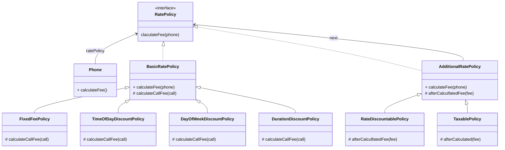
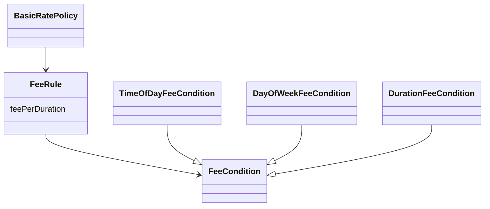
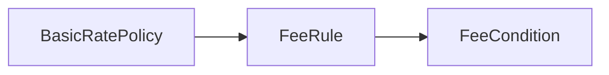

# 14. 일관성 있는 협력
특정한 문제를 유사한 방법으로 해결하고 있다는 사실을 알면 문제를 이해하는 것만으로도 코드의 구조를 예상할 수 있게 된다.
객체들의 협력이 전체적으로 일관성 있는 유사한 패턴을 따른다면 시스템을 이해하고 확장하기 위해 요구되는 정신적인 부담을 크게 줄일 수 있다.

## 01 핸드폰 과금 시스템 변경하기

> 기본 정책 확장


> 고정요금 방식 구현하기

```java
import java.time.Duration;

public class FixedFeePolicy extends BasicRatePolicy {
    private Money amount;
    private Duration seconds;

    public FixedFeePolicy(Money amount, Duration seconds) {
        this.amount = amount;
        this.seconds = seconds;
    }
    
    @Override
    protected Money calculateFee(Call call) {
        return amount.times(call.getDuration().getSeconds() / seconds.getSeconds());
    }
}
```

> 시간대별 방식 구현하기

```java
import java.time.Duration;
import java.time.LocalDateTime;
import java.time.LocalTime;
import java.util.ArrayList;

public class DateTimeInterval {
    private LocalDateTime from;
    private LocalDateTime to;

    public static DateTimeInterval of(LocalDatetime from, LocalDateTime to) {
        return new DateTimeInterval(from, to);
    }

    public static DateTimeInterval toMidnight(LocalDateTime from) {
        return new DateTimeInterval(from, LocalDateTime.of(23, 59, 59, 999_999_999));
    }

    public static DateTimeInterval fromMidnight(LocalDateTime to) {
        return new DateTimeInterval(LocalDateTime.of(to.toLocalDate(), LocalTime.of(0, 0)), to);
    }

    public static DateTimeInterval during(LocalDate date) {
        return new DateTimeInterval(
                LocalDateTime.of(date, LocalTime.of(0, 0)),
                LocalDateTime.of(date, LocalTime.of(23, 59, 59, 999_999_999))
        );
    }

    private DateTimeInterval(LocalDateTime from, LocalDateTime to) {
        this.from = from;
        this.to = to;
    }

    public List<DateTimeInterval> splitByDay() {
        if (days() > 0) {
            return splitByDay(days());
        }

        return Arrays.asList(this);
    }

    public Duration duration() {
        return Duration.between(from, to);
    }

    public LocalDateTime getFrom() {
        return from;
    }

    public LocalDateTime getTo() {
        return to;
    }

    private long days() {
        return Duration.between(from.toLocalDate().atStartOfDay(), to.toLocalDate().atStartOfDay()).toDays();
    }

    private List<DateTimeInterval> splitByDay(long days) {
        List<DateTimeInterval> result = new ArrayList<>();
        addFirstDay(result);
        addMiddleDays(result, days);
        addLastDay(result);
        return result;
    }
    
    private void addFirstDay(List<DateTimeInterval> result) {
        result.add(DateTimeInterval.toMidnight(from));
    }
    
    private void addMiddleDays(List<DateTimeInterval> result, long days) {
        for (int loop = 1; loop < days; loop++) {
            result.add(DateTimeInterval.during(from.toLocalDate().plusDays(loop)));
        }
    }
    
    private void addLastDay(List<DateTimeInterval> result) {
        result.add(DateTimeInterval.fromMidnight(to));
    }
}
```
```java
import java.time.LocalDateTime;

public class Call {
    private DateTimeInterval interval;
    
    public Call(LocalDateTime from, LocalDateTime to) {
        this.interval = DateTimeInterval.of(from, to);
    }
    
    public Duration getDuration() {
        return interval.duration();
    }
    
    public LocalDateTime getFrom() {
        return interval.getFrom();
    }
    
    public LocalDateTime getTo() {
        return interval.getTo();
    }
    
    public DateTimeInterval getInterval() {
        return interval;
    }
    
    public List<DateTimeInterval> splitByDay() {
        return interval.splitByDay();
    }
}
```

```java
import java.time.Duration;
import java.util.ArrayList;

public class TimeOfDayDiscountPolicy extends BasicRatePolicy {
    private List<LocalTime> starts = new ArrayList<>();
    private List<LocalTime> ends = new ArrayList<>();
    private List<Duration> durations = new ArrayList<>();
    private List<Money> amounts = new ArrayList<>();

    @Override
    protected Money calculateCallFee(Call call) {
        Money result = Money.ZERO;

        for (DateTimeInterval interval : call.splitByDay()) {
            for (int loop = 0; loop < starts.size(); loop++) {
                result.plut(
                        amounts.get(loop)
                                .times(
                                        Duration.between(from(interval, starts.get(loop)), to(interval, ends.get(loop))).getSeconds() / durations.get(loop).getSeconds()
                                )
                );
            }
        }
        
        return result;
    }
    
    private LocalTime from(DateTimeInterval interval, LocalTime from) {
        return interval.getFrom().toLocalTime().isBefore(from)
                ? from
                : interval.getFrom().toLocalTime();
    }
    
    private LocalTime to(DateTimeInterval interval, LocalTime to) {
        return interval.getTo().toLocalTime().isAfter(to)
                ? to
                : interval.getTo().toLocalTime();
    }
}
```

> 요일별 방식 구현하기

```java
import java.time.DayOfWeek;
import java.time.Duration;

public class DayOfWeekDiscountRule {
    private List<DayOfWeek> dayOfWeeks = new ArrayList<>();
    private Duration duration = Duration.ZERO;
    private Money amount = Money.ZERO;

    public DayOfWeekDiscountRule(List<DayOfWeek> dayOfWeeks, Duration duration, Money amount) {
        this.dayOfWeeks = dayOfWeeks;
        this.duration = duration;
        this.amount = amount;
    }
    
    public Money calculate(DateTimeInterval interval) {
        if (dayOfWeeks.contains(interval.getFrom().getDayOfWeek())) {
            return amount.times(interval.duration().getSeconds() / duration.getSeconds());
        }
        
        return Money.ZERO;
    }
}
```
```java
import java.util.ArrayList;

public class DayOfWeekDiscountPolicy extends BasicPolicy {
    private List<DayOfWeekDiscountRule> rules = new ArrayList<>();
    
    public DayOfWeekDiscountPolicy(List<DayOfWeekDiscountRule> rules) {
        this.rules = rules;
    }
    
    @Override
    protected Money calculateCallFee(Call call) {
        Money result = Money.ZERO;
        for (DateTimeInterval interval : call.getInterval().splitByDay()) {
            for (DayOfWeekDiscountRule rule: rules) {
                result.plus(rule.calculate(interval));
            }
        }
        return result;
    }
}
```

> 구간별 방식 구현하기

```java
public class DurationDiscountRule extends FixedFeePolicy {
    private Duration from;
    private Duration to;

    public DurationDiscountRule(Duration from, Duration to, Money amount, Duration seconds) {
        super(amount, seconds);
        this.from = from;
        this.to = to;
    }

    public Money calculate(Call call) {
        if (call.getDuration().compareTo(to) > 0) {
            return Money.ZERO;
        }

        if (call.getDuration().compareTo(from) < 0) {
            return Money.ZERO;
        }

        Phone phone = new Phone(null);
        phone.call(new Call(call.getFrom().plus(from), call.getDuration.compareTo(to) > 0 ? call.getFrom().plus(to) : call.getTo()));
        
        return super.calculateFee(phone);
    }
}
```

## 02 설계에 일관성 부여하기
일관성 있는 설계를 위한 조언
1. 다양한 설계 경험을 익혀라
   * 풍부한 설계 경험을 가진 사람은 어떤 변경이 중요한지, 그리고 그 변경을 어떻게 다뤄야 하는지에 대한 통창력을 가지게 된다.
2. 디자인 패턴을 학습하고 변경이라는 문맥 안에서 디자인 패턴을 적용해 보라.
   * 디자인 패턴은 특정한 변경에 대해 일관성 있는 설계를 만들 수 있는 경험 법칙을 모아 놓은 일종의 설계 템플릿이다.

협력을 일관성 있게 만들기 위해 다음과 같은 기본 지침을 따르는 것이 도움이 될 것이다.
* 변하는 개념을 변하지 않는 개념으로부터 분리하라.
* 변하는 개념을 캡슐화하라.

> 조건 로직 대 객체 탐색
```java
public class ReservationAgency {
    
    public Reservatation reserve(Screening screening, Customer customer, int audienceCount) {
        for (DiscountCondition condition : movie.getDiscountConditions()) {
            if (condition.getType() == DiscountConditionType.PERIOD) {
                ...
            } else {
                ...
            }
        }
        
        if (discountable) {
            switch (movie.getMovieType()) {
                case AMOUNT_DISCOUNT:
                    // 금액 할인 정책
                case PERCENT_DISCOUNT:
                    // 비율 할인 정책
                case NONE_DISCOUNT:
                    // 할인 정책이 없는 경우
            }
        } else {
            // 할인 적용이 불가능한 경우
        }
    }
}
```
절치지향 프로그램에서 변경을 처리하는 전통적인 방법은 이처럼 조건문의 분기를 추가하거나 개별 분기 로직을 수정하는 것이다.

객체지향은 조금 다른 접근방법을 취한다.
조건 로직을 객체 사이의 이동으로 바꾸는 것이다.

```java
public class Movie {
    private DiscountPolicy discountPolicy;
    
    public Money calculateMovieFee(Screening screening) {
        return fee.minus(discountPolicy.calculateDiscountAmount(screening));
    }
}
```
Movie는 현재의 할인 정책이 어떤 종류인지 확인하지 않는다. 단순히 현재의 할인 정책을 나타내는 discountPolicy에 필요한 메시지를 전송할 뿐이다.
할인 정책의 종류를 체크하던 조건문이 discountPolicy로의 객체 이동으로 대체된 것이다.
다형성은 바로 이런 조건 로직을 객체 사이의 이동으로 바꾸기 위해 객체지향이 제공하는 설계 기법이다.

> 캡슐화 다시 살펴보기

많은 사람들은 객체의 캡슐화에 관한 이야기를 들으면 반사적으로 `데이터 은닉(data hiding)`을 떠올린다.
그러나 캡슐화는 데이터 은닉 이상이다.
GOF의 조언에 따르면 캡슐화란 단순히 데이터를 감추는 것이 아니다. 소프트웨어 안에서 변할 수 있는 모든 '개념'을 감추는 것이다.

* 데이터 캡슐화
  * 클래스는 내부에서 관리하는 데이터를 캡슐화 한다.
* 메서드 캡슐화
  * 클래스의 내부 행동을 캡슐화
* 객체 캡슐화
  * 객체 캡슐화는 합성을 의미한다.
* 서브타입 캡슐화
  * 서브타입의 종류를 캡슐화


## 03 일관성 있는 기본 정책 구현하기

> 변경 분리하기 

일관성 있는 협력을 만들기 위한 첫 번째 단계는 변하는 개념과 변하지 않는 개념을 분리하는 것이다.

> 변경 캡슐화하기

협력을 일관성 있게 만들기 위해서는 변경을 캡슐화해서 파급효과를 줄여야 한다.
변경을 캡슐화하는 가장 좋은 방법은 변하지 않는 부분으로부터 변하는 부분을 분리하는 것이다.
변하는 부분의 공통점을 추상화하는 것도 잊어서는 안 된다.



> 협력 패턴 설계하기

변하는 부분과 변하지 않는 부분을 분리하고, 변하는 부분을 적절히 추상화하고 나면 변하는 부분을 생략한 채 변하지 않는 부분만을 이용해 객체 사이의 협력을 이야기 할 수 있다.
추상화만으로 구성한 협력은 추상화를 구체적인 사례로 대체함으로써 다양한 상황으로 확장할 수 있게 된다.



> 추상화 수준에서 협력 패턴 구현하기

```java
public interface FeeCondition {
    List<DateTimeInterval> findTimeIntervals(Call call);
}
```
```java
public class FeeRule {
    private FeeCondition feeCondition;
    private FeePerDuration feePerDuration;
    
    public FeeRule(FeeCondition feeCondition, FeePerDuration feePerDuration) {
        this.feeCondition = feeCondition;
        this.feePerDuration = feePerDuration;
    }
    
    public Money calculateFee(Call call) {
        return feeCondition.findTimeIntervals(call)
                .stream()
                .map(each -> feePerDuration.calculate(each))
                .reduce(Money.ZERO, (fisrt, second) -> fisrt.plus(second));
    }
}
```
```java
public class FeePerDuration {
    private Money fee;
    private Duration duration;
    
    public FeePerDuration(Money fee, Duration duration) {
        this.fee = fee;
        this.duration = duration;
    }
    
    public Money calculate(DateTimeInterval interval) {
        return fee.times(Math.ceil((double)interval.duration().toNanos() / duration.toNanos()));
    }
}
```

```java
import java.util.ArrayList;
import java.util.Arrays;

public class BasicRatePolicy implements RatePolicy {
    private List<FeeRule> feeRules = new ArrayList<>();

    public BasicRatePolicy(FeeRule... feeRules) {
        this.feeRules = Arrays.asList(feeRules);
    }
    
    @Override
    public Money calculateFee(Phone phone) {
        return phone.getCalls()
                .stream()
                .map(call -> calculate(call))
                .reduce(Money.ZERO, (first, second) -> first.plus(second));
    }
    
    private Money calculate(Call call) {
        return feeRules.stream()
                .map(rule -> rule.calculateFee(call))
                .reduce(Money.ZERO, (first, second) -> first.plus(second));
    }
}
```

> 구체적인 협력 구현하기

* 시간대별 정책

```java
import java.time.LocalDateTime;
import java.time.LocalTime;

public class TimeOfDayFeeCondition implements FeeCondition {
    private LocalTime from;
    private LocalTime to;

    public TimeOfDayFeeCondition(LocalTime from, LocalTime to) {
        this.from = from;
        this.to = to;
    }

    @Override
    public List<DateTimeInterval> findTimeInterval(Call call) {
        return call.getInterval()
                .splitByDay()
                .stream()
                .filter(each -> from(each).isBefore(to(each)))
                .map(each -> DateTimeInterval.of(
                        LocalDateTime.of(each.getFrom().toLocalDate(), from(each)),
                        LocalDateTime.of(each.getTo().toLocalDate(), to(each))))
                .collect(Collectors.toList());
    }
    
    private LocalTime from(DateTimeInterval interval) {
        return interval.getFrom().toLocalTime().isBefore(from) 
                ? from
                : interval.getFrom().toLocalTime();
    }
    
    private LocalTime to(DateTimeInterval interval) {
        return interval.getTo().toLocalTime().isAfter(to)
                ? to
                : interval.getTo().toLocalTime();
    }
}
```

* 요일별 정책

```java
import java.time.DayOfWeek;
import java.util.ArrayList;
import java.util.Arrays;

public class DayOfWeekFeeCondition implements FeeCondition {
    private List<DayOfWeek> dayOfWeeks = new ArrayList<>();

    public DayOfWeekFeeCondition(DayOfWeek... dayOfWeeks) {
        this.dayOfWeeks = Arrays.asList(dayOfWeeks);
    }

    @Override
    public List<DateTimeInterval> findTimeInterval(Call call) {
        return call.getInterval()
                .splitByDay()
                .stream()
                .filter(each -> dayOfWeeks.contains(each.getFrom().getDayOfWeek()))
                .collect(Collectors.toList());
    }
}
```

* 구간별 정책

```java
import java.util.Arrays;
import java.util.Collections;

public class DurationFeeCondition implements FeeCondition {
    private Duration from;
    private Duration to;

    public DurationFeeCondition(Duration from, Duration to) {
        this.from = from;
        this.to = to;
    }

    @Override
    public List<DateTimeInterval> findTimeInterval(Call call) {
        if (call.getInterval().duration().compareTo(from) < 0) {
            return Collections.EMPTY_LIST;
        }

        return Arrays.asList(DateTimeInterval.of(
                call.getInterval().getFrom().plus(from),
                call.getInterval().duration().compareTo(to) > 0
                    ? call.getInterval().getFrom().plus(to)
                    : call.getInterval().getTo()));
    }
}
```

> 협력 패턴에 맞추기
* 고정요금 정책

```java
import java.util.Arrays;

public class FixedFeeCondition implements FeeCondition {
    @Override
    public List<DateTimeInterval> findTimeIntervals(Call call) {
        return Arrays.asList(call.getInterval());
    }
}
```

> 패턴을 찾아라

애플리케이션에서 유사한 기능에 대한 변경이 지속적으로 발생하고 있다면 변경을 캡슐화할 수 있는 적절한 추상화를 찾은 후, 이 추상화에 변하지 않는 공통적인 책임을 할당 하라.
따라서 일관성 있게 만든다는 것은 유사한 변경을 수용할 수 있는 협력 패턴을 발견하는 것과 동일하다.
